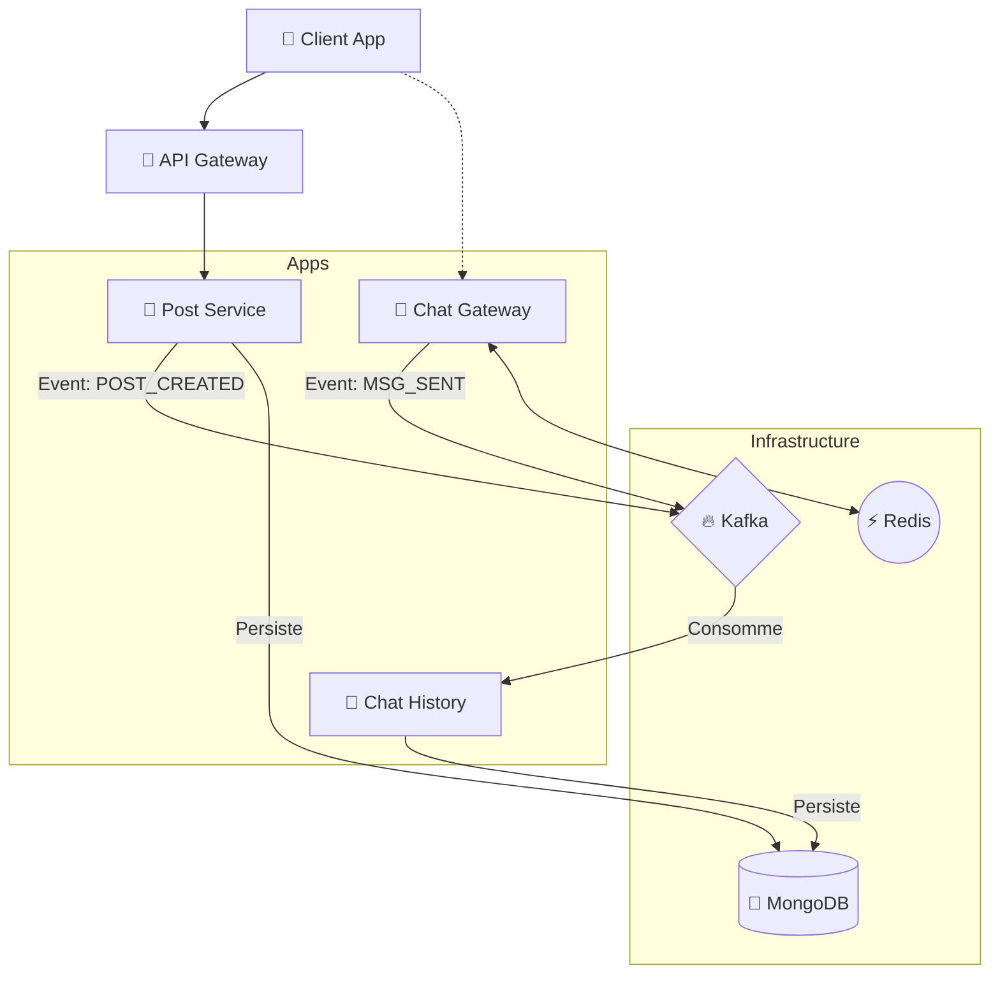

# ARCHITECTURE.md - Social Network Project

## 1. Vue d'ensemble

Architecture microservices polyglotte orientée événements (Event-Driven).
Le système combine des APIs REST classiques (CRUD) et des WebSockets (Temps réel) orchestrés autour d'un bus d'événements Kafka.

### Principes Clés

- **Monorepo :** Tout le code réside dans un seul dépôt.
- **Polyglot Persistence :** Chaque service utilise la base de données la plus adaptée à son besoin.
- **Best Tool for the Job :** Rust pour la perf, Java pour la sécu, Node pour l'I/O.
- **Async First :** Les services communiquent principalement via Kafka pour le découplage.

---

## 2. Structure du Projet (Monorepo)

```text
/
├── apps/                          # Services déployables
│   ├── auth-service/              # [Node/NestJS] Gestion Identité & JWT
│   ├── user-service/              # [Node/NestJS] Gestion Profils Utilisateurs
│   ├── api-gateway/               # [Kong/Nginx] Point d'entrée unique (REST + WebSocket)
│   ├── notification-service/      # [Node/NestJS] Envoi Notifications Push
│   ├── chat-gateway/              # [Rust/Axum] Serveur WebSocket (Stateless)
│   ├── chat-delivery-service/      # [Node/NestJS] Consumer Kafka -> Sauvegarde messages (Mongo)
│   ├── feed-worker/               # [Rust] Worker d'arrière-plan (Fan-out)
│   ├── post-service/              # [Node/NestJS] Gestion Contenu & CRUD
│   ├── graph-service/             # [Node/NestJS] Gestion Relations (Neo4j)
│   └── media-service/             # [Node/NestJS] Gestion Uploads (S3 Pre-signed)
│
├── libs/                          # Code partagé
│   ├── event-contracts/           # [Protobuf/Avro] Définitions des événements Kafka (Universel)
│   ├── shared-ts/                 # [TS] DTOs partagés entre Front et Node services
│   └── shared-rust/               # [Rust] Crates utilitaires (Logger, config)
│
├── infrastructure/
│   └── local/                     # Docker Compose (Kafka, Redis, DBs)
│       └── docker-compose.yml
└── tools/                         # Scripts de build/deploy

```

---

## 3. Matrice Technologique

| Service          | Langage / Framework     | Base de Données     | Rôle Principal                                                                           |
| ---------------- | ----------------------- | ------------------- | ---------------------------------------------------------------------------------------- |
| **Auth Service** | **Node.js** (NestJS)    | **PostgreSQL**      | Inscription, Login, OAuth2, Sécurité.                                                    |
| **User Service** | **Node.js** (NestJS)    | **PostgreSQL**      | Gestion des profils utilisateurs.                                                        |
| **Chat Gateway** | **Rust** (Axum + Tokio) | **Redis** (Pub/Sub) | Gestion massive des connexions WebSockets (Pas de stockage) et chiffrement bout en bout. |

| **Chat History** | **Node.js** (NestJS) | **MongoDB** | Consomme Kafka et archive les conversations. |
| **Feed Worker** | **Rust** | **Redis** (Cache) | Consomme Kafka et construit les Timelines (une timeline suivis et une timeline générale). |
| **Post Service** | **Node.js** (NestJS) | **MongoDB** | Stockage flexible des posts/commentaires. |
| **Graph Service** | **Node.js** (NestJS) | **Neo4j** | Gestion du graphe social (Amis, Follow). |
| **Media Service** | **Node.js** (NestJS) | **S3 / MinIO** | Orchestration uploads (Pre-signed URLs). |
| **API Service** | **Kong / Nginx** | N/A | Point d'entrée unique (Rate Limiting, Auth). |
| **Notification Service** | **Node.js** (NestJS) | N/A | Envoi de notifications push (Firebase, APNs). |
**Infrastructure Commune :**

- **Event Bus :** Apache Kafka (Zookeeper pour coordination).
- **Cache & PubSub :** Redis.
- **Gateway :** API Gateway (ex: Kong ou Nginx) en front.

---

## 4. Flux de Données & Communication

### A. Flux "Post Created" (Exemple Asynchrone)

1. **Client** -> POST /posts -> **Post Service** (Sauvegarde MongoDB).
2. **Post Service** -> Produit event `POST_CREATED` -> **Kafka**.
3. **Feed Worker** (Consumer) :

- Lit `POST_CREATED`.
- Appelle **Graph Service** (gRPC/HTTP) -> Récupère liste Amis.
- Ecrit l'ID du post dans les Timelines **Redis** des amis (Fan-out).

4. **Notification Service** (Consumer) -> Envoie Push Notif.

### B. Flux "Chat Message" (Temps Réel & Persistance)

1. **Alice** -> WebSocket -> **Chat Gateway (Instance A)**.
2. **Chat Gateway** -> Publie sur **Redis Pub/Sub** (Channel: `chat_events`).
3. **Chat Gateway (Instance B)** -> Reçoit l'event Redis -> Pousse via WebSocket vers **Bob**.
4. **Chat Gateway** -> Produit event `MESSAGE_SENT` -> **Kafka**.
5. **Chat History Service** (Consumer Node.js) -> Lit Kafka -> Sauvegarde dans **MongoDB**.

### C. Flux "Media Upload" (Performance)

1. **Client** -> Demande upload -> **Media Service**.
2. **Media Service** -> Génère URL S3 Pré-signée -> Renvoie au Client.
3. **Client** -> PUT binaire -> **S3 / MinIO** (Directement).

---

## 5. Décisions d'Architecture (ADR)

**ADR-001 : Stockage de l'Historique de Chat**

- **Contexte :** Le stockage de chat nécessite une écriture rapide (Write-heavy). La solution idéale est Cassandra/ScyllaDB.
- **Décision Phase 1 :** Utilisation de **MongoDB**.
- _Justification :_ Réduit la complexité opérationnelle en local (pas de cluster lourd). Suffisant pour les premiers millions de messages. Réutilisation de l'infra du Post Service.

- **Stratégie Long Terme :** Migration vers **ScyllaDB**.
- _Déclencheur :_ Problèmes de performance en écriture ou besoin de sharding géographique complexe.

---

## 6. Infrastructure Locale (Docker Compose)

Le fichier `infrastructure/local/docker-compose.yml` doit provisionner :

- **Zookeeper & Kafka** (Port 9092)
- **Redis** (Port 6379)
- **PostgreSQL** (Port 5432 - DB: `auth_db`)
- **MongoDB** (Port 27017 - DB: `social_db` & `chat_db`)
- **MinIO** (S3 Local - Port 9100)

---

## 7. Diagramme Global


