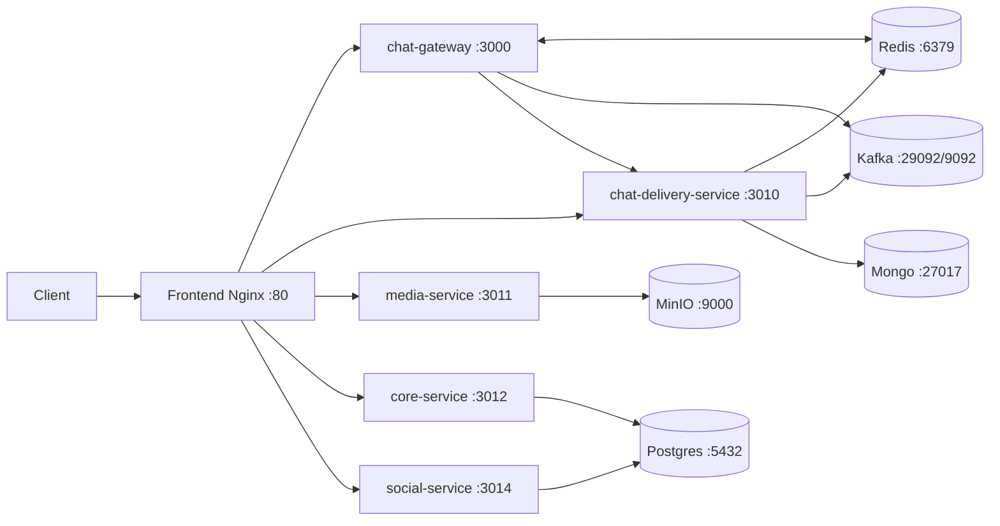

# ARCHITECTURE.md - Canari (etat reel du code)

## 1. Objectif et perimetre

Ce document decrit l'architecture actuelle telle qu'elle est implementee dans le code.
Source de verite utilisee:

- `infrastructure/docker-compose.prod.yml`
- `infrastructure/local/docker-compose.yml`
- `infrastructure/local/Dockerfile.frontend` (config Nginx runtime)
- points d'entree des services dans `apps/*/src/main.*`
- liaisons inter-services visibles dans le code applicatif

## 2. Vue d'ensemble

Canari est un monorepo microservices avec:

- Frontend SvelteKit servi par Nginx en production
- Services backend Rust + NestJS
- Transport temps reel via WebSocket
- Coordination/eventing via Redis Pub/Sub et Kafka
- Stockage relationnel/objet/document (PostgreSQL, MongoDB, MinIO)

## 3. Services deployes

| Service                         | Stack                       | Port interne                 | Exposition host (compose)                                                                                             | Role                                             |
| ------------------------------- | --------------------------- | ---------------------------- | --------------------------------------------------------------------------------------------------------------------- | ------------------------------------------------ |
| frontend (Nginx + build Svelte) | Nginx                       | 80                           | prod: `${FRONTEND_HOST_PORT:-80}:80`                                                                                  | Point d'entree HTTP unique + reverse proxy       |
| chat-gateway                    | Rust/Axum                   | 3000                         | `3000:3000`                                                                                                           | WebSocket chat MLS, presence, routage temps reel |
| chat-delivery-service           | NestJS + Kafka microservice | 3010                         | `3010:3010`                                                                                                           | API MLS, messages offline, historique            |
| media-service                   | NestJS                      | 3011                         | `3011:3011`                                                                                                           | Upload/acces media chiffre via MinIO             |
| core-service                    | NestJS                      | 3012                         | `3012:3012`                                                                                                           | Auth, users, paiement Stripe                     |
| social-service                  | NestJS                      | 3014                         | `3014:3014`                                                                                                           | Posts, forms, channels                           |
| redis                           | Redis                       | 6379                         | `6379:6379`                                                                                                           | Presence, Pub/Sub, streams                       |
| kafka                           | Confluent Kafka             | 29092 (interne), 9092 (host) | `9092:9092`                                                                                                           | Bus d'evenements                                 |
| zookeeper                       | Confluent Zookeeper         | 2181                         | non expose                                                                                                            | Coordination Kafka                               |
| postgres                        | PostgreSQL                  | 5432                         | `5432:5432`                                                                                                           | Donnees relationnelles                           |
| mongo                           | MongoDB                     | 27017                        | `27017:27017`                                                                                                         | Donnees document                                 |
| minio                           | MinIO                       | 9000 (API), 9001 (console)   | local: `9000:9000`, `9001:9001`; prod: `${MINIO_API_HOST_PORT:-19000}:9000`, `${MINIO_CONSOLE_HOST_PORT:-19001}:9001` | Stockage objet S3-compatible                     |
| coturn (local uniquement)       | Coturn                      | 3478/5349 + range UDP        | `3478`, `5349`, `49000-49040/udp`                                                                                     | STUN/TURN pour appels                            |

## 4. Ports detailes

### 4.1 Ports applicatifs backend

- `3000`: chat-gateway
- `3010`: chat-delivery-service
- `3011`: media-service
- `3012`: core-service
- `3014`: social-service

Le service appels `call-service` est archive et n'est plus expose ni deploie dans les stacks activees.

### 4.2 Ports infra

- `6379`: Redis
- `9092`: Kafka expose host
- `29092`: Kafka listener inter-container (`kafka:29092`)
- `2181`: Zookeeper interne
- `5432`: PostgreSQL
- `27017`: MongoDB
- `9000`: MinIO API S3 (ou host 19000 en prod)
- `9001`: MinIO console (ou host 19001 en prod)
- `3478`, `5349`, `49000-49040/udp`: Coturn local

### 4.3 Frontend et dev

- `80`: frontend Nginx en prod
- `1420`: Vite dev server (`frontend/vite.config.js`)
- `1421`: HMR websocket en mode Tauri host

## 5. Ingress HTTP: mapping Nginx -> services

Le frontend Nginx fait office de gateway applicative. Routes configurees dans `infrastructure/local/Dockerfile.frontend`:

| Route publique  | Upstream interne             | Notes                                  |
| --------------- | ---------------------------- | -------------------------------------- |
| `/api/ws`       | `chat-gateway:3000`          | WS chat, protege via `auth_request`    |
| `/api/groups`   | `chat-gateway:3000`          | routes groupes cote gateway            |
| `/api/mls-api`  | `chat-delivery-service:3010` | API MLS, protege via `auth_request`    |
| `/api/history`  | `chat-delivery-service:3010` | historique, protege via `auth_request` |
| `/api/media`    | `media-service:3011`         | media blobs                            |
| `/api/posts`    | `social-service:3014`        | posts, protege via `auth_request`      |
| `/api/forms`    | `social-service:3014`        | forms, protege via `auth_request`      |
| `/api/channels` | `social-service:3014`        | channels                               |
| `/api/auth`     | `core-service:3012`          | auth                                   |
| `/api/users`    | `core-service:3012`          | users                                  |
| `/api/payments` | `core-service:3012`          | paiement, protege via `auth_request`   |

Auth interne Nginx:

- endpoint interne: `/internal/auth/verify`
- proxy vers `core-service:3012/api/auth/verify`
- headers reinjectes vers upstreams proteges: `X-User-Id`, `X-User-Logged-In`

## 6. Liaisons inter-services (code)

### 6.1 HTTP synchrone

- `chat-gateway` -> `chat-delivery-service`
  - appel `POST {DELIVERY_SERVICE_URL}/mls-api/send`
  - utilise pour la livraison offline ou fallback non connecte

- `social-service` -> service paiement
  - `forms.service.ts` appelle `POST {PAYMENT_SERVICE_URL}/api/payments/create-checkout-session`
  - fallback code: `http://localhost:3004` si variable absente

- `core-service` -> service forms
  - `payment/webhook.controller.ts` appelle `POST {FORM_SERVICE_URL}/api/forms/submissions/:id/mark-paid`
  - fallback code: `http://localhost:3008` si variable absente

### 6.2 Pub/Sub Redis

- Canal `chat:messages`
  - publie par `chat-gateway`
  - consomme localement par `chat-gateway` (fanout multi-instance)

- Canal `chat:channel_events`
  - consomme par `chat-gateway` pour notifier les clients connectes

- Presence
  - cles `user:online:<userId>:<deviceId>` dans Redis

- Historique groupe
  - stream `history:<groupId>` alimente par `chat-gateway`
  - lu par `chat-delivery-service` pour `/api/history/:groupId`

### 6.3 Kafka

- Topic `chat.messages`
  - produit par `chat-gateway` (evenements `MessageSentEvent`)
  - consomme par `chat-delivery-service` (microservice Kafka, group `chat-delivery-consumer`)

- Topic `post.created`
  - consomme par `chat-gateway` (abonnement visible dans `main.rs`)
  - utilite: diffusion d'evenements channels/posts vers clients en ligne

## 7. Endpoints backend exposes (principaux)

### 7.1 chat-gateway (port 3000)

- `GET /api/health`
- `GET /api/ws` (WebSocket)
- `GET /api/presence`
- `GET/POST /api/groups/{group_id}/tree`

### 7.2 chat-delivery-service (port 3010, prefix global `/api`)

Familles d'endpoints majeures:

- `/api/mls-api/sync/session/*`
- `/api/mls-api/pin-verifier/check`
- `/api/mls-api/groups*`
- `/api/mls-api/register-device`
- `/api/mls-api/welcome*`
- `/api/mls-api/send`
- `/api/mls-api/messages/*`
- `/api/history/:groupId`

### 7.3 core-service (port 3012, prefix `/api`)

- `/api/auth/*`
- `/api/users/*`
- `/api/payments/*`
- `/api/payments/webhook` (raw body Stripe)

### 7.4 social-service (port 3014, prefix `/api`)

- `/api/posts/*`
- `/api/forms/*`
- `/api/channels/*`

### 7.5 media-service (port 3011, prefix `/api`)

- endpoints media exposes via `/api/media/*` derriere Nginx

## 8. Flux critiques

### 8.1 Message MLS (online/offline)

1. Client -> `frontend` -> `/api/ws` -> `chat-gateway`
2. `chat-gateway` publie en Redis `chat:messages` pour les destinataires online
3. Si destinataire offline: `chat-gateway` appelle `chat-delivery-service /mls-api/send`
4. `chat-gateway` archive aussi en Kafka `chat.messages` et Redis Stream `history:*`

### 8.2 Creation paiement formulaire

1. Client -> `/api/forms/*` -> `social-service`
2. `social-service` appelle le service paiement (`/api/payments/create-checkout-session`)
3. Webhook Stripe recu par `core-service /api/payments/webhook`
4. `core-service` notifie le service forms (`/api/forms/submissions/:id/mark-paid`)

## 9. Ecart a surveiller

- Les fallbacks `PAYMENT_SERVICE_URL=http://localhost:3004` et `FORM_SERVICE_URL=http://localhost:3008` ne correspondent pas aux ports compose (`3012` et `3014`).
- Ces valeurs ne cassent pas tant que les variables d'environnement sont correctement renseignees, mais elles sont trompeuses en cas de config manquante.

## 10. Diagramme simplifie

# Chiffrement

La messagerie utilise un chiffrement de bout en bout (E2EE) pour garantir la confidentialité des messages dans toutes les conversations. Voici les détails techniques des mécanismes de chiffrement utilisés selon le type de discussion :

## 1. Discussions Directes et Petits Groupes (DMs)

- **Protocole de Chiffrement :** Utilisation de **Message Layer Security (MLS)** pour la gestion des clés et le chiffrement de groupe. (cf. [RFC 9420](https://datatracker.ietf.org/doc/html/rfc9420)).
- **Perfect Forward Secrecy (PFS) et Post-Compromise Security (PCS) :** Le protocole MLS assure la rotation continue des clés, empêchant la lecture des anciens messages si une clé est compromise, et garantissant l'impossibilité de lire les nouveaux si un membre est expulsé.

## 2. Canaux Communautaires (Espaces / Workspaces)

Pour les espaces communautaires à fort volume impliquant de fréquents mouvements de membres (ex: promotions, associations), le maintien exclusif de la rotation MLS pure peut s'avérer trop coûteux en performances. Un modèle hybride est ainsi appliqué :

- **Clé par Canal :** Une clé privée symétrique unique (AES-256) est générée pour chaque canal. Actuellement (au stade de MVP), cette clé est statique et n'est pas modifiée au cours du temps.
- **Distribution via MLS :** La clé privée du canal n'est **jamais** transmise en clair au serveur. Lorsqu'un nouveau membre rejoint le canal, un bot ou un administrateur ayant déjà accès transmet la clé privée du canal de manière asynchrone au nouvel arrivant via un message chiffré MLS (en utilisant l'infrastructure sécurisée de la partie DMs/Groupes de l'application).
- **Chiffrement des messages :** Les messages envoyés dans le canal sont chiffrés en AES-256-GCM à l'aide de la clé statique du canal.
- **Accès à l'historique :** Ce paradigme permet intrinsèquement à un nouveau venu, une fois la clé reçue, de déchiffrer sans complexité l'intégralité de l'historique du canal.
- **Gestion des expulsions :** Dans la version actuelle, une exclusion repose sur une interdiction serveur ("soft block") : le serveur coupe l'accès de la cible aux flux de la WebSocket et de l'API. La clé n'étant pas rotative, la cryptographie seule ne prévient pas un membre expulsé de déchiffrer les requêtes futures s'il parvenait à écouter le réseau en contournant l'ACL. C'est un compromis assumé sur ce volet MVP.
# Chiffrement

La messagerie utilise un chiffrement de bout en bout (E2EE) pour garantir la confidentialité des messages dans toutes les conversations. Voici les détails techniques des mécanismes de chiffrement utilisés selon le type de discussion :

## 1. Discussions Directes et Petits Groupes (DMs)

- **Protocole de Chiffrement :** Utilisation de **Message Layer Security (MLS)** pour la gestion des clés et le chiffrement de groupe. (cf. [RFC 9420](https://datatracker.ietf.org/doc/html/rfc9420)).
- **Perfect Forward Secrecy (PFS) et Post-Compromise Security (PCS) :** Le protocole MLS assure la rotation continue des clés, empêchant la lecture des anciens messages si une clé est compromise, et garantissant l'impossibilité de lire les nouveaux si un membre est expulsé.

## 2. Canaux Communautaires (Espaces / Workspaces)

Pour les espaces communautaires à fort volume impliquant de fréquents mouvements de membres (ex: promotions, associations), le maintien exclusif de la rotation MLS pure peut s'avérer trop coûteux en performances. Un modèle hybride est ainsi appliqué :

- **Clé par Canal :** Une clé privée symétrique unique (AES-256) est générée pour chaque canal. Actuellement (au stade de MVP), cette clé est statique et n'est pas modifiée au cours du temps.
- **Distribution via MLS :** La clé privée du canal n'est **jamais** transmise en clair au serveur. Lorsqu'un nouveau membre rejoint le canal, un bot ou un administrateur ayant déjà accès transmet la clé privée du canal de manière asynchrone au nouvel arrivant via un message chiffré MLS (en utilisant l'infrastructure sécurisée de la partie DMs/Groupes de l'application).
- **Chiffrement des messages :** Les messages envoyés dans le canal sont chiffrés en AES-256-GCM à l'aide de la clé statique du canal.
- **Accès à l'historique :** Ce paradigme permet intrinsèquement à un nouveau venu, une fois la clé reçue, de déchiffrer sans complexité l'intégralité de l'historique du canal.
- **Gestion des expulsions :** Dans la version actuelle, une exclusion repose sur une interdiction serveur ("soft block") : le serveur coupe l'accès de la cible aux flux de la WebSocket et de l'API. La clé n'étant pas rotative, la cryptographie seule ne prévient pas un membre expulsé de déchiffrer les requêtes futures s'il parvenait à écouter le réseau en contournant l'ACL. C'est un compromis assumé sur ce volet MVP.
