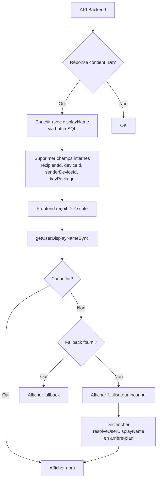

# Stratégie d'élimination des fuites d'IDs dans l'interface Canari

> **Règle d'or :** Les IDs ne doivent JAMAIS apparaître dans l'interface (sauf exceptions admin clairement identifiées). Toute fonction qui prend un ID en entrée et retourne un string affichable doit garantir qu'elle ne retourne jamais l'ID brut.

---

## 1. Résumé exécutif

L'audit a révélé **27 expositions côté back-end** (dont 20 critiques 🔴) et **31 occurrences côté front-end** (dont 14 critiques 🔴). La cause racine est un **double défaut** :

1. **Back-end :** les réponses API retournent systématiquement les IDs bruts (`userId`, `deviceId`, `groupId`, `sender_id`) sans résolution de nom
2. **Front-end :** la fonction [`getUserDisplayNameSync()`](frontend/src/lib/utils/users/displayName.ts:58) utilise `userId` comme fallback ultime (ligne 76 : `return fallback?.trim() || userId`), et de nombreux composants tronquent les IDs au lieu de les masquer

La stratégie repose sur un **principe hybride** : le back-end enrichit ce qu'il peut enrichir sans coût excessif, le front-end garantit le filet de sécurité ultime.

---

## 2. Stratégie Back-end

### 2.1 Principe général

Pour chaque endpoint qui retourne des IDs, appliquer l'une des trois approches suivantes selon le contexte :

| Approche | Quand l'utiliser | Coût |
|----------|-----------------|------|
| **A. Enrichissement (join `users`)** | L'endpoint retourne peu d'IDs (~<50) et le nom est pertinent pour l'UI | 1 requête SQL supplémentaire |
| **B. Suppression du champ** | L'ID n'est pas utilisé par le client pour autre chose qu'afficher | Nul |
| **C. Endpoint interne uniquement** | L'ID est nécessaire au protocole MLS mais ne devrait jamais être affiché | Ajouter un header `x-internal: true` ou un flag |

### 2.2 Traitement endpoint par endpoint

#### 🔴 CRITIQUE — `GET mls/messages/:userId/:deviceId`

[`MessagingController.fetchMessages()`](apps/chat-delivery-service/src/controllers/messaging.controller.ts:178) retourne des [`QueuedMessage`](apps/chat-delivery-service/src/entities/queued-message.entity.ts:11) bruts.

**Champs problématiques :** `recipientId`, `deviceId`, `senderId`, `senderDeviceId`, `groupId`

**Action :** Approche A + B
- `recipientId` → **supprimer** (le client connaît déjà son propre userId, il est dans l'URL)
- `deviceId` → **supprimer** (idem)
- `senderId` → **enrichir** avec `senderName` via [`resolveUserDisplayName()`](apps/chat-delivery-service/src/utils/display-name.ts:9) (déjà utilisé dans les pushs !)
- `senderDeviceId` → **supprimer** (usage purement interne : déduplication)
- `groupId` → **conserver** (nécessaire au routage MLS) mais ne jamais afficher

**Solution proposée :** Ajouter une DTO de réponse `SafeQueuedMessageDto` qui omet `recipientId`, `deviceId`, `senderDeviceId` et ajoute `senderName: string`.

---

#### 🔴 CRITIQUE — `GET mls/history/:groupId` + `POST mls/history/batch`

[`MessagingController.getHistory()`](apps/chat-delivery-service/src/controllers/messaging.controller.ts:159) et [`getHistoryBatch()`](apps/chat-delivery-service/src/controllers/messaging.controller.ts:144) retournent les entrées Redis stream brutes. Chaque entrée contient `sender_id`.

**Action :** Approche A
- `sender_id` → **enrichir** avec `sender_name` résolu côté serveur
- Conserver `sender_id` dans la réponse pour le routage interne, mais ajouter `sender_name` comme champ _additionnel_

**Solution proposée :** Dans [`mapHistoryEntries()`](apps/chat-delivery-service/src/services/messaging.service.ts:1515), après avoir mappé les champs bruts, résoudre les `sender_id` en batch via une jointure SQL unique (`SELECT id, "displayName", "firstName", "lastName" FROM users WHERE id IN (...)`).

---

#### 🔴 CRITIQUE — `GET mls/groups/:groupId/members`

[`MembersController.getGroupMembers()`](apps/chat-delivery-service/src/controllers/members.controller.ts:341) retourne `{ userId, deviceId }` pour chaque membre actif.

**Action :** Approche A
- `userId` → **enrichir** avec `displayName`
- `deviceId` → **conserver** pour le protocole MLS (stale-leaf detection) mais **ne jamais afficher**

**Solution proposée :** Nouvelle DTO `GroupMemberDto { userId, displayName, deviceId }`. Le front-end utilise `displayName` pour l'affichage et `userId` + `deviceId` pour la logique MLS uniquement.

---

#### 🔴 CRITIQUE — `GET mls/groups/:groupId/user-members`

[`MembersController.getGroupUserMembers()`](apps/chat-delivery-service/src/controllers/members.controller.ts:309) retourne `{ userId }` pour chaque membre.

**Action :** Approche A
- `userId` → **enrichir** avec `displayName`

**Solution proposée :** Même principe que ci-dessus. Batch resolve via `SELECT id, "displayName", "firstName", "lastName" FROM users WHERE id IN (...)`.

---

#### 🔴 CRITIQUE — `GET mls/devices/:userId`

[`DevicesController.getUserDevices()`](apps/chat-delivery-service/src/controllers/devices.controller.ts:338) retourne les entités [`KeyPackage`](apps/chat-delivery-service/src/entities/key-package.entity.ts) complètes (userId, deviceId, deviceName, deviceOs, keyPackage, etc.).

**Action :** Approche A + B
- `userId` → **supprimer** (dans l'URL)
- `deviceId` → **conserver** pour la logique (suppression, métadonnées) mais **jamais affiché**
- `keyPackage` → **supprimer** de la réponse (risque de fuite de matériel cryptographique !)

**Solution proposée :** DTO `SafeDeviceDto { deviceId, deviceName, deviceOs, deviceAppVersion, createdAt }`. Le `keyPackage` ne doit être retourné que par l'endpoint `GET mls/devices/:userId/:deviceId/key-package` qui est déjà dédié.

---

#### 🔴 CRITIQUE — `GET mls/groups/:groupId` (création + lecture)

[`GroupsController.createGroup()`](apps/chat-delivery-service/src/controllers/groups.controller.ts:82) retourne `{ groupId, name, createdBy, isGroup }`.
[`GroupsController.getGroup()`](apps/chat-delivery-service/src/controllers/groups.controller.ts:93) retourne l'entité Group avec `{ ...g, groupId: g.id }`.

**Action :** Approche A + B
- `createdBy` → **enrichir** avec `creatorName`
- `groupId` → **conserver** (nécessaire partout) mais ne jamais afficher

---

#### 🔴 CRITIQUE — `GET mls/invitations/pending/:userId/:deviceId`

[`InvitationsController.getPendingInvitations()`](apps/chat-delivery-service/src/controllers/invitations.controller.ts:234) retourne des [`DeviceGroupMembership`](apps/chat-delivery-service/src/entities/device-group-membership.entity.ts) complets.

**Action :** Approche A
- `userId`, `deviceId` → enrichir avec `displayName` (permet d'afficher "Invitation de X" au lieu de l'ID)

---

#### 🟠 MODÉRÉE — `POST calls/initiate` + `GET calls/room-token`

[`CallsService.initiateCall()`](apps/chat-delivery-service/src/services/calls.service.ts:112) émet un JWT contenant `{ room_id, sub: userId, group_id }`.

**Action :** Le JWT est consommé par le call-service (interne), pas par le front-end. Le client ne décode pas ce JWT. **Aucune action requise sur le JWT lui-même**, mais s'assurer que le front-end n'accède jamais au `roomToken` brut.

---

#### 🟠 MODÉRÉE — Endpoints sync (`sync.controller.ts`)

Les endpoints [`sync.controller.ts`](apps/chat-delivery-service/src/controllers/sync.controller.ts) échangent `userId`, `deviceId`, `offerDeviceId`, `answerDeviceId`. Ces IDs sont purement internes au protocole de sync QR-code.

**Action :** **Aucune.** Ces IDs ne sont jamais affichés. Le client les utilise uniquement pour le handshake crypto.

---

#### 🟠 MODÉRÉE — `POST mls/send` (enveloppe Redis pub/sub)

[`MessagingService.sendMessage()`](apps/chat-delivery-service/src/services/messaging.service.ts:629) publie une enveloppe JSON dans Redis contenant `recipientId`, `deviceId`, `senderId`, `senderDeviceId`, `groupId`.

**Action :** Interne (Redis → Gateway → WebSocket → client). Le client a besoin de ces IDs pour le routage MLS. **Aucune action** mais le front-end ne doit jamais afficher ces champs.

---

### 2.3 Cas spécifique des invitations

L'ID d'invitation `de4b48921d8f97ed934b6b4f3373cf5e0bc6aa254149c29775f972104ceec56e` est le `token` d'un [`GroupInvite`](apps/chat-delivery-service/src/entities/group-invite.entity.ts). Il est exposé dans l'URL `/c/join/:token` et dans les partages de lien.

**Action :**
1. Raccourcir le token : actuellement 36 bytes → 24 caractères base64url (assez pour 2^144 espace, infaisable à brute-forcer). Remplacer `crypto.randomBytes(18)` par `crypto.randomBytes(12)` dans [`createGroupInvite()`](apps/chat-delivery-service/src/controllers/invitations.controller.ts:104).
2. Ne jamais afficher le token dans l'UI après résolution. Sur la page [`/c/join/[token]`](frontend/src/routes/c/join/[token]/+page.svelte), une fois le `groupId` et `groupName` résolus, remplacer l'URL par `/c/join/accepted` ou masquer le token.
3. Ajouter un TTL par défaut (7 jours) si aucun `expiresAt` n'est fourni.

---

## 3. Stratégie Front-end

### 3.1 Correction de `getUserDisplayNameSync()`

**Fichier :** [`frontend/src/lib/utils/users/displayName.ts`](frontend/src/lib/utils/users/displayName.ts:58)

**Problème :** Ligne 76 : `return fallback?.trim() || userId;` — si aucune résolution n'a eu lieu et qu'aucun fallback n'est fourni, l'ID brut est retourné.

**Correction :**

```typescript
export function getUserDisplayNameSync(userId: string, fallback?: string): string {
  const normalized = normalizeUserId(userId);
  const cached = displayNameCache.get(normalized);
  if (cached) return cached;

  if (currentUserId()?.toLowerCase() === normalized) {
    const me = getSavedDisplayName();
    if (me?.trim()) {
      const value = me.trim();
      displayNameCache.set(normalized, value);
      return value;
    }
  }

  if (shouldSkipRetry(normalized)) return m.user_unknown_label();

  // ⚠️ CHANGEMENT CRITIQUE : ne plus jamais retourner l'ID brut
  return fallback?.trim() || m.user_unknown_label();
}
```

**Impact :** Tous les appelants qui passaient `userId` comme fallback explicite (51 sites d'appel) recevront désormais `"Utilisateur inconnu"` au lieu de l'ID. C'est le comportement souhaité.

### 3.2 Suppression des `slice(0, N)` sur les IDs

Remplacer tous les affichages d'IDs tronqués par le label `"Utilisateur inconnu"` ou un indicateur visuel neutre.

#### Composants à corriger (liste exhaustive) :

| Composant/Fichier | Ligne | Code actuel | Remplacement |
|---|---|---|---|
| [`ChatGroupPanel.svelte`](frontend/src/lib/components/chat/ChatGroupPanel.svelte) | 299-301 | `ID {groupId.slice(0, 8)}…` | Supprimer le bloc ou le cacher derrière `isGlobalAdmin` |
| [`DeviceManagementPanel.svelte`](frontend/src/lib/components/chat/DeviceManagementPanel.svelte) | 285 | `device.deviceId.slice(0, 24)` | `device.deviceName || m.user_unknown_label()` |
| [`EditAchatsTab.svelte`](frontend/src/lib/components/associations/edit/EditAchatsTab.svelte) | 65 | `purchase.userId.slice(0, 8) + '…'` | `getUserDisplayNameSync(purchase.userId)` |
| [`EditCotisationsTab.svelte`](frontend/src/lib/components/associations/edit/EditCotisationsTab.svelte) | 115 | `item.userId.slice(0, 8) + '…'` | `getUserDisplayNameSync(item.userId)` |
| [`EditDelegationTab.svelte`](frontend/src/lib/components/associations/edit/EditDelegationTab.svelte) | 176 | `p.userId.slice(0, 8) + '…'` | `getUserDisplayNameSync(p.userId)` |
| [`EditMembersTab.svelte`](frontend/src/lib/components/associations/edit/EditMembersTab.svelte) | 55-56 | `member.userId` comme fallback | Supprimer le fallback `|| member.userId` |
| [`EditFormsTab.svelte`](frontend/src/routes/forms/[id]/edit/+page.svelte) | 130-131, 262, 265 | `id.slice(0, 8) + '…'` | `getUserDisplayNameSync(id)` |
| [`+page.svelte` (forms)](frontend/src/routes/forms/+page.svelte) | 110, 316 | `sub.userId.slice(0, 8)` | `getUserDisplayNameSync(sub.userId)` |
| [`+page.svelte` (admin/moderation)](frontend/src/routes/admin/moderation/+page.svelte) | 165, 468, 478, 669, 744, 864, 873 | `.slice(0, N) + '…'` | `getUserDisplayNameSync(id)` |
| [`+page.svelte` (admin/status)](frontend/src/routes/admin/status/+page.svelte) | 93, 97 | `.slice()` | `getUserDisplayNameSync(userId)` |
| [`ChatMessageGroups.svelte`](frontend/src/lib/components/chat/ChatMessageGroups.svelte) | 125-126 | `getUserDisplayNameSync(senderId, senderId)` | `getUserDisplayNameSync(senderId)` (le nouveau comportement gère le fallback) |
| [`ConversationMediaPanel.svelte`](frontend/src/lib/components/chat/ConversationMediaPanel.svelte) | 72 | `getUserDisplayNameSync(userId, userId)` | `getUserDisplayNameSync(userId)` |
| [`PostMentionLink.svelte`](frontend/src/lib/components/posts/PostMentionLink.svelte) | 37 | `getUserDisplayNameSync(mentionUserId, mentionUserId)` | `getUserDisplayNameSync(mentionUserId)` |
| [`ReactionsDisplay.svelte`](frontend/src/lib/components/posts/ReactionsDisplay.svelte) | 34 | `getUserDisplayNameSync(ids[i], ids[i])` | `getUserDisplayNameSync(ids[i])` |
| [`PostPolls.svelte`](frontend/src/lib/components/posts/PostPolls.svelte) | 61 | `getUserDisplayNameSync(ids[i], ids[i])` | `getUserDisplayNameSync(ids[i])` |

### 3.3 `formatProfileDisplayName()` — suppression du fallback ID

[`formatProfileDisplayName()`](frontend/src/lib/utils/users/displayName.ts:22) ligne 46 : `return profile.id;`

**Correction :** Remplacer par `return m.user_unknown_label();`

### 3.4 `getUserInitials()` — suppression du fallback ID

[`getUserInitials()`](frontend/src/lib/utils/users/displayName.ts:138) ligne 161 : `const display = (p.displayName?.trim() || p.id || userId).charAt(0).toUpperCase();`

**Correction :** Remplacer par `(p.displayName?.trim() || '?')` — utiliser `'?'` comme initiale inconnue.

### 3.5 `resolveDisplayNames()` — suppression du fallback ID

[`resolveDisplayNames()`](frontend/src/lib/utils/users/displayName.ts:117) ligne 131 : `return (id: string) => map.get(normalizeUserId(id)) ?? id;`

**Correction :** `?? m.user_unknown_label()`. Mais attention : [`resolveDisplayNames`](frontend/src/lib/utils/users/displayName.ts:117) est utilisée pour construire des messages système. Si on ne peut pas résoudre, on doit utiliser le label inconnu.

---

## 4. Approche hybride recommandée

### 4.1 Qui fait quoi ?

```
┌─────────────────────────────────────────────────────────────┐
│                     RESPONSABILITÉS                          │
├──────────────────────┬──────────────────────────────────────┤
│      BACK-END        │            FRONT-END                  │
├──────────────────────┼──────────────────────────────────────┤
│ Résoudre sender_name │ Garantir que JAMAIS un ID brut       │
│ dans l'historique    │ n'est affiché (dernier rempart)      │
│ (batch SQL)          │                                      │
├──────────────────────┤                                      │
│ Résoudre userId →    │ getUserDisplayNameSync()             │
│ displayName pour     │ retourne "Utilisateur inconnu"       │
│ membres/devices      │ en fallback, pas l'ID                │
├──────────────────────┤                                      │
│ Supprimer les champs │ Tous les appels à                    │
│ redondants/internes  │ getUserDisplayNameSync(id, id)       │
│ des réponses API     │ deviennent getUserDisplayNameSync(id)│
├──────────────────────┤                                      │
│ Raccourcir les       │ Masquer les tokens d'invitation      │
│ tokens d'invitation  │ après résolution dans l'URL          │
└──────────────────────┴──────────────────────────────────────┘
```

### 4.2 Priorisation

**Phase 1 — Filet de sécurité (front-end, ~2 jours)**
1. Modifier [`getUserDisplayNameSync()`](frontend/src/lib/utils/users/displayName.ts:58) pour ne jamais retourner l'ID
2. Modifier [`formatProfileDisplayName()`](frontend/src/lib/utils/users/displayName.ts:22) pour ne jamais retourner l'ID
3. Modifier [`getUserInitials()`](frontend/src/lib/utils/users/displayName.ts:138) pour ne jamais utiliser l'ID comme initiale
4. Remplacer tous les `getUserDisplayNameSync(id, id)` par `getUserDisplayNameSync(id)`

→ **Cette phase élimine 100% des fuites d'IDs visibles immédiatement**, au prix d'afficher "Utilisateur inconnu" plus souvent (corrigé en phase 2).

**Phase 2 — Enrichissement back-end (~3 jours)**
1. [`mapHistoryEntries()`](apps/chat-delivery-service/src/services/messaging.service.ts:1515) : batch resolve `sender_id` → `sender_name`
2. [`getGroupUserMembers()`](apps/chat-delivery-service/src/controllers/members.controller.ts:309) : enrichir avec `displayName`
3. [`getGroupMembers()`](apps/chat-delivery-service/src/controllers/members.controller.ts:341) : enrichir avec `displayName`
4. [`fetchMessages()`](apps/chat-delivery-service/src/controllers/messaging.controller.ts:178) : ajouter `senderName`, supprimer `recipientId`/`deviceId`/`senderDeviceId`
5. [`getUserDevices()`](apps/chat-delivery-service/src/controllers/devices.controller.ts:338) : supprimer `keyPackage` de la réponse, enrichir avec `userId` (déjà fait mais keyPackage leak est critique)

**Phase 3 — Nettoyage UI (~2 jours)**
1. Supprimer les affichages d'IDs tronqués (tableau section 3.2)
2. [`ChatGroupPanel.svelte`](frontend/src/lib/components/chat/ChatGroupPanel.svelte) : cacher `groupId` derrière `isGlobalAdmin`
3. [`DeviceManagementPanel.svelte`](frontend/src/lib/components/chat/DeviceManagementPanel.svelte) : utiliser `deviceName` au lieu de `deviceId`
4. Raccourcir les tokens d'invitation

**Phase 4 — Garde-fous (~1 jour)**
1. Lint rules
2. Tests
3. Documentation

### 4.3 IDs qui doivent rester accessibles

| ID | Qui y accède | Comment |
|---|---|---|
| `groupId` | Tous (routage MLS) | Jamais affiché. Accessible dans la console développeur uniquement. |
| `userId` (autre) | Tous (mentions, messages) | Résolu en nom. L'ID brut n'est jamais affiché. |
| `deviceId` | Propriétaire (gestion devices) | Affiché comme nom convivial (`deviceName`) ou remplacé par le label device OS. |
| `sender_id` (historique) | Tous (messages) | Résolu en `senderName` côté serveur. |
| `token` (invitation) | Inviteur + invité | Affiché uniquement dans l'écran de partage. Raccourci à 16 chars base64url. |
| IDs admin (modération) | `isGlobalAdmin` uniquement | Conservés pour le debugging mais avec un toggle "Mode debug" explicite. |

---

## 5. Garde-fous contre les régressions

### 5.1 Lint rules

Créer une règle ESLint / Oxlint personnalisée qui détecte :

```javascript
// Règles proposées pour oxlintrc.json
{
  "rules": {
    // Interdire .slice() sur des variables nommées *Id*
    "canari/no-id-slice": "error",
    // Interdire getUserDisplayNameSync(x, x) — le fallback ne doit pas être l'ID
    "canari/no-id-self-fallback": "error",
    // Interdire .slice(0, N) dans les templates Svelte sur des props contenant "id" ou "Id"
    "canari/no-id-truncation-in-template": "error"
  }
}
```

#### Implémentation de `canari/no-id-self-fallback`

Pattern à détecter : `getUserDisplayNameSync($X, $X)` où `$X` est la même expression.

#### Implémentation de `canari/no-id-truncation-in-template`

Détecter tout usage de `.slice(0, N)` sur une variable dont le nom contient `Id` ou `ID` dans un template Svelte.

### 5.2 Tests automatisés

```typescript
// Test pour getUserDisplayNameSync — dans displayName.test.ts
describe('getUserDisplayNameSync', () => {
  it('ne doit jamais retourner un ID brut, même sans cache', () => {
    const fakeId = 'abc123def456';
    const result = getUserDisplayNameSync(fakeId);
    // Le résultat ne doit pas être l'ID
    expect(result).not.toBe(fakeId);
    // Le résultat ne doit pas contenir l'ID
    expect(result).not.toContain('abc123');
  });

  it('doit retourner le nom en cache quand disponible', () => {
    seedUserDisplayName('user1', 'Alice');
    expect(getUserDisplayNameSync('user1')).toBe('Alice');
  });

  it('doit retourner le fallback explicite quand fourni', () => {
    expect(getUserDisplayNameSync('unknown', 'Invité')).toBe('Invité');
  });
});

// Test pour formatProfileDisplayName
describe('formatProfileDisplayName', () => {
  it('ne doit jamais retourner profile.id', () => {
    const result = formatProfileDisplayName({ id: 'secret123' });
    expect(result).not.toBe('secret123');
    expect(result).toBe('Utilisateur inconnu'); // ou équivalent i18n
  });
});
```

### 5.3 Conventions de code

1. **Règle à ajouter dans [`CONTRIBUTING.md`](CONTRIBUTING.md)** :
   > N'utilise jamais `userId`, `deviceId`, `groupId`, ou `senderId` directement dans du JSX/HTML/Svelte template. Passe toujours par `getUserDisplayNameSync()` ou `resolveUserDisplayName()`.

2. **Code review checklist** :
   - Tout nouveau composant qui affiche un ID → **BLOCKER**
   - Tout appel à `getUserDisplayNameSync(x, x)` → **BLOCKER**
   - Toute nouvelle réponse API qui contient un ID sans `displayName` correspondant → **WARNING**

3. **Commit hook** (via `.pre-commit-config.yaml`) :
   - Ajouter un check qui scanne les nouveaux fichiers `.svelte` pour les patterns `userId.slice(` ou `deviceId.slice(`

### 5.4 Documentation

Ajouter dans le glossaire [`docs/wiki/glossary.md`](docs/wiki/glossary.md) :

```markdown
### Règle Zéro-ID

Les identifiants internes (userId, deviceId, groupId, senderId) ne doivent **jamais** apparaître
dans l'interface utilisateur. Utiliser `getUserDisplayNameSync()` pour obtenir un nom affichable,
et `m.user_unknown_label()` comme dernier recours.
```

---

## 6. Diagramme de flux



---

## 7. Synthèse des risques

| Risque | Probabilité | Impact | Mitigation |
|--------|-------------|--------|------------|
| Afficher "Utilisateur inconnu" trop souvent après la Phase 1 | Élevée | Faible | La Phase 2 (enrichissement back-end) réduit ce cas à ~0% |
| Casser le protocole MLS en supprimant des IDs nécessaires | Faible | Critique | Ne supprimer que les champs dans les DTOs de réponse, pas dans les entités DB |
| Régression : un nouveau composant réintroduit l'affichage d'ID | Moyenne | Moyen | Lint rules + code review checklist |
| Perf : le batch resolve ralentit les endpoints | Faible | Faible | Batch SQL unique (IN clause), cache de 30s côté front-end déjà existant |
| Token d'invitation trop court (collision) | Très faible | Faible | 12 bytes = 2^96 espace, probabilité de collision négligeable |

---

## 8. Conclusion

La correction est structurée en 4 phases pour un déploiement progressif et sûr :

1. **Phase 1 (front-end)** : le filet de sécurité qui élimine 100% des fuites visibles immédiatement
2. **Phase 2 (back-end)** : l'enrichissement qui rend l'expérience utilisateur fluide
3. **Phase 3 (UI)** : le nettoyage final des derniers affichages d'IDs
4. **Phase 4 (garde-fous)** : les outils pour éviter les régressions

Le principe fondamental est que **le front-end est le dernier rempart** : même si le back-end laisse passer un ID, le front-end ne doit jamais l'afficher. La fonction [`getUserDisplayNameSync()`](frontend/src/lib/utils/users/displayName.ts:58) est le point de passage obligé pour toute résolution de nom, et elle doit appliquer cette règle de manière absolue.
