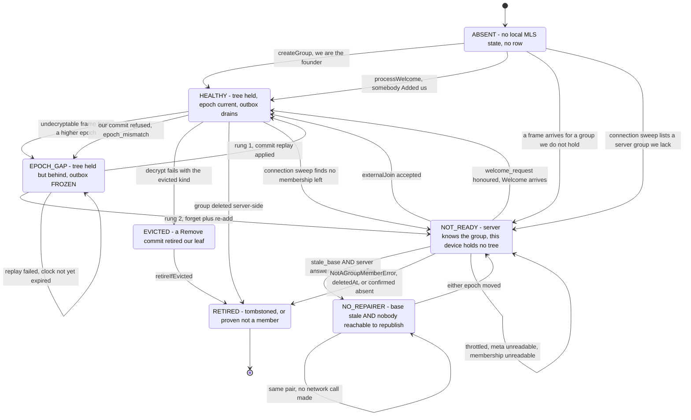
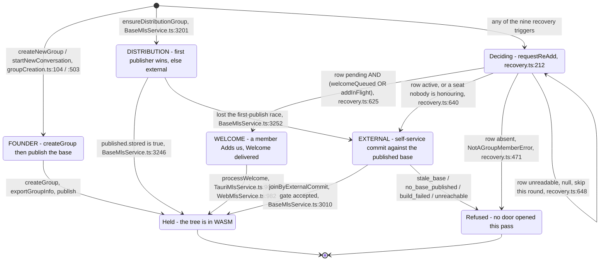
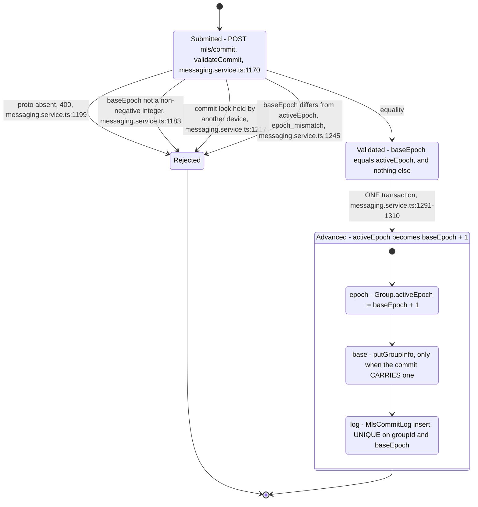
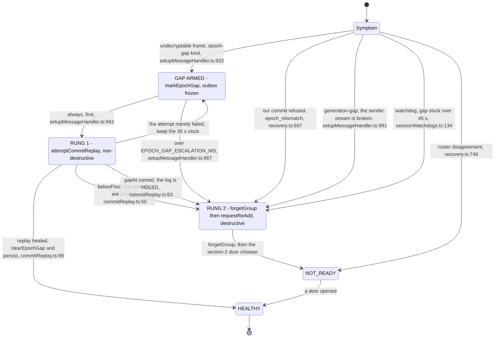
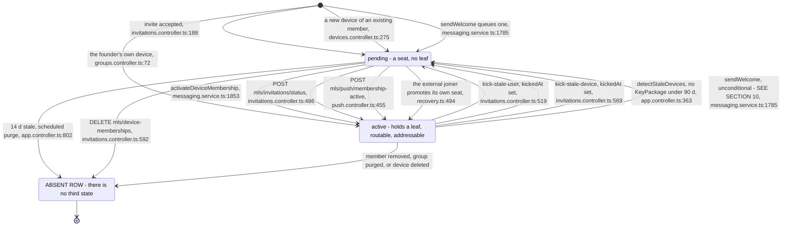
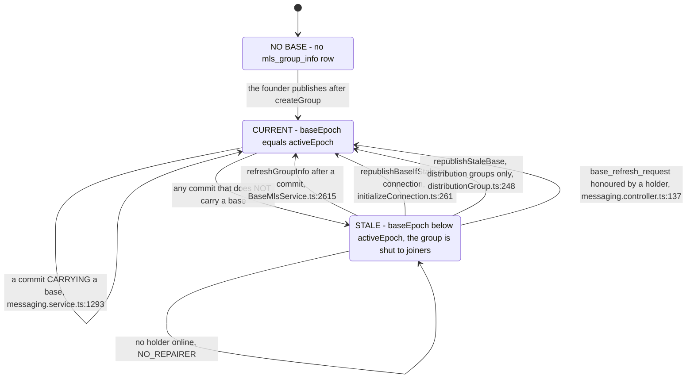
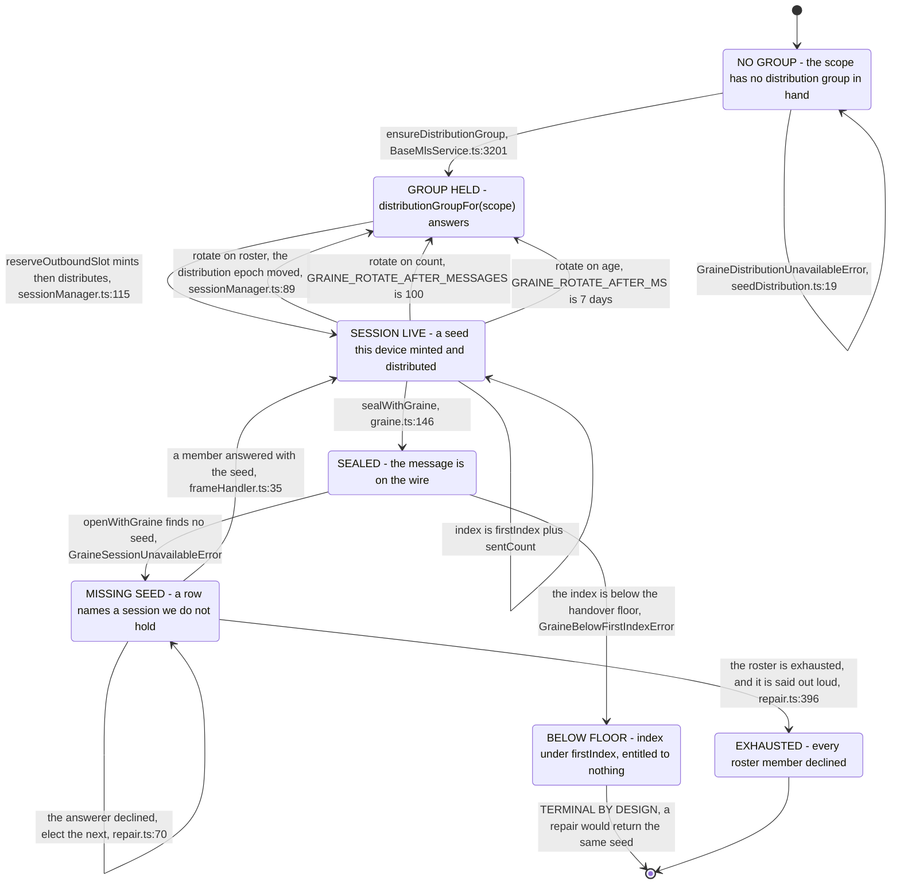

# The MLS and Graine state machine, drawn from the code

**STATUS 2026-09-12. THE SOURCE IS THE CODE, NOT THIS PAGE - and where the two disagreed, the wiki
was corrected rather than the diagram softened.** Five such disagreements were found drawing it and
they are in `CHANGELOG.md` under `[Unreleased]`; three mechanisms this wiki described had been
deleted outright.

Every transition below names the file and line that performs it. A transition with no `file:line` is
not in this page, because a state machine nobody can check against the source becomes the next stale
document. Line numbers drift; the function names do not, so a stale number is repaired by grepping
the name beside it.

**What this page is FOR, beyond documenting.** Two questions the diagrams are drawn to answer:

1. **Where are there SEVERAL paths to one outcome?** Section 8. A second path is a second place a
   fix has to land, and every duplicate here has already cost at least one defect.
2. **Where does a path DEAD-END?** Section 9. A state with no outgoing edge is a user stuck, and
   the triage in section 10 says which ones are worth a pull request.

**Perimeter** (chosen with the user, 2026-09-12): the MLS and Graine protocols, client and server,
**plus the transport state that actually decides** - the Redis routing sets, the add and commit
locks, the queued Welcomes, the FCM wakes. Device identity, key packages, the PIN and the factory
reset are OUT: they have their own lifecycle and their own pages.

**Related pages.** [mls-protocol](mls-protocol.md) is the reference for the entities and the wire;
[mls-recovery-ladder](mls-recovery-ladder.md) is the prose account of section 4;
[mls-desync-prevention](mls-desync-prevention.md) is the tactic list;
[channel-encryption](channel-encryption.md) is Graine's protocol page. This page is the only one
that draws them together, and the only one with diagrams.

---

## 1. The master diagram - what a conversation IS, at any instant

A conversation is in exactly one of these from THIS DEVICE's point of view. Two devices in the same
group are routinely in different states, which is the whole reason the recovery ladder exists.

**`NO_REPAIRER` is the one terminal state nobody decided on**, and it is the state the 2026-09-12
production incident sat in. It is reachable, it is correctly detected, it is correctly logged, and
nothing in the product can leave it except somebody else coming online. Section 9 says what that
costs.

---

## 2. Getting IN - the four doors, and which one is yours

There are exactly four ways a device comes to hold a tree, and which one it takes is not the
caller's choice: the server's own membership row decides, read at
[recovery.ts:625-655](../../../frontend/src/lib/utils/chat/recovery.ts).

**`pending` alone used to BE the answer, and it is a state read as an event.** The row says a member
was TOLD to Add this device; it says nothing about anyone doing it. The two extra facts -
`welcomeQueued` and `addInFlight` - are what separate "in flight for 200 ms" from "registered
yesterday and never honoured". Measured on production 2026-09-03: eleven groups, ten hours, 552
requests, zero queued Welcomes. **A server carrying neither field falls back to the old reading**,
because a native client ships its own frontend and an old APK talks to a new server
([recovery.ts:631-637](../../../frontend/src/lib/utils/chat/recovery.ts)).

**The external join builds its own successor base in the same breath**
([BaseMlsService.ts:3048-3068](../../../frontend/src/lib/services/BaseMlsService.ts)): an external
commit is applied to the returned instance at once, so for one moment only this device can export the
GroupInfo for the epoch its own commit produces. That base travels inside the submission, which is
what stops an external joiner locking the NEXT one out.

---

## 3. The commit gate - one number, one writer, one direction

Everything about epochs reduces to this. `dm_groups.activeEpoch` has exactly ONE writer.

**The three writes are in ONE transaction and the priority is deliberate**: the base row that makes
this advance survivable for every other device is not optional, and failing to write it fails the
commit. The cost is one retry by the committer, which `submitCommit` is already built for - against
a loss no later call can repair
([messaging.service.ts:1286-1290](../../../apps/chat-delivery-service/src/services/messaging.service.ts)).

**There is no path back.** Nothing writes `activeEpoch` to anything but `baseEpoch + 1`, so no group
can return to epoch 0. The `reset-epoch` route that once did is deleted, and the only
client that still called it - `bootstrap_dead_conversation` - is deleted with it (2026-09-12).

**The base is MONOTONIC**: `putGroupInfo` refuses a regression with `existing.baseEpoch >= baseEpoch`
- note `>=`, not `>` - and returns `{ stored: false }` rather than throwing
([messaging.service.ts:1507](../../../apps/chat-delivery-service/src/services/messaging.service.ts)).
That returned boolean is what the distribution-group first-publish race reads as its verdict.

---

## 4. The recovery ladder - two rungs, and where each is entered

**The two ways into rung 2 are NOT the same claim.** `belowFloor` or a named `gapAt` is a PROOF that
no amount of waiting produces the missing commits - escalating on the clock instead spends 30 s with
a frozen outbox while every arriving frame is ACKed and dropped, which is how twelve messages were
lost on production on 2026-09-02 (group `7da231f8`, epoch 121 absent from the commit log). A merely
failed attempt keeps the clock, because the next frame may well succeed.

**Four cadences, each answering a different question**
([sessionWatchdogs.ts](../../../frontend/src/lib/composables/session/sessionWatchdogs.ts),
[recovery.ts:22](../../../frontend/src/lib/utils/chat/recovery.ts)):

| Constant | Value | What it is for |
| --- | --- | --- |
| `WATCHDOG_TICK_MS` | 5 s | The resolution the stuck-gap net needs, and nothing else |
| `EPOCH_GAP_ESCALATION_MS` | 30 s | The reactive escalation, which gets first chance |
| `STUCK_EPOCH_GAP_MS` | 45 s | The net behind it, for a peer that then went quiet |
| `RECOVERY_SWEEP_MS` | 5 min | The safety net for a candidate no reactive trigger covers |
| `RECOVERY_TIMEOUT_MS` | 60 s | The per-group floor every caller of the seam is held to |

`isReAddDue` exists so the sweep can decline to ask a question already answered, without silencing a
REACTIVE caller - which carries new information, and the rate that arrives at is worth measuring
([recovery.ts:783](../../../frontend/src/lib/utils/chat/recovery.ts)).

---

## 5. The server's per-device membership - two values, and a marker

**THE ENUM HAS EXACTLY TWO VALUES** - `'pending' | 'active'`, since
`001_device_group_status_enum.sql`. There is no soft delete on this table, so a removal is an ABSENT
ROW, never a state. `kickedAt` is a MARKER on a `pending` row answering one question - *is this seat
waiting on a re-add a kick promised* - and it is what `reportStrandedDeviceMemberships` partitions
on ([app.controller.ts:542-543](../../../apps/chat-delivery-service/src/app.controller.ts)).

**The row decides who gets the message.** `sendMessage` resolves recipients with
`WHERE status = 'active'`
([messaging.service.ts:757](../../../apps/chat-delivery-service/src/services/messaging.service.ts)),
narrowed again by "has a static KeyPackage" - a device with none does not exist server-side, and
queueing for it is storage nothing will ever collect (WP-GHOST-1). The SENDER is checked too: a
`pending` sender is refused `sender_not_active`, because a device holding no leaf encrypts nothing
anyone can open
([messaging.service.ts:742](../../../apps/chat-delivery-service/src/services/messaging.service.ts)).

**Redis `group:members:<groupId>` is a SECOND roster**, written beside the SQL one at
[messaging.service.ts:1858](../../../apps/chat-delivery-service/src/services/messaging.service.ts)
and [:1800](../../../apps/chat-delivery-service/src/services/messaging.service.ts). SQL decides the
fan-out; Redis decides live routing. They are written by the same two functions and can still
disagree - section 10 has the case where they provably do.

---

## 6. The base, and the things that mint one

**The strict gate turns a stale base into a lockout.** `externalJoin` refuses one BEFORE the round
trip ([BaseMlsService.ts:3033](../../../frontend/src/lib/services/BaseMlsService.ts)): a base behind
the epoch is refused by the gate with certainty, and only a member holding the tree can mint a new
one. Never learn by failing what a fact could have told you.

**Two minters, not one, and a code comment still says otherwise.**
[BaseMlsService.ts:2609](../../../frontend/src/lib/services/BaseMlsService.ts) reads *"This is the
ONLY thing that mints a base"*. It is the only minter for an ORDINARY staged add or remove, which is
unapplied at submit time and has nothing to export. A commit that CARRIES a `groupInfo` - every
external join does - has its base written by `validateCommit` inside the same transaction. The wiki
carried the same false clause and was corrected; the comment is section 10's P3-1.

**`classifyBase` is the one classifier**, with five verdicts - `no-base-published`, `current`,
`server-did-not-say`, `this-device-is-behind-too`, `republish`
([staleBase.ts:74](../../../frontend/src/lib/utils/chat/staleBase.ts)). The third and fourth exist so
a device whose OWN tree is behind does not publish a base worse than the one already there.

---

## 7. Graine - a salon is not an MLS group

**The distinction the whole design rests on.** A salon's messages are sealed under a per-sender
SEED, and MLS is the courier that carries that seed to the people entitled to it - nothing more. The
server has never held a salon key. `isChannelConversationId` keeps the two apart and is checked at
every MLS seam ([channelCrypto.ts:182](../../../frontend/src/lib/utils/chat/channelCrypto.ts)).

**DISTRIBUTE BEFORE PERSIST, NEVER THE REVERSE**
([sessionManager.ts:106](../../../frontend/src/lib/utils/graine/sessionManager.ts)). Persisting first
and failing to distribute leaves a seed in hand that will be reused - every message under it
unreadable by everyone including its own author, permanently. Distributing first means a failure
leaves the seed nowhere: the send fails, and the next attempt mints again.

**The index is burned before the message is sent, and stays burned if the send fails.** A gap in the
indices costs nothing, since every message carries its own index and the receiver derives that key
directly. Re-handing an index out, on a send that failed after the server had it, costs the whole
session - two messages under one AES-GCM key, which leaves no trace at either end. The chain is
serialised per (channel, sender) to make that unrepresentable rather than unlikely.

**Rotation on ROSTER is the structural one, and it is why the epoch is stored at all.** Every
membership change commits to the scope's distribution group and moves its epoch, so an epoch that no
longer matches means the set of people holding this seed is no longer the set entitled to it.
Compared with `!==` rather than `<`: any disagreement is a disagreement. An ADD rotates a session it
did not have to, deliberately - the cost is one O(1) distribution, against a durable "somebody LEFT"
marker that is silently wrong the once it is missed.

**The repair terminates on a PROOF, not a count or a clock.** The answerer is elected
deterministically from the roster, so without the `declined` set the same member would be elected
for ever. Each decline removes one member from a finite roster, so the walk ends - on the seed
arriving, or on the roster being exhausted
([repair.ts:60-70](../../../frontend/src/lib/utils/graine/repair.ts)).

**The roster asked is the roster that HOLDS the seed.** On a private salon that is the salon's own
members: asking the community's would elect an answerer who cannot even see the request, since it
travels on the salon's own group
([repair.ts:180](../../../frontend/src/lib/utils/graine/repair.ts)).

**Graine has no wiki page of its own** and `channel-encryption.md` is the de-facto one for roughly
forty code files. That is section 10's P2-3.

---

## 8. Several paths to one thing - the duplicates

Ordered by what a second path costs. **A duplicate with a written justification is still a
duplicate**, and the justification is quoted so it can be argued with rather than assumed.

| # | The one thing | The paths | Justified in writing? | Verdict |
| --- | --- | --- | --- | --- |
| D1 | Promote a membership to `active` | `activateDeviceMembership` (messaging.service.ts:1853), `POST mls/invitations/status` (invitations.controller.ts:486), `POST mls/push/membership-active` (push.controller.ts:455), the external joiner's own call (recovery.ts:494) | Partly. recovery.ts:494: *"the Welcome path promotes the row and the inviter's path promotes it; this path never did, and it is the path this commit makes reachable, so it owes the same write"* | **TENABLE, BADLY SHAPED.** Four writers of one column, three of them HTTP routes. The justification defends adding the fourth CALL, not keeping four ROUTES. One route with three callers is the same fix with one seam. |
| D2 | Mint an external-join base | the `refreshGroupInfo` follow-up (BaseMlsService.ts:2615), `validateCommit`'s in-transaction `putGroupInfo` (messaging.service.ts:1293) | No - the comment at BaseMlsService.ts:2609 denies the second exists | **NOT A DUPLICATE, A DOCUMENTATION DEFECT.** The two cover disjoint cases: staged commits export nothing, carried commits export their own successor. P3-1. |
| D3 | Repair a stale base | `republishBaseIfStale` on connection (initializeConnection.ts:261), `republishStaleBase` for distribution groups (distributionGroup.ts:248), `base_refresh_request` honoured by a holder (messaging.controller.ts:137) | Yes. staleBase.ts:8 says the shared classifier exists because the repair it was extracted from *"runs for DISTRIBUTION groups only"* | **TENABLE.** One classifier, three trigger points, no second policy. Factorisation working as intended. |
| D4 | Decide a group needs recovery | nine call sites of `requestReAdd` - sessionAuth.ts:155/:183/:226, sessionConnection.ts:152, sessionWatchdogs.ts:155, useConversations.svelte.ts:1006, setupMessageHandler.ts:114, actions.ts:169, groupCreation.ts:582, outbox.ts:467 | Yes, by construction: the seam owns the throttle and the not-ready marker, so callers are triggers rather than policies | **TENABLE.** One seam, one cadence, nine reasons to ring it - the design the watchdog docblock argues for at length. |
| D5 | Sweep local groups against the server list | `initializeConnection.ts:170` and `discoverMissingGroups` in `actions.ts:384` | Half. initializeConnection.ts:190: *"The twin in `actions.ts` was fixed hours earlier and carries the same note"* | **NOT TENABLE.** A defect that had to be fixed TWICE, hours apart, with the second site cleared by a first audit that read the prose instead of the code. Two sweeps that destroy WASM state on the same predicate. P2-2. |
| D6 | Enter rung 2 | setupMessageHandler.ts:967 (read side), `recoverForkedGroup` (recovery.ts:697, write side), the watchdog's stuck-gap net (sessionWatchdogs.ts:134), `generation-gap` (setupMessageHandler.ts:991) | Yes. BaseMlsService.ts:2620: *"THE LADDER HAD EXACTLY ONE ENTRANCE, AND IT WAS THE READ SIDE"* - the write side was added deliberately | **TENABLE.** Four symptoms, one destructive action, and all four route through `forgetGroup` plus the section-2 door chooser. |
| D7 | Answer a `welcome_request` | foreground `handleWelcomeRequest` (actions.ts:750), background `POST mls/push/send-welcome-and-commit` (push.controller.ts:569) | Yes. push.controller.ts:604 calls the background path *"the single chokepoint for the background (push) re-add path - its foreground counterpart enforces the same check client-side in handleWelcomeRequest"* | **NOT TENABLE AS SHIPPED.** The justification is sound and the implementation broke it: the background half has been returning 400 since `proto` became mandatory. P1-1. |
| D8 | Hold a message back | `!isGroupHealthy` returns retry (outbox.ts:462), `isInEpochGap` inside `canSendInGroup` (groupUsability.ts:61), `epochSendBarrier.ts` | Yes. groupUsability.ts:58: it *"was written inline in the session layer as `isGroupHealthy` and had exactly one caller; the second caller would have re-derived it, and two facts are easy to compose wrongly"* | **TENABLE.** The extraction is the fix; what is left is the composed predicate and its two named halves. |
| D9 | Two rosters for one group | SQL `dm_device_group_memberships`, Redis `group:members:<groupId>` | `device-group-membership.entity.ts`, since 2026-09-12 | **TENABLE, AND NOW WRITTEN DOWN.** SQL decides the fan-out, Redis decides live routing - different questions, one writer each. The invariant was unstated, which is how P1-2 shipped; it is now in the entity docblock and asserted by `messaging.welcome-membership.spec.ts`. P2-4 done. |
| D10 | Forget a group | `forgetGroup` reached from six distinct sites in `BaseMlsService` alone, plus rung 2, plus both sweeps | No | **TENABLE.** One WASM primitive with many reasons to call it. The duplicated CONCERN is D5's, not this one's. |

---

## 9. Dead ends - a state with no way out

### What each one actually costs, measured (production, 2026-09-12)

The table below was written from the code. This one was read off production, read-only, on 58 live
groups and 361 accounts - because a dead end with no population is a hypothesis, and four of the
claims in the audit that produced this page did not survive the query.

| Claim | What production says | Verdict |
| --- | --- | --- |
| DE1/DE2 - a group nobody can repair | **1 of 58**: no published base at all AND no active holder. Three more sit exactly ONE epoch behind, which is a commit that just landed, not a dead end | **REAL, population 1** |
| DE8 - a `pending` seat nobody honours | 91 pending rows, **30** past the one-hour window with no queued Welcome, **all 30 classified `never added`** (zero `kickedAt`), oldest 10 days, **0** past the 14-day purge | **REAL, and already reported hourly and swept** |
| DE9 - a commit-log hole | **18 holes across 11 of 58 groups**, and **every single one is exactly ONE epoch wide** - including epoch 121. Two groups have no commits logged at all | **REAL, 19% of live groups** |
| A tombstoned group still carrying live state | 1432 tombstoned groups: **0** with an active membership, **0** with a queued message | **REFUTED - tombstoning is clean** |
| Legacy `queued_message.content` / `type` still in use | 5307 queued rows: **0** with legacy content, **0** without `proto` | **REFUTED - the columns are dead and droppable** |
| `revoked_device` rows outliving their device | 240 rows, oldest 2026-06-14: **0** whose device still holds a key package | **REFUTED - revocation purges what it bans** |
| `keyVersion` / `latestKeyRotationPayload` at defaults | `keyVersion`: **0 of 58** at default. `latestKeyRotationPayload`: **58 of 58 NULL** | **HALF REFUTED - the second column is dead** |
| `pending_welcome_notify:{userId}` leaking in Redis | 5 keys, **every one carrying a TTL** (6 h to 22 h). 57 `group:members` sets for 58 live groups | **REFUTED - in-flight state, not a leak** |

**The single-epoch width of every commit-log hole is the finding worth keeping.** Eighteen holes and
not one of them spans two epochs says these are individual commits that failed to be logged, not
ranges lost to an outage - which is a different defect with a different fix, and it is the shape a
count alone would have hidden.

| # | The dead end | How it is reached | Terminal by design? |
| --- | --- | --- | --- |
| DE1 | **`NO_REPAIRER`** - the published base is stale and the server answers `no_peer_online` | `externalJoin` returns `stale_base`, then `sendBaseRefreshRequest` answers `noPeerOnline` (recovery.ts:565-577) | **NO, AND IT IS NOW COUNTED.** It is left only when an epoch moves, which needs a holder online - the very thing that is absent. Correctly detected, correctly logged, no exit. `reportSingleHolderGroups` names the population one step from it, hourly (P1-3, 2026-09-12). |
| DE2 | **A group whose tree NO member holds any longer** | every holder lost its state; the base is stale or absent | **YES, AND IT CANNOT BE OTHERWISE.** Every entry into a group in RFC 9420 - Welcome, external commit, ReInit, subgroup branching, external proposals - requires a party holding the group secrets. This server holds only ciphertext. A server-side resurrection would be a backdoor, which is why the spec has none. **It is not hypothetical: one live group on production was in this state on 2026-09-12**, and `reportSingleHolderGroups` now names it hourly at ERROR. |
| DE3 | ~~**`bootstrap_dead_conversation`**~~ | ~~nothing reaches it~~ | **DELETED 2026-09-12 (P2-1).** It POSTed to `claim-bootstrap` then `reset-epoch`, both routes long gone, and no frontend caller ever invoked it. It was also the last thing in the product claiming DE2 is recoverable, which is the reason it is gone rather than merely unregistered. |
| DE4 | ~~**The background re-add returns 400**~~ | ~~`POST mls/push/send-welcome-and-commit` called `validateCommit` with no `proto`, which the guard at messaging.service.ts refuses~~ | **FIXED 2026-09-12 (P1-1).** The route now hands `proto: body.commitPayload` to `validateCommit`, and `baseEpoch` is required rather than optional - the optional branch broadcast without validating, which is the hole the guard exists to close. Covered by `push.controller.welcome-commit.spec.ts`, which this route did not have. |
| DE5 | **An outbox entry held for ever** | `!isGroupHealthy` returns `retry` with no attempt ceiling (outbox.ts:462) | **NO.** The two permanent failures are `group-deleted` and `evicted`; a group in `NO_REPAIRER` is neither, so the entry retries for the life of the install. P2-5. |
| DE6 | **`GraineBelowFirstIndexError`** | a seed handed over mid-session, and messages that precede the floor | **YES.** A repair would return the identical seed, so asking for one would loop for ever. The design says so (channelSeal.ts:60). |
| DE7 | **The Graine roster is exhausted** | every member of the roster declined the seed | **YES, AND IT TERMINATES ON A PROOF** rather than a count or a clock, and it is said out loud. |
| DE8 | **A `pending` row nobody honours** | a seat written with no Welcome queued and no add in flight | **NO, AND THE EXIT IS RECENT.** `readWelcomeOwed` returns `false`, the device serves itself an external join, and the row is named hourly by `reportStrandedDeviceMemberships`. Listed because that report is the only witness. |
| DE9 | **A commit-log hole** | a commit advanced the epoch with no row; `IDX_mls_commit_log_group_epoch` is UNIQUE on `(groupId, baseEpoch)`, so no later call can refill it | **TERMINAL FOR RUNG 1, BY CONSTRUCTION.** `gapAt` names it and sends the device straight to rung 2 rather than waiting out the clock. The hole never heals; the DEVICE does. |

---

## 10. Triage - what is worth a pull request

**Nothing here has been opened as a PR.** The user arbitrates (2026-09-12: *"Diagramme + triage,
puis tu arbitres"*). Each P1 was verified by reading the code, not by taking a search's word.

### P1 - a broken user-facing path

**P1-1. FIXED 2026-09-12. The background re-add was dead, and it is the path that rescues a
locked-out device.** `POST /mls/push/send-welcome-and-commit` called
`validateCommit({ groupId, deviceId, baseEpoch })` with **no `proto`**
([push.controller.ts](../../../apps/chat-delivery-service/src/controllers/push.controller.ts)), and
since `proto` became mandatory
([messaging.service.ts](../../../apps/chat-delivery-service/src/services/messaging.service.ts))
every such call threw a 400 **before the Welcome was sent** - on the FCM-woken path by which a phone
rescues a device that cannot join by itself. The guard's own comment asserted *"the only caller,
`submitCommit` in `frontend/src/lib/mls-client/mlsDeliveryApi.ts`"*: it enumerated the consumers that
MENTION the seam, not the ones that reach it, which is exactly what the repo rule about auditing a
seam's consumers exists to prevent.

The route now passes the commit as `proto`, and **`baseEpoch` is required** rather than optional.
The optional branch meant *broadcast without validating*, which advances the real MLS epoch while the
commit log gains no row - the permanent hole DE9 describes. It was not a compatibility shim: the
native JNI has returned `baseEpoch` since 2026-06-26, before `v0.10.0`, and the client floor is
0.14.0, so no client that can reach MLS at all could omit it. **The route had no test**;
`push.controller.welcome-commit.spec.ts` is that test, and it fails against the code this fixed.

**P1-2. FIXED 2026-09-12. `sendWelcome` demoted an active membership while telling Redis to keep
routing to it.** [messaging.service.ts](../../../apps/chat-delivery-service/src/services/messaging.service.ts)
upserted `status: 'pending'` with `skipUpdateIfNoValuesChanged` - which does NOT protect an `active`
row, because the value CHANGES - and then `sadd`ed the device into `group:members:<groupId>`. SQL
said `pending`, Redis said routable, and the SQL fan-out (`WHERE status = 'active'`) dropped it. The
comment directly above the write said *"Upsert DeviceGroupMembership to active"*. Reachable through
the roster disagreement `recoverRosterDisagreement` exists for.

**Two writes, two fixes, and the second is the one that restores an invariant the code already
declared.** The conflict clause now overwrites `kickedAt` and nothing else, so a Welcome cannot
demote - only `activateDeviceMembership` moves that column. And the `sadd` is **deleted** rather
than corrected: `sendMessage` states that `group:members:` is OWNED by `activateDeviceMembership`,
which writes it at the pending->active transition, and that its own reconciliation firing at all
"means an owner did not write". `sendWelcome` was a second writer of that set, announcing a device
as routable one line after recording that it had not joined - and the gateway both broadcasts from
that set and ELECTS an answerer for `welcome_request` out of it, so a device holding no group state
could be picked to serve one. Nothing replaces it: a device the Welcome has not reached cannot
decrypt a broadcast, and `activateDeviceMembership` adds it and replays what it missed (DF2) the
moment it can. `sendWelcome` had no test; it has one now.

**P1-3. MEASURED AND REPORTED 2026-09-12. `NO_REPAIRER` has no exit, and nothing counted how many
conversations were in it.** `reportStaleExternalJoinBases` (shipped in #526) finds stale BASES. It
does not find the population that decides availability, which is groups with **fewer than two
independent tree-holders**: a DM with one live leaf is one uninstall away from DE2. A predicate that
named the last incident is not the predicate that names the next one.

**The population was measured on production before the predicate was written**, because its shape
decided the predicate's shape. Of **58 live groups**:

| Holders (distinct users with an `active` device) | Groups | |
| --- | --- | --- |
| 0 | 1 | already DE2 |
| 1 | 9 | one uninstall from DE2 |
| 2 or more | 48 | |

**And the naive predicate was wrong, which only the measurement could have said.** Five of those ten
have fewer than two rows in `dm_group_members` - the authoritative answer to who is a member - so
they are one-person groups and orphans, not conversations. Reporting them would have made half of
every line noise. The shipped predicate requires `>= 2` user-level members, and it names **five real
conversations, one of them at epoch 284 with six devices sitting `pending` on it**.

`reportSingleHolderGroups` runs hourly beside the other three reports. It WARNs at one holder, where
there is still something to do, and ERRORs at zero, where there is not. **It repairs nothing,
because nothing can**: DE2 is terminal by RFC 9420 construction, so the only useful moment is before
it, and the only thing a server can contribute is to say which conversations are near it.

### P2 - correctness

- ~~**P2-1. Delete `bootstrap_dead_conversation`**~~ **DONE 2026-09-12.** The command, its module, its `use` and its registration are gone; `ForegroundCritical`, `write_mls_state_blob` and `force_create_group` each keep other callers and stay.
- **P2-2. Collapse D5**, the two group sweeps, into one predicate with one implementation. The twin cost the same fix twice.
- **P2-3. Graine has no wiki page**, for roughly forty code files. `channel-encryption.md` is the protocol; the seeds, the sessions, the repair walk, the roster reconcile and the retention sweep have no reference page.
- ~~**P2-4. State the SQL/Redis roster invariant** (D9) where a reader will find it, and assert it in a test.~~ **DONE 2026-09-12, with P1-2** - the invariant is in the `DeviceGroupMembership` docblock (one writer for `status`, one for the routing set, and `sendWelcome` is neither) and asserted by `messaging.welcome-membership.spec.ts`. Two rosters with no written invariant is how P1-2 shipped.
- **P2-5. Give the held outbox entry a terminal state** (DE5), or a report naming entries held beyond a threshold. A message held for ever looks, from the outside, exactly like one delivered.

### P3 - hygiene

- **P3-1.** `BaseMlsService.ts:2609` still says the follow-up `refreshGroupInfo` is *"the ONLY thing that mints a base"* (D2). Narrow it to the staged case, the way the wiki now is.
- **P3-2.** D1's four routes writing one column. One route, three callers.
- **P3-3.** This page is the first mermaid in `docs/`. If more follow, the convention is the one here: `stateDiagram-v2`, and a `file:line` on every transition.
