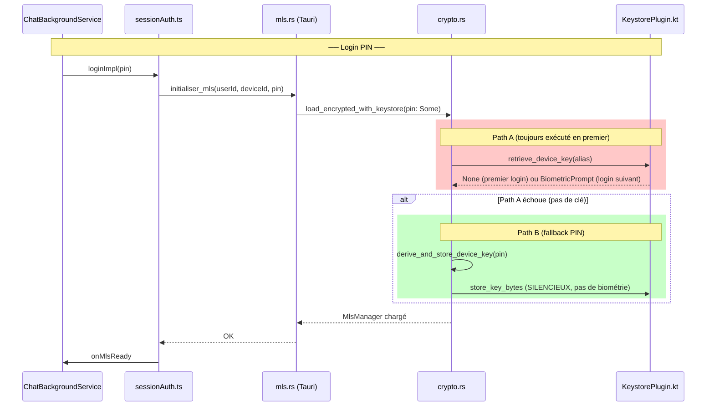

# Analyse des bugs du flux login Android

## Résumé exécutif

Le problème central est que [`load_encrypted_with_keystore`](frontend/mls-core/src/crypto.rs:103-164) exécute **systématiquement** le Path A (`retrieve_device_key`) **avant** le Path B (PIN), pour **tous** les logins. Sur Android, `retrieve_device_key` → `getKeyBytes` déclenche un `BiometricPrompt("Déverrouiller Canari")` dès que des données chiffrées existent dans SharedPreferences pour l'alias. Or, Path B stocke ces données **silencieusement** (sans prompt biométrique) lors du premier login PIN réussi. Résultat : tous les logins PIN ultérieurs déclenchent un BiometricPrompt intempestif.

---

## 1. Architecture du flux de login



### Chaîne d'appels clé

| Étape | Fichier | Fonction |
|-------|---------|----------|
| 1 | [`sessionAuth.ts:381`](frontend/src/lib/composables/session/sessionAuth.ts:381) | `mlsService.init(userId, pin, ...)` |
| 2 | [`mls.rs:12-45`](frontend/src-tauri/src/commands/mls.rs:12-45) | `initialiser_mls(pin)` → si `pin` non vide → `pin_opt = Some(pin)` |
| 3 | [`crypto.rs:103-164`](frontend/mls-core/src/crypto.rs:103-164) | `load_encrypted_with_keystore(user_id, device_id, blob, pin_opt, keystore)` |
| 4a | [`crypto.rs:113`](frontend/mls-core/src/crypto.rs:113) | **Path A** : `keystore.retrieve_device_key(&alias)` |
| 4b | [`crypto.rs:136-158`](frontend/mls-core/src/crypto.rs:136-158) | **Path B** : `derive_and_store_device_key(pin, salt, alias, keystore)` |
| 5a | [`keystore_bridge.rs:40-61`](frontend/src-tauri/src/keystore_bridge.rs:40-61) | `PluginDeviceKeyStore::retrieve_device_key` → `keystore().get_key_bytes(...)` |
| 5b | [`keystore_bridge.rs:29-38`](frontend/src-tauri/src/keystore_bridge.rs:29-38) | `PluginDeviceKeyStore::store_device_key` → `keystore().store_key_bytes(...)` |
| 6a | [`mobile.rs:56-63`](frontend/src-tauri/patches/tauri-plugin-keystore/src/mobile.rs:56-63) | `Keystore::get_key_bytes` → `run_mobile_plugin("getKeyBytes", ...)` |
| 6b | [`mobile.rs:48-52`](frontend/src-tauri/patches/tauri-plugin-keystore/src/mobile.rs:48-52) | `Keystore::store_key_bytes` → `run_mobile_plugin("storeKeyBytes", ...)` |
| 7a | [`KeystorePlugin.kt:337-395`](frontend/src-tauri/patches/tauri-plugin-keystore/android/src/main/java/KeystorePlugin.kt:337-395) | `getKeyBytes` → si SharedPreferences contient IV+ct → **BiometricPrompt("Déverrouiller Canari")** |
| 7b | [`KeystorePlugin.kt:315-329`](frontend/src-tauri/patches/tauri-plugin-keystore/android/src/main/java/KeystorePlugin.kt:315-329) | `storeKeyBytes` → chiffre et stocke dans SharedPreferences **sans biométrie** |

---

## 2. Détail des bugs et causes racines

### B1 : BiometricPrompt intempestif pendant le login PIN (sans "Stay signed in")

**Scénario** : OIDC → PinModal → tape le PIN (sans cocher "Stay signed in") → le modal système Android "Déverrouiller Canari" s'ouvre.

**Cause racine** : [`load_encrypted_with_keystore`](frontend/mls-core/src/crypto.rs:113) exécute le Path A (`retrieve_device_key`) **avant** toute considération du mode d'authentification (PIN vs biométrie).

**Mécanisme précis** :

1. **Premier login** : Path A → `retrieve_device_key` → `getKeyBytes` → `readCipherDataForAlias` retourne `null` (SharedPreferences vide) → `invoke.resolve({keyBytes: null})` → `retrieve_device_key` retourne `None` → **pas de BiometricPrompt** ✅
2. Path B s'exécute : `derive_and_store_device_key` → `storeDeviceKey` → `store_key_bytes` → `storeKeyBytes` dans Kotlin → chiffre la clé avec une clé AES AndroidKeyStore (`setUserAuthenticationRequired(false)`, ligne 463) → stocke IV + ciphertext dans SharedPreferences → **silencieux, pas de BiometricPrompt** ✅
3. **Login PIN suivant** : Path A → `retrieve_device_key` → `getKeyBytes` → `readCipherDataForAlias` retourne `(iv, ciphertext)` NON null → **BiometricPrompt("Déverrouiller Canari")** s'ouvre ❌

**Fichiers impliqués** :
- [`crypto.rs:103-133`](frontend/mls-core/src/crypto.rs:103-133) — Path A toujours exécuté en premier
- [`KeystorePlugin.kt:337-395`](frontend/src-tauri/patches/tauri-plugin-keystore/android/src/main/java/KeystorePlugin.kt:337-395) — `getKeyBytes` déclenche BiometricPrompt si données présentes
- [`KeystorePlugin.kt:448-467`](frontend/src-tauri/patches/tauri-plugin-keystore/android/src/main/java/KeystorePlugin.kt:448-467) — `generateBiometricProtectedKeyForAlias` avec `setUserAuthenticationRequired(false)` (stockage silencieux)

**Impact** : À chaque login PIN après le premier, l'utilisateur doit annuler un BiometricPrompt système parasite. L'annulation fait échouer `retrieve_device_key` (retourne `None`), puis Path B s'exécute normalement avec le PIN. Fonctionnellement le login réussit, mais l'UX est dégradée.

---

### B2 : BiometricPrompt demandé alors que l'utilisateur n'a jamais enrolé de biométrie Canari

**Scénario** : Login PIN + "Stay signed in" → BiometricPrompt (B1) → annule → decline enrollment → ferme/rouvre → BiometricPrompt s'ouvre à nouveau.

**Cause racine** : La même que B1, avec une précision importante : le `BiometricPrompt` déclenché par `getKeyBytes` est un **pure UX gate**, pas lié au flag applicatif `canari_biometric_configured`.

**Mécanisme précis** :

Dans [`KeystorePlugin.kt:393-394`](frontend/src-tauri/patches/tauri-plugin-keystore/android/src/main/java/KeystorePlugin.kt:393-394) :
```kotlin
// No CryptoObject — biometric is a pure UX gate, not a crypto requirement.
biometricPrompt.authenticate(promptInfo)
```

Le `BiometricPrompt.authenticate(promptInfo)` SANS `CryptoObject` signifie que :
- N'importe quelle empreinte enregistrée au niveau OS Android suffit
- Aucun lien avec le flag `canari_biometric_configured` (localStorage)
- La clé AES AndroidKeyStore sous-jacente a `setUserAuthenticationRequired(false)` (ligne 463)
- Le déchiffrement dans `onAuthenticationSucceeded` (ligne 360-361) utilise `getDecryptionCipherForAlias` qui initialise le cipher SANS contrainte biométrique

**Pourquoi le message "notifications push dégradées" apparaît** : Après annulation répétée du BiometricPrompt, le flux peut arriver dans un état où `check_push_secret_health` retourne `no_secret` (ligne 452 de [`sessionAuth.ts`](frontend/src/lib/composables/session/sessionAuth.ts:452)), ce qui déclenche l'erreur `keystore_lost`.

---

### B3 : PIN demandé au lieu de l'empreinte après enrollment biométrique réussi

**Scénario** : Login PIN + "Stay signed in" → BiometricPrompt (B1) → annule → accepte enrollment → met son empreinte → ferme/rouvre → le PIN modal s'affiche au lieu du BiometricBottomSheet.

**Cause racine** : Le flag `canari_biometric_configured` et/ou le `mls_device_id` dans `localStorage` sont probablement perdus entre les sessions (process kill Android), faisant échouer la vérification `isBiometricConfigured()` ou `isKeyPresent()` dans [`startLoginFlow`](frontend/src/lib/components/layout/ChatBackgroundService.svelte:720-756).

**Mécanisme précis** :

Le flux `startLoginFlow` pour la branche biométrique (lignes 720-756) nécessite **trois conditions** :

```typescript
// Condition 1 : Flag biométrique
const isBiometricConfigured = await BiometricService.isConfigured();  // ligne 723

// Condition 2 : Device ID existant
const storedDeviceId = localStorage.getItem(`mls_device_id_${savedUser}`);  // ligne 727
const hasExistingDevice = storedDeviceId !== null;

// Condition 3 : Clé présente dans le keystore
const alias = `mls_device_key_${savedUser}_${storedDeviceId}`;
const keyPresent = await BiometricService.isKeyPresent(alias);  // ligne 732
```

Si l'une de ces conditions échoue, le flux passe par `nativeStorageLogin` (ligne 765) → PinVault vide (car `clearPinAndKey()` a été appelé dans [`enrollBiometricImpl`](frontend/src/lib/composables/session/sessionBiometrics.ts:75)) → fallback vers `openPinModal` (ligne 778) → **PIN modal affiché au lieu du BiometricBottomSheet**.

**Hypothèses sur la cause précise** (à confirmer par reproduction) :

| Hypothèse | Probabilité | Détail |
|-----------|-------------|--------|
| `localStorage` vidé par Android (process kill) | Élevée | [`BiometricService.isConfigured()`](frontend/src/lib/services/biometric.ts:71-85) vérifie d'abord `localStorage`. Le fallback natif (`native_flags.json`) est fiable (écrit sur disque), mais si les deux échouent, `isConfigured()` retourne `false`. |
| `mls_device_id_{userId}` perdu dans localStorage | Moyenne | Si ce localStorage est vidé, `hasExistingDevice = false` → pas de branche biométrique. |
| Alias incorrect (deviceId changé) | Faible | Le `deviceId` devrait être stable pour un même appareil. |

**Note** : `enrollBiometricImpl` stocke bien le flag dans les deux stores :
- `localStorage.setItem('canari_biometric_configured', 'true')` (ligne 46 de [`biometric.ts`](frontend/src/lib/services/biometric.ts:46))
- `invoke('set_native_flag', { key: 'biometricConfigured', value: true })` (ligne 48)

Et `isKeyPresent` appelle `hasKeyBytes` (ligne 107 de [`biometric.ts`](frontend/src/lib/services/biometric.ts:107)) qui lit SharedPreferences sans BiometricPrompt (lignes 430-437 de [`KeystorePlugin.kt`](frontend/src-tauri/patches/tauri-plugin-keystore/android/src/main/java/KeystorePlugin.kt:430-437)).

---

### B4 : Boucle infinie dans les paramètres (refresh token en boucle)

**Scénario** : Après échec du login biométrique (B3) et refus du PIN, l'utilisateur se retrouve bloqué avec une boucle de refresh token dans les paramètres.

**Cause racine** : Non directement liée au flux de login. Il s'agit probablement d'un problème distinct dans la gestion du `SessionExpiredError` ou des appels API qui retentent indéfiniment après un 401. Cette investigation nécessite l'analyse du code des paramètres (settings page), hors périmètre des fichiers analysés ici.

**Recommandation** : Investiguer séparément le composant Settings et le mécanisme de refresh token.

---

## 3. Questions spécifiques

### Q1 : Quand `load_encrypted_with_keystore` est appelé avec un PIN, le Path A est-il exécuté ?

**Oui, systématiquement.** Le code à la ligne 113 de [`crypto.rs`](frontend/mls-core/src/crypto.rs:113) ne vérifie PAS si un PIN a été fourni avant d'exécuter Path A :

```rust
// Path A: keystore has a key for this device — use it directly.
if let Some(key) = keystore.retrieve_device_key(&alias) {
    // ... utilise la clé ...
}

// Path B: no (valid) keystore key — fall back to PIN.
match pin {
    Some(pin_str) => { /* ... */ }
    None => Err(...)
}
```

Le `pin` n'est vérifié qu'au Path B, après l'échec du Path A. Path A est donc toujours tenté en premier, quel que soit le mode d'authentification.

### Q2 : `retrieve_device_key` sur Android déclenche-t-il vraiment un BiometricPrompt ?

**Oui, conditionnellement.** Dans [`KeystorePlugin.kt`](frontend/src-tauri/patches/tauri-plugin-keystore/android/src/main/java/KeystorePlugin.kt:337-395) :

- Si `readCipherDataForAlias(alias)` retourne `null` → retour immédiat SANS BiometricPrompt ✅
- Si `readCipherDataForAlias(alias)` retourne des données → **BiometricPrompt("Déverrouiller Canari")** s'ouvre ❌

Le BiometricPrompt utilise `authenticate(promptInfo)` SANS `CryptoObject` (ligne 394). C'est un **pure UX gate** — le cipher sous-jacent n'a PAS de contrainte biométrique (`setUserAuthenticationRequired(false)`, ligne 463).

### Q3 : Pourquoi `isBiometricConfigured()` pourrait retourner `false` après enrollment ?

Plusieurs raisons possibles :

1. **`localStorage` vidé par Android** : Sur certains ROM (MIUI, OnePlus, etc.), `localStorage` (WebView) peut être effacé entre les sessions. Le fallback natif via [`get_native_flags`](frontend/src-tauri/src/commands/storage.rs:168-185) lit `native_flags.json` sur disque, ce qui est plus fiable. Mais si ce fichier est aussi corrompu ou inaccessible, `isConfigured()` retourne `false`.

2. **Race condition** : Si l'enrollment est interrompu (crash, kill process) entre `authenticate()` et `localStorage.setItem()`, le flag n'est jamais persisté.

3. **`deviceId` manquant** : Si `mls_device_id_{userId}` est absent du localStorage, `hasExistingDevice = false` → le flux biométrique est court-circuité même si `isConfigured()` retourne `true`.

### Q4 : Pourquoi une boucle infinie dans les paramètres ?

Cette question est hors périmètre des fichiers analysés. Elle nécessite l'analyse du code de la page Settings et du mécanisme de refresh token. Probablement liée à une tentative de rafraîchissement de token qui échoue en boucle après un `SessionExpiredError`.

### Q5 : `derive_and_store_device_key` (Path B) doit-il continuer à s'exécuter en mode PIN ?

**Oui**, pour deux raisons :

1. **Push notifications** : La clé stockée dans le keystore est utilisée par [`push_context.json`](frontend/src-tauri/src/commands/push.rs) pour déchiffrer les messages MLS en arrière-plan (FCM). Sans cette clé, les push notifications ne peuvent pas déchiffrer les messages.

2. **Transition PIN → biométrie** : Le stockage de la clé dans le keystore pendant le login PIN permet à l'utilisateur d'activer la biométrie plus tard (via la bannière d'enrollment) sans avoir à re-saisir son PIN.

Le problème n'est PAS le stockage de la clé (Path B), mais la **tentative systématique de lecture** (Path A) avant de savoir si l'utilisateur veut s'authentifier par PIN ou par biométrie.

---

## 4. Solutions proposées

### Solution S1 (recommandée) : Court-circuiter Path A quand un PIN est fourni

**Principe** : Si `pin.is_some()`, l'utilisateur a explicitement choisi de s'authentifier par PIN → skip Path A, aller directement à Path B.

**Fichier à modifier** : [`crypto.rs`](frontend/mls-core/src/crypto.rs:103-164), fonction `load_encrypted_with_keystore`

**Changement** : Inverser la priorité : vérifier d'abord si un PIN est fourni. Si oui, exécuter Path B directement. Path A n'est tenté que si `pin.is_none()` (mode biométrique).

```rust
// Avant (actuel) : Path A toujours en premier
if let Some(key) = keystore.retrieve_device_key(&alias) { ... }
match pin { ... }

// Après (proposé) : PIN fourni → Path B directement
match pin {
    Some(pin_str) => {
        // L'utilisateur a saisi son PIN : ne PAS tenter le keystore
        // (évite le BiometricPrompt intempestif)
        // ... Path B ...
    }
    None => {
        // Mode biométrique : tenter le keystore
        if let Some(key) = keystore.retrieve_device_key(&alias) { ... }
        else { Err("No keystore key and no PIN provided") }
    }
}
```

**Avantages** :
- Résout B1 et B2 définitivement
- Changement minimal (une fonction, un seul fichier)
- Aucun impact sur le flux biométrique (qui passe `pin = None`)
- Aucun impact sur le stockage de la clé (Path B continue de stocker)
- Aucun impact sur les push notifications (la clé reste dans le keystore)

**Inconvénients** :
- Si la clé keystore est valide mais que l'utilisateur saisit son PIN quand même, on dérive la clé depuis le PIN au lieu d'utiliser la clé keystore existante. Ce n'est pas un problème car la clé dérivée est identique (même PIN, même sel → même clé Argon2id).

### Solution S2 (alternative) : Ajouter un paramètre `skip_keystore` au niveau de `initialiser_mls`

**Principe** : Le frontend sait s'il est en mode PIN ou biométrie. Ajouter un booléen `skip_keystore: bool` à la commande Tauri `initialiser_mls` pour permettre au frontend de désactiver explicitement Path A.

**Fichiers à modifier** :
- [`mls.rs`](frontend/src-tauri/src/commands/mls.rs:12-45) — ajouter le paramètre `skip_keystore`
- [`crypto.rs`](frontend/mls-core/src/crypto.rs:103-164) — propager le flag à `load_encrypted_with_keystore`
- [`sessionAuth.ts`](frontend/src/lib/composables/session/sessionAuth.ts:381) — passer `skip_keystore: true` quand `!isBiometric`

**Avantages** : Plus explicite, séparation claire des deux modes.

**Inconvénients** : Plus de changements (3 fichiers), risque de divergence si un appelant oublie de passer le flag.

### Solution S3 (renforcement) : Fiabiliser la persistance des flags pour B3

**Principe** : S'assurer que le flag `biometricConfigured` et le `deviceId` survivent aux process kills Android.

**Fichiers à modifier** :
- [`sessionAuth.ts`](frontend/src/lib/composables/session/sessionAuth.ts:405) — après `setMyDeviceId`, persister aussi dans le store natif
- [`sessionBiometrics.ts`](frontend/src/lib/composables/session/sessionBiometrics.ts:64-91) — ajouter une vérification post-enrollment que le flag est bien lisible

**Changements** :
1. Dans `loginImpl`, après `ctx.setMyDeviceId(mlsService.getDeviceId())`, ajouter :
   ```typescript
   if (isTauriRuntime()) {
     await invoke('set_native_flag', { key: `mls_device_id_${ctx.getUserId()}`, value: ctx.getMyDeviceId() });
   }
   ```
2. Dans `startLoginFlow`, si `hasExistingDevice` est `false` dans localStorage, tenter un fallback natif (comme le fait déjà `isConfigured()`).
3. Ajouter un mécanisme de re-stockage : si `isConfigured()` est `true` mais `isKeyPresent()` est `false`, proposer à l'utilisateur de re-saisir son PIN une fois pour re-stocker la clé, puis basculer en biométrie.

---

## 5. Impact global et recommandation

### Solution recommandée

**S1** (inversion de priorité Path A/Path B dans `load_encrypted_with_keystore`) est la solution recommandée car :

1. Elle résout le problème à la source (B1, B2)
2. Changement minimal et localisé
3. Aucune régression pour le flux biométrique
4. Aucun impact sur les push notifications
5. Le comportement devient : "si l'utilisateur fournit un PIN, utiliser le PIN ; sinon, utiliser le keystore" — ce qui est l'intention originale

### Plan de mise en œuvre

| Étape | Fichier | Action |
|-------|---------|--------|
| 1 | [`crypto.rs`](frontend/mls-core/src/crypto.rs:103-164) | Inverser Path A/Path B : si `pin.is_some()`, exécuter Path B directement ; Path A seulement si `pin.is_none()` |
| 2 | [`sessionAuth.ts`](frontend/src/lib/composables/session/sessionAuth.ts:405) | Persister `mls_device_id` dans le store natif en plus du localStorage (renforcement B3) |
| 3 | [`ChatBackgroundService.svelte`](frontend/src/lib/components/layout/ChatBackgroundService.svelte:720-756) | Ajouter fallback natif pour `hasExistingDevice` (renforcement B3) |

### Note sur B4

La boucle infinie de refresh token dans les paramètres est un bug distinct qui nécessite une investigation séparée du code de la page Settings.
