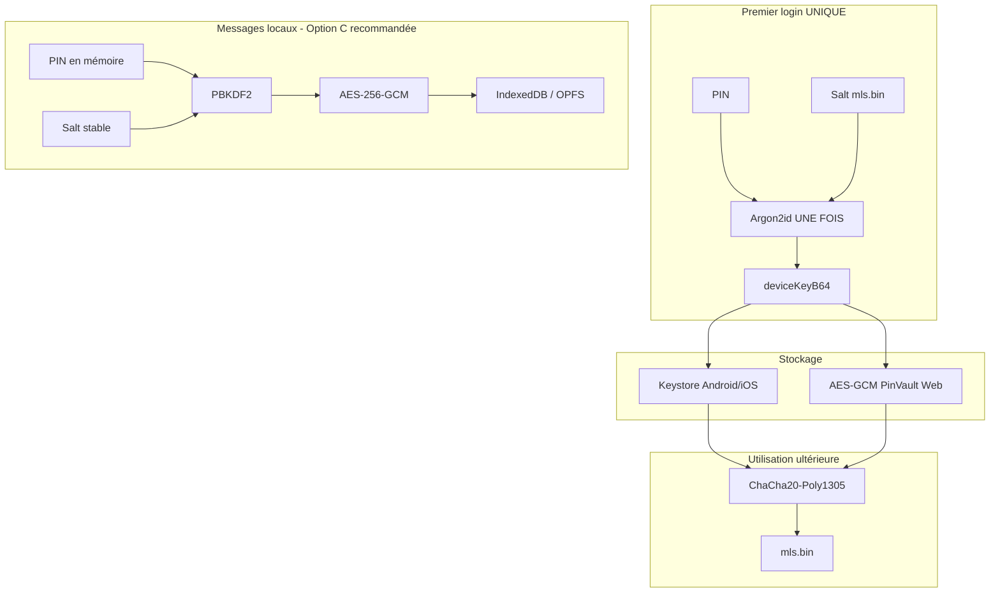

# Analyse de faisabilité : Remplacement du PIN par `deviceKeyB64`

> **Objectif :** Après le premier login, `deviceKeyB64` remplace le PIN pour toutes les opérations de chiffrement. Plus jamais besoin d'Argon2id (ni de PBKDF2).

---

## 1. État des lieux : où le PIN est utilisé aujourd'hui

### 1.1 Vue d'ensemble

```mermaid
flowchart TB
    subgraph "Premier login (C3)"
        PIN[PIN utilisateur] --> ARGON[Argon2id]
        SALT1[Salt aléatoire 16B] --> ARGON
        ARGON --> DEVKEY[deviceKeyB64 = clé 32B]
        DEVKEY --> KS[Keystore Android/iOS]
        DEVKEY --> PVC[PinVault AES-GCM - À CRÉER]
    end

    subgraph "Chiffrement mls.bin (actuel)"
        PIN2[PIN] --> ARGON2[Argon2id]
        SALT2[Salt 16B dans mls.bin] --> ARGON2
        ARGON2 --> CHACHA[ChaCha20-Poly1305]
        CHACHA --> MLSBIN[mls.bin]
    end

    subgraph "Chiffrement messages locaux (actuel)"
        PIN3[PIN] --> PBKDF[PBKDF2-HMAC-SHA256]
        SALT3[Salt stable par user] --> PBKDF
        PBKDF --> AESGCM[AES-256-GCM]
        AESGCM --> IDB[IndexedDB / OPFS]
    end

    subgraph "PinVault (actuel)"
        PIN4[PIN] --> AESGCM2[AES-GCM Web Crypto]
        AESGCM2 --> LS[localStorage / sessionStorage]
    end
```



### 1.2 Détail par fichier

| Fichier | Fonction(s) | Rôle du PIN | KDF utilisé |
|---|---|---|---|
| [`security.rs`](frontend/mls-core/src/security.rs) | `encrypt_state_with_pin`, `derive_key_from_pin` | Dérivation clé mls.bin | **Argon2id** |
| [`crypto.rs`](frontend/mls-core/src/crypto.rs) | `save_encrypted`, `load_encrypted` | Chiffrement/déchiffrement mls.bin | **Argon2id** |
| [`crypto.rs:39`](frontend/mls-core/src/crypto.rs:39) | `save_encrypted_with_key` | Chiffrement mls.bin avec clé pré-dérivée | **Aucun** ✅ |
| [`crypto.rs:171`](frontend/mls-core/src/crypto.rs:171) | `load_with_key` | Déchiffrement mls.bin avec clé pré-dérivée | **Aucun** ✅ |
| [`pin_crypto.rs`](frontend/mls-wasm/src/pin_crypto.rs) | `encrypt_with_pin`, `decrypt_with_pin` | WASM bindings pour mls.bin | **Argon2id** |
| [`encryption.ts`](frontend/src/lib/encryption.ts) | `encryptData`, `decryptData` | Chiffrement messages locaux | **PBKDF2** |
| [`pinVault.ts`](frontend/src/lib/utils/pinVault.ts) | `savePin`, `loadPin` | Stockage du PIN raw (AES-GCM) | **Aucun** (stockage) |
| [`sessionAuth.ts`](frontend/src/lib/composables/session/sessionAuth.ts) | `loginImpl`, `nativeStorageLoginImpl` | Flow d'authentification | Appelle les autres |
| [`TauriMlsService.ts`](frontend/src/lib/services/TauriMlsService.ts) | `saveState`, `changePIN`, `_initImpl` | Orchestration Tauri | Délègue au Rust |
| [`WebMlsService.ts`](frontend/src/lib/services/WebMlsService.ts) | `saveState`, `changePIN`, `_initImpl` | Orchestration Web | Délègue au WASM |
| [`pinChange.ts`](frontend/src/lib/utils/chat/pinChange.ts) | `performPinChange`, `reencryptLocalMessages` | Rotation de PIN | **PBKDF2** |
| [`sqlite.ts`](frontend/src/lib/db/sqlite.ts), [`indexeddb.ts`](frontend/src/lib/db/indexeddb.ts) | `saveMessages` | Persistance messages | **PBKDF2** (via `encryption.ts`) |

### 1.3 Ce qui est déjà migré (`deviceKeyB64`)

| Stockage | Statut |
|---|---|
| Keystore Android/iOS | ✅ `deviceKeyB64` déjà stocké |
| `push_context.json` | ✅ `deviceKeyB64` déjà présent |
| PinVault (Web/Desktop) | ❌ Stocke le PIN raw, pas `deviceKeyB64` |

---

## 2. Réponse aux questions

### 2.1 Peut-on remplacer `encrypt_state_with_pin` par `encrypt_state_with_key` ?

**Oui, et le code existe déjà.** Les fonctions [`save_encrypted_with_key`](frontend/mls-core/src/crypto.rs:39) et [`load_with_key`](frontend/mls-core/src/crypto.rs:171) font exactement cela :

- `save_encrypted_with_key(key)` : génère un salt frais (ignoré au reload), chiffre avec ChaCha20 directement
- `load_with_key(key)` : ignore le salt, déchiffre avec ChaCha20 directement

**Format de `mls.bin` : inchangé.** Le format `[salt 16] [nonce 12 || ciphertext]` reste identique. La seule différence : avec `load_with_key`, le salt est ignoré (la clé est déjà dérivée).

Le `salt` est conservé dans le format pour deux raisons :
1. Rétrocompatibilité avec l'ancien chemin Argon2id
2. Migration transparente (on peut relire un vieux `mls.bin` avec l'ancien PIN puis le ré-écrire avec la clé)

### 2.2 Où stocker `deviceKeyB64` sur le Web ?

**PinVault AES-GCM, comme le PIN actuellement.** Le `deviceKeyB64` est déjà une clé cryptographique de 32 bytes ; le stocker chiffré avec AES-GCM ajoute une couche de défense en profondeur (même si la wrap key est dans le même storage).

Risque Web spécifique : **pas de keystore hardware**. Si l'utilisateur vide son localStorage, `deviceKeyB64` est perdu. Avec le PIN actuel, l'utilisateur peut le ressaisir. Avec `deviceKeyB64`, il faudrait re-saisir le PIN pour re-dériver la clé → mécanisme de fallback nécessaire.

### 2.3 Comment gérer la transition des `mls.bin` existants ?

**Migration paresseuse au prochain login :**

```
1. L'utilisateur saisit son PIN (comme aujourd'hui)
2. On extrait le salt du mls.bin existant
3. On dérive deviceKeyB64 = Argon2id(PIN, salt) — UNE DERNIÈRE FOIS
4. On déchiffre mls.bin avec cette clé
5. On stocke deviceKeyB64 dans PinVault + Keystore
6. On ré-écrit mls.bin via save_encrypted_with_key(deviceKeyB64)
7. Pour les prochains lancements : load_with_key(deviceKeyB64)
```

**Aucun changement de format, aucune migration de masse.** C'est une migration paresseuse, par appareil, au prochain login.

**Cas du PIN changé sur un autre appareil :** Le `mls.bin` local est chiffré avec l'ancien PIN. `load_with_key(deviceKeyB64_nouveau)` échouera → le flux existant `MLS_LOCAL_STATE_UNDECRYPTABLE` s'enclenche, l'utilisateur saisit l'ancien PIN → on dérive l'ancienne clé → on ré-encrypte avec la nouvelle.

### 2.4 Impact sur `changePIN`

Aujourd'hui :

```
changePIN(newPin):
  1. pinCheck(newPin) côté serveur
  2. mlsService.changePIN(newPin) → ré-encrypte mls.bin avec newPin
  3. reencryptLocalMessages(storage, oldPin, newPin) → ré-encrypte tous les messages
  4. applyNewPinLocally → savePin(newPin) + supprime ancienne clé keystore
```

Avec `deviceKeyB64` :

```
changePIN(newPin):
  1. pinCheck(newPin) côté serveur (inchangé)
  2. newDeviceKey = Argon2id(newPin, salt_from_mls.bin) — Argon2id UNE FOIS
  3. mlsService.changeStateKey(newDeviceKey) → ré-encrypte mls.bin avec newDeviceKey
  4. reencryptLocalMessages(storage, oldDeviceKey, newDeviceKey) → ré-encrypte messages
  5. applyNewDeviceKeyLocally → saveDeviceKey(newDeviceKeyB64) + met à jour keystore
```

**La complexité du `changePIN` augmente** car il faut maintenant gérer deux clés (device key pour mls.bin + message key pour les messages locaux). Si on unifie les deux (même clé pour tout), c'est plus simple mais moins sécurisé (cf. §5).

### 2.5 Premier login (C3)

**Ok.** Le flux C3 est le cas normal où `deviceKeyB64` n'existe pas encore :

```
1. L'utilisateur saisit son PIN
2. On fetch le salt serveur → pinCheck
3. mlsService.init(userId, pin, state) → Argon2id une fois
4. On dérive deviceKeyB64 et on le stocke (PinVault + Keystore)
5. On écrit mls.bin avec save_encrypted_with_key(deviceKeyB64)
```

### 2.6 Mode biométrique (C5)

**Presque aucun changement.** Le flux C5 utilise déjà [`load_encrypted_with_keystore`](frontend/mls-core/src/crypto.rs:102) avec `pin: None` → la clé vient du keystore → elle est déjà une `deviceKeyB64`.

---

## 3. Changements nécessaires par fichier

### 3.1 [`crypto.rs`](frontend/mls-core/src/crypto.rs) — Rust MLS Core

| Changement | Impact |
|---|---|
| `save_encrypted` : déprécier, rediriger vers `save_encrypted_with_key` | Faible |
| `load_encrypted` : déprécier, rediriger vers `load_with_key` | Faible |
| `load_encrypted_owned` : idem | Faible |
| Ajouter `load_with_key_owned` (zeroize) | Faible |
| `load_encrypted_with_keystore` : simplifier (le chemin PIN dérive déjà la clé) | Faible |

### 3.2 [`security.rs`](frontend/mls-core/src/security.rs) — Rust Security

| Changement | Impact |
|---|---|
| `encrypt_state_with_pin` : marquer `#[deprecated]`, conserver pour migration | Faible |
| `derive_key_from_pin` : conserver (nécessaire pour first login + changePIN) | Aucun |
| `derive_and_store_device_key` : déjà fait ✅ | Aucun |

### 3.3 [`pin_crypto.rs`](frontend/mls-wasm/src/pin_crypto.rs) — WASM Bindings

| Changement | Impact |
|---|---|
| Ajouter `encrypt_with_key(key_b64, data)` → `encrypt_blob` | Faible |
| Ajouter `decrypt_with_key(key_b64, encrypted_data)` → `decrypt_blob` | Faible |
| `encrypt_with_pin` / `decrypt_with_pin` : conserver pour migration | Aucun |

### 3.4 [`pinVault.ts`](frontend/src/lib/utils/pinVault.ts) — Stockage local

**Changement le plus important côté TypeScript :**

| Changement | Impact |
|---|---|
| Renommer `savePin` → `saveDeviceKey` (ou garder le nom, changer le contenu) | **Moyen** |
| Renommer `loadPin` → `loadDeviceKey` (retourne `string \| null`, base64 de 32B) | **Moyen** |
| `clearPinAndKey` : inchangé (nettoie le storage) | Aucun |
| `isPinPersistenceEnabled` : renommer `isDeviceKeyPersistenceEnabled` ? Optionnel | Faible |
| `setPinPersistence` : idem | Faible |

**Note importante :** `deviceKeyB64` fait ~44 caractères (base64 de 32 bytes). C'est plus long que le PIN (6-8 chiffres) mais le mécanisme AES-GCM reste identique.

### 3.5 [`sessionAuth.ts`](frontend/src/lib/composables/session/sessionAuth.ts) — Flow d'auth

| Changement | Impact |
|---|---|
| `loginImpl` : après `mlsService.init()`, appeler `saveDeviceKey(deviceKeyB64)` au lieu de `savePin(pin)` | **Moyen** |
| `nativeStorageLoginImpl` : appeler `loadDeviceKey()` au lieu de `loadPin()` | **Moyen** |
| `SessionContext` : ajouter `getDeviceKey(): string`, `setDeviceKey(v: string)` | **Moyen** |
| Tous les appels à `ctx.getPin()` pour le chiffrement → `ctx.getDeviceKey()` | **Élevé** (beaucoup d'occurrences) |
| `biometricLoginImpl` : inchangé (utilise déjà le keystore) | Aucun |
| `recoverPinImpl` : adapter pour utiliser `deviceKeyB64` | Moyen |

**Attention :** [`ctx.getPin()`](frontend/src/lib/composables/session/sessionAuth.ts) est appelé dans de très nombreux endroits :
- `makeRecoveryDeps` (ligne 95)
- `makeOutboxDeps` (ligne 119)
- `setupMessageHandler` (ligne 565)
- `handleWelcomeRequest` (ligne 618)
- `handleHistoryRequest` (ligne 744)
- `initializeConnection` (ligne 768)
- etc.

**Chaque appelant doit être audité** pour déterminer s'il a besoin du PIN (vérification serveur) ou de la clé (chiffrement local).

### 3.6 [`TauriMlsService.ts`](frontend/src/lib/services/TauriMlsService.ts)

| Changement | Impact |
|---|---|
| `_pin` → `_deviceKey: string` | Moyen |
| `saveState(pin)` → `saveState(deviceKey)` | **Élevé** (change l'interface `IMlsService`) |
| `changePIN(newPin)` → dériver nouvelle clé, appeler `saveState(newKey)` | **Élevé** |
| `loadStateWithPin(pin)` → `loadStateWithKey(key)` | **Élevé** |
| `generateKeyPackage(pin)` → `generateKeyPackage(key)` | Moyen |
| `_initImpl` : après init, dériver et stocker `deviceKeyB64` | Moyen |
| `store_push_context` : déjà OK (dérive deviceKeyB64 du PIN côté Rust) | Faible |
| `reloadStateFromDisk` : utiliser `this._deviceKey` | Faible |

### 3.7 [`WebMlsService.ts`](frontend/src/lib/services/WebMlsService.ts)

| Changement | Impact |
|---|---|
| `saveState(pin)` → `saveState(key)` | **Élevé** (change l'interface) |
| `changePIN(newPin)` → dériver, `saveState(newKey)` | **Élevé** |
| `encryptState(plain, pin)` → `encryptState(plain, key)` | Moyen |
| `loadStateWithPin(pin)` → `loadStateWithKey(key)` | **Élevé** |

### 3.8 [`mlsWasmLoader.ts`](frontend/src/lib/mls-client/mlsWasmLoader.ts)

| Changement | Impact |
|---|---|
| `loadAndInitWasm(userId, deviceId, state, pin?)` → accepter `key?: string` en plus ou à la place | Moyen |
| `encryptMlsStateOnMainThread(plain, pin)` → `encryptMlsStateOnMainThread(plain, key)` | Faible |

### 3.9 [`encryption.ts`](frontend/src/lib/encryption.ts) — Messages locaux

**C'est le point le plus complexe de toute la migration.**

Aujourd'hui : `encryptData(data, pin, stableSalt)` → PBKDF2(pin, salt) → AES-GCM

**Option A : Remplacer le PIN par `deviceKeyB64` dans `encryptData`**
- `deviceKeyB64` (base64) → décodé en 32 bytes → utilisé directement comme clé AES-GCM
- Plus besoin de PBKDF2
- **MAIS** : toutes les données existantes chiffrées avec PBKDF2(PIN) deviennent illisibles
- Nécessite une migration complète de tous les messages (comme `reencryptLocalMessages` mais pour le nouveau format)

**Option B : Dériver une sous-clé message depuis `deviceKeyB64`**
- `messageKey = HKDF(deviceKeyB64, stableSalt, "canari-messages")`
- Utiliser `messageKey` comme clé AES-GCM
- **MAIS** : incompatible avec les messages existants (même problème)

**Option C : Ne pas toucher à `encryption.ts` (recommandé)**
- Continuer à utiliser PBKDF2(PIN) pour les messages locaux
- Le PIN reste en mémoire comme aujourd'hui
- Seul `mls.bin` utilise `deviceKeyB64`
- **Avantage** : aucune migration des messages, risque minimal
- **Inconvénient** : le PIN est toujours nécessaire en mémoire pour chiffrer/déchiffrer les messages
- **Contre-argument** : le PIN est déjà en mémoire aujourd'hui, on ne change rien

**Option D : Stocker le PIN ET `deviceKeyB64` dans PinVault**
- PinVault stocke les deux
- `deviceKeyB64` pour mls.bin (pas d'Argon2id)
- PIN pour les messages locaux (PBKDF2, pas d'Argon2id non plus)
- **Avantage** : zéro migration de messages, élimination d'Argon2id
- **Inconvénient** : on stocke toujours le PIN

### 3.10 [`pinChange.ts`](frontend/src/lib/utils/chat/pinChange.ts)

| Changement | Impact |
|---|---|
| `performPinChange` : `mlsService.changePIN(newPin)` → `mlsService.changeStateKey(newDeviceKey)` | Moyen |
| `reencryptLocalMessages(storage, oldPin, newPin)` → dépend du choix §3.9 | Variable |
| `applyNewPinLocally` : `savePin(newPin)` → `saveDeviceKey(newDeviceKeyB64)` | Faible |

### 3.11 [`sqlite.ts`](frontend/src/lib/db/sqlite.ts) et [`indexeddb.ts`](frontend/src/lib/db/indexeddb.ts)

| Changement | Impact |
|---|---|
| `saveMessages(msgs, pin)` → `saveMessages(msgs, deviceKey)` | Dépend du choix §3.9 |
| `saveOutboxEntry(entry, pin)` → idem | Dépend du choix §3.9 |

### 3.12 Interface `IMlsService`

| Méthode actuelle | Nouvelle signature |
|---|---|
| `init(userId, pin, state?, opts?)` | `init(userId, pin, state?, opts?)` — inchangé, le PIN est nécessaire au premier login |
| `saveState(pin): Uint8Array` | `saveState(deviceKey): Uint8Array` ou `saveState(): Uint8Array` (clé interne) |
| `changePIN(newPin): void` | `changeStateKey(newDeviceKey): void` |
| `generateKeyPackage(pin): Uint8Array` | `generateKeyPackage(deviceKey): Uint8Array` |

---

## 4. Architecture cible



**Flux simplifié :**

```
AVANT :  PIN ──Argon2id──▶ clé ──ChaCha20──▶ mls.bin   (à chaque lancement)
APRÈS :  deviceKeyB64 ──ChaCha20──▶ mls.bin             (instantané)
         └── stocké dans PinVault AES-GCM + Keystore
```

---

## 5. Risques et points d'attention

### 🔴 Risque ÉLEVÉ : Migration des messages locaux

Changer `encryption.ts` pour utiliser `deviceKeyB64` au lieu du PIN via PBKDF2 implique de ré-encrypter **tous** les messages locaux. Sur un appareil avec des milliers de messages, c'est long, risqué (crash au milieu = corruption), et la complexité est élevée.

**Recommandation :** Option C — ne pas migrer les messages locaux. Continuer à utiliser PBKDF2(PIN) pour `encryption.ts`. L'objectif "plus jamais d'Argon2id" est atteint sans toucher aux messages.

### 🔴 Risque ÉLEVÉ : Changement d'interface `IMlsService`

Modifier les signatures de `saveState`, `changePIN`, `generateKeyPackage` impacte TOUS les appelants. Le refactoring est mécanique mais touche beaucoup de code.

### 🟡 Risque MOYEN : Fallback Web sans keystore

Sur Web, si le `localStorage` est vidé, `deviceKeyB64` est perdu. Il faut un fallback où l'utilisateur saisit son PIN → Argon2id une fois → re-stocke `deviceKeyB64`.

### 🟡 Risque MOYEN : Double source de vérité

Pendant la transition, `deviceKeyB64` est dans PinVault ET dans le keystore. Il faut garantir qu'ils restent synchronisés après un `changePIN`.

### 🟢 Risque FAIBLE : Rétrocompatibilité mls.bin

Le format binaire ne change pas. Un vieux `mls.bin` peut être relu avec l'ancien chemin Argon2id, puis ré-écrit avec le nouveau chemin `deviceKeyB64`. Aucun flag de version nécessaire.

### 🟢 Risque FAIBLE : Keystore déjà migré

Le keystore stocke déjà `deviceKeyB64`. Aucun changement de ce côté.

---

## 6. Alternative plus simple recommandée

### Approche hybride : `deviceKeyB64` pour mls.bin uniquement

| Composant | Avant | Après |
|---|---|---|
| **mls.bin** | Argon2id(PIN) → ChaCha20 | `deviceKeyB64` → ChaCha20 |
| **Messages locaux** | PBKDF2(PIN) → AES-GCM | PBKDF2(PIN) → AES-GCM (inchangé) |
| **PinVault** | Stocke le PIN | Stocke `deviceKeyB64` (nouveau) |
| **Keystore** | `deviceKeyB64` ✅ | `deviceKeyB64` ✅ (inchangé) |

**Avantages :**
1. **Zéro migration de messages** — le plus gros risque est éliminé
2. **Argon2id éliminé** — l'objectif principal est atteint
3. **PinVault change de contenu** mais pas de mécanisme
4. **Changements limités** à ~10 fichiers au lieu de ~20
5. **Le PIN reste en mémoire** mais c'est déjà le cas aujourd'hui

**Inconvénients :**
1. Le PIN est toujours stocké en mémoire pour `encryptData/decryptData`
2. PBKDF2 est toujours utilisé (mais c'est ~100x moins coûteux qu'Argon2id)
3. Deux secrets en circulation (PIN + deviceKeyB64) au lieu d'un seul

### Encore plus simple : ne rien changer

Si l'objectif est juste la performance, [`deriveKey`](frontend/src/lib/encryption.ts:23) dans `encryption.ts` a déjà un **cache par `(pin, salt)`**. Argon2id n'est appelé qu'une fois par session pour `mls.bin`. Le gain de performance serait marginal.

---

## 7. Estimation de l'effort

### Approche complète (PIN → deviceKeyB64 partout, messages inclus)

| Phase | Effort | Risque |
|---|---|---|
| Rust : adapter crypto.rs + security.rs | 2-3 fichiers | Faible |
| WASM : nouveaux bindings | 1 fichier | Faible |
| PinVault : adapter stockage | 1 fichier | Faible |
| Interface IMlsService : refactoring signatures | 1 fichier + tous les appelants | **Élevé** |
| TauriMlsService : refactoring | 1 fichier | Moyen |
| WebMlsService : refactoring | 1 fichier | Moyen |
| sessionAuth.ts : refactoring complet | 1 fichier + SessionContext | **Élevé** |
| encryption.ts : migration messages | 1 fichier + DB | **Très élevé** |
| pinChange.ts : adaptation | 1 fichier | Moyen |
| Tests : mise à jour | Plusieurs fichiers | Moyen |
| **Total** | **~15-20 fichiers** | **Élevé** |

### Approche hybride recommandée (mls.bin uniquement)

| Phase | Effort | Risque |
|---|---|---|
| Rust : adapter crypto.rs + security.rs | 2-3 fichiers | Faible |
| WASM : nouveaux bindings | 1 fichier | Faible |
| PinVault : adapter pour stocker deviceKeyB64 | 1 fichier | Faible |
| Interface IMlsService : signatures | 1 fichier | Moyen |
| TauriMlsService : adapter save/load | 1 fichier | Moyen |
| WebMlsService : adapter save/load | 1 fichier | Moyen |
| sessionAuth.ts : adapter stockage | 1 fichier | Moyen |
| pinChange.ts : adapter (dérivation clé) | 1 fichier | Faible |
| encryption.ts | **Aucun changement** | Nul |
| Messages locaux | **Aucun changement** | Nul |
| **Total** | **~8-10 fichiers** | **Moyen** |

---

## 8. Conclusion

**La proposition est techniquement faisable.** Le code Rust possède déjà les primitives nécessaires (`save_encrypted_with_key`, `load_with_key`). Le keystore stocke déjà `deviceKeyB64`. Le plus gros risque est la migration des messages locaux.

**Recommandation :** Adopter l'**approche hybride** (§6) qui remplace Argon2id par `deviceKeyB64` pour `mls.bin` uniquement, sans toucher au chiffrement des messages locaux. Cela élimine Argon2id (objectif principal) avec un risque maîtrisé et un effort raisonnable (~8-10 fichiers).

**Si l'objectif est vraiment d'éliminer TOUTE trace du PIN**, alors il faut aussi migrer `encryption.ts` et tous les messages locaux — un chantier nettement plus lourd qui nécessite une procédure de migration robuste avec rollback.
