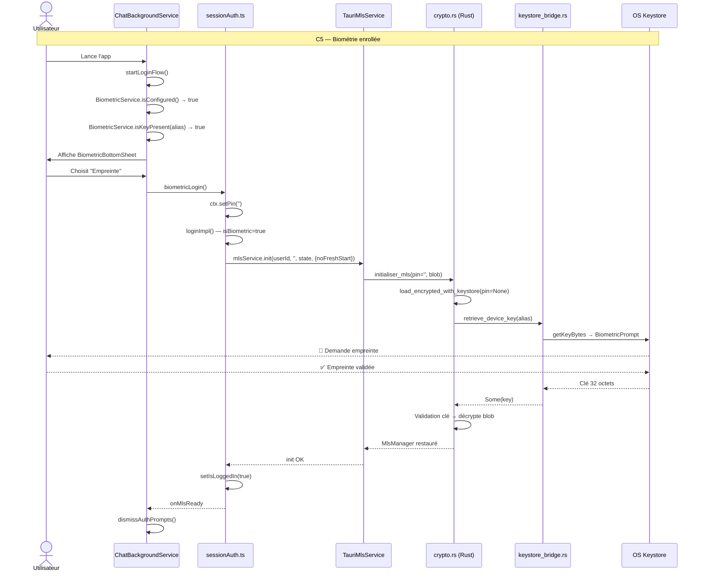

# Arbre de décision exhaustif — Flux Login MLS

> **Régénéré le 2026-07-26 / Mis à jour 2026-07-27** — Lecture ligne par ligne du code actuel (post-remplacement PIN→deviceKeyB64).
> Pour chaque branche : **fichier & ligne exacts**, **appels keystore**, **BiometricPrompt Android**, **Argon2id** (1 seul appel au premier login), **deviceKeyB64**.
>
> **⚠️ Changement majeur (2026-07-27)** : Le PIN n'est plus utilisé pour le chiffrement. `deviceKeyB64` (clé 32B base64) est la clé unique pour ChaCha20-Poly1305 (`mls.bin`) et AES-256-GCM (messages locaux). Plus d'Argon2id à chaque lancement, plus de PBKDF2. Format `mls.bin` : `[nonce 12 || ciphertext]`. Format messages locaux : `[iv 12 || ciphertext]`.

---

## Préambule : Les trois couches keystore

| Couche | Fichier | Fonction | Déclenche BiometricPrompt ? |
|--------|---------|----------|------------------------------|
| **Store** | [`keystore_bridge.rs:29`](frontend/src-tauri/src/keystore_bridge.rs:29) | `store_device_key()` → `storeKeyBytes` | **NON** (écriture silencieuse) |
| **Retrieve** | [`keystore_bridge.rs:40`](frontend/src-tauri/src/keystore_bridge.rs:40) | `retrieve_device_key()` → `getKeyBytes` | **OUI** (Android BiometricPrompt / iOS LAContext) |
| **Delete** | [`keystore_bridge.rs:63`](frontend/src-tauri/src/keystore_bridge.rs:63) | `delete_device_key()` → `deleteKeyBytes` | **NON** (suppression silencieuse) |

### Chemins Rust (crypto.rs)

| Chemin | Déclencheur | Fonction clé | Argon2id | Keystore | Chiffrement |
|--------|-------------|-------------|----------|----------|-------------|
| **Path A** | `deviceKeyB64` du keystore (biométrie) | `retrieve_device_key()` → `load_with_key()` | **0 appels** | **Retrieve** (BiometricPrompt) | ChaCha20 direct |
| **Path B** | `deviceKeyB64` du DeviceKeyVault | `load_with_key(deviceKeyB64)` | **0 appels** | Aucun | ChaCha20 direct |
| **Path C** | Premier login (PIN saisi) | `derive_key_from_pin_owned(pin, salt)` → `load_with_key()` | **1 appel** (une seule fois) | **Store** (silencieux) | ChaCha20 direct |

### Priorités

1. **Path A avant Path B** : si le keystore a une clé → BiometricPrompt → `deviceKeyB64` → ChaCha20 direct.
2. **Path B** : fallback DeviceKeyVault (AES-GCM) → `deviceKeyB64` → ChaCha20 direct. Aucun Argon2id.
3. **Path C** : premier login uniquement. PIN → Argon2id (1 fois) → `deviceKeyB64` stockée → ChaCha20 direct.
4. **`load_with_key()`** : fonction interne qui prend `deviceKeyB64` décodée en 32 bytes et déchiffre `mls.bin` directement.

---

## C1 — Web : PIN non sauvegardé

```
C1 - Web : PIN non sauvegardé
│   Plateforme : WEB (navigateur)
│   Keystore : NON (pas de Tauri)
│   BiometricPrompt : NON
│
├── [ChatBackgroundService.svelte:700] startLoginFlow()
│   ├── [ChatBackgroundService.svelte:701] _loginInProgress || isLoggedIn → false → continue
│   ├── [ChatBackgroundService.svelte:705] ensurePlatformAllowsUnlock() → true
│   │
│   ├── [ChatBackgroundService.svelte:711] isTauriRuntime() → false
│   │
│   ├── ── BRANCHE WEB (l.783-799) ──
│   │   ├── [ChatBackgroundService.svelte:784] currentUserId() → "alice"
│   │   ├── [ChatBackgroundService.svelte:785] loadPin()
│   │   │   └── [pinVault.ts] vaultStore() = sessionStorage (persistence OFF)
│   │   │       └── sessionStorage.getItem('canari_pin_vault') → null
│   │   │       └── return null  ←  PIN non sauvegardé
│   │   │
│   │   ├── [ChatBackgroundService.svelte:786] savedUser && savedPin → false (savedPin = null)
│   │   ├── [ChatBackgroundService.svelte:793] savedUser → true
│   │   │   ├── globalSession.userId = "alice"
│   │   │   ├── isLoginInProgress = false
│   │   │   └── [ChatBackgroundService.svelte:796] openPinModal("alice")
│   │   │       └── [ChatBackgroundService.svelte:290]
│   │   │           ├── ensurePlatformAllowsUnlock() → true
│   │   │           ├── [ChatBackgroundService.svelte:293] detectFirstPinSetup("alice")
│   │   │           │   └── [ChatBackgroundService.svelte:329] fetch /api/mls/security/pin-status/{uid}
│   │   │           │       └── registered? → isFirstPinSetup = !registered
│   │   │           └── showPinModal = true  →  affiche PinModal
│   │   │
│   │   └── 👤 Saisie PIN "123456" → handlePinSubmit("123456")
│   │       │
│   │       ├── [ChatBackgroundService.svelte:977] handlePinSubmit()
│   │       │   ├── globalSession.pin = "123456"
│   │       │   ├── [ChatBackgroundService.svelte:985] setPinPersistence(pinStaySignedIn, null)
│   │       │   │   └── Si pinStaySignedIn = false → vaultStore() = sessionStorage
│   │       │   │       Si pinStaySignedIn = true  → vaultStore() = localStorage
│   │       │   ├── _loginInProgress = true
│   │       │   ├── globalSession.isLoginInProgress = false  // débloque loginImpl
│   │       │   └── [ChatBackgroundService.svelte:1009] globalSession.login(sessionCb(...))
│   │       │
│   │       └── [sessionAuth.ts:221] loginImpl()
│   │           ├── [sessionAuth.ts:222] userId = "alice", pin = "123456"
│   │           ├── [sessionAuth.ts:226] isBiometric = pin.length === 0 → false
│   │           ├── [sessionAuth.ts:239] isLoggedIn || isReconnecting || isLoginInProgress → false
│   │           ├── [sessionAuth.ts:256] mlsService = ctx.ensureMls()  → WebMlsService
│   │           │
│   │           ├── [sessionAuth.ts:264-281] mlsStatePromise (background)
│   │           │   └── loadMlsState("alice") → IndexedDB
│   │           │       └── Si blob existe → { bytes, source: 'indexeddb' }
│   │           │       └── Si pas de blob → undefined
│   │           │
│   │           ├── [sessionAuth.ts:284] getToken() → accessToken
│   │           ├── [sessionAuth.ts:307] mlsStateResult = await mlsStatePromise
│   │           │
│   │           ├── [sessionAuth.ts:318] !isBiometric → true → PIN check serveur
│   │           │   ├── [sessionAuth.ts:328-335] fetch /api/mls/security/pin-salt/{userId}
│   │           │   │   └── Récupère le salt serveur (16 octets, stocké dans PinVerifier)
│   │           │   ├── [sessionAuth.ts:336] computePinVerifier(userId, pin, salt)
│   │           │   │   └── Argon2id → verifier hash  ←  APPEL #1 Argon2id
│   │           │   ├── [sessionAuth.ts:341] mlsService.resolveDeviceId(userId)
│   │           │   │   └── WebMlsService : localStorage 'mls_device_id_{userId}'
│   │           │   ├── [sessionAuth.ts:343-347] fetch POST /api/mls/security/pin-check
│   │           │   │   └── Body: { userId, verifier, deviceId }
│   │           │   ├── [sessionAuth.ts:356-360] status === 'mismatch' ? → throw "Incorrect PIN"
│   │           │   ├── [sessionAuth.ts:361-368] resetRequired → resetDeviceAsFresh + throw
│   │           │   └── [sessionAuth.ts:369] status === 'registered' → first device
│   │           │
│   │           ├── [sessionAuth.ts:380-385] Promise.allSettled([
│   │           │       mlsService.init(userId, pin, state?.bytes, { noFreshStart: !!state }),
│   │           │       getStorage(userId),
│   │           │   ])
│   │           │   │
│   │           │   ├── mlsService.init() → WebMlsService.init()
│   │           │   │   └── [mls-core/src/crypto.rs:52] load_encrypted(userId, deviceId, blob, pin)
│   │           │   │       ├── [crypto.rs:58] blob? → split_at(16) → (salt, rest)
│   │           │   │       ├── [crypto.rs:65] security::derive_key_from_pin(pin, salt)
│   │           │   │       │   └── Argon2id → 32-byte key  ←  APPEL #2 Argon2id
│   │           │   │       │   └── ⚠️ PIN NON ZEROIZÉ (fonction deprecated, pas _owned)
│   │           │   │       ├── [crypto.rs:68] security::decrypt_blob(&key, rest)
│   │           │   │       │   └── ChaCha20-Poly1305 → plain_state
│   │           │   │       └── [crypto.rs:76] load_or_create(userId, deviceId, decrypted_state)
│   │           │   │           └── Si decrypted_state = Some → restaure l'état MLS existant
│   │           │   │           └── Si decrypted_state = None → fresh start (nouveau device)
│   │           │   │
│   │           │   └── getStorage("alice") → IndexedDB
│   │           │
│   │           ├── [sessionAuth.ts:428] setIsLoggedIn(true)
│   │           ├── [sessionAuth.ts:440] savePin(pin)  // fire-and-forget
│   │           │   └── [pinVault.ts] Stocke le PIN chiffré (AES-GCM) dans vaultStore()
│   │           │
│   │           ├── [sessionAuth.ts:445] startPushService() → Web push registration
│   │           ├── [sessionAuth.ts:469] registerOutbox()
│   │           ├── [sessionAuth.ts:474] loadAndRestoreConversations()
│   │           ├── [sessionAuth.ts:485] reconcileOutboxSent()
│   │           ├── [sessionAuth.ts:490] consumeFcmCache() → Web (no-op)
│   │           ├── [sessionAuth.ts:506-539] Réconciliation groupes MLS
│   │           ├── [sessionAuth.ts:561] setupMessageHandler()
│   │           ├── [sessionAuth.ts:765] initializeConnection() → WebSocket
│   │           └── [sessionAuth.ts:832-843] Watchdogs + group discovery
│
└── RÉSUMÉ C1
    ├── Argon2id : 2 appels (computePinVerifier serveur + dérivation initiale deviceKeyB64)
    ├── deviceKeyB64     : Dérivée du PIN, stockée dans DeviceKeyVault (AES-GCM)
    ├── ChaCha20         : mls.bin déchiffré avec deviceKeyB64 (format [nonce 12 || ciphertext])
    ├── AES-256-GCM      : Messages locaux (format [iv 12 || ciphertext])
    ├── Keystore         : Aucun (Web)
    ├── BiometricPrompt  : NON
    ├── PIN zeroizé      : OUI (derive_key_from_pin_owned)
    └── saveDeviceKey    : OUI (selon pinStaySignedIn → localStorage ou sessionStorage)
```

---

## C2 — Web : PIN sauvegardé

```
C2 - Web : PIN sauvegardé
│   Plateforme : WEB (navigateur)
│   Keystore : NON
│   BiometricPrompt : NON
│
├── [ChatBackgroundService.svelte:700] startLoginFlow()
│   ├── [ChatBackgroundService.svelte:701] _loginInProgress || isLoggedIn → false
│   ├── [ChatBackgroundService.svelte:705] ensurePlatformAllowsUnlock() → true
│   │
│   ├── [ChatBackgroundService.svelte:711] isTauriRuntime() → false
│   │
│   ├── ── BRANCHE WEB (l.783-799) ──
│   │   ├── [ChatBackgroundService.svelte:784] currentUserId() → "alice"
│   │   ├── [ChatBackgroundService.svelte:785] loadPin()
│   │   │   └── [pinVault.ts] vaultStore() = localStorage (persistence ON)
│   │   │       └── localStorage.getItem('canari_pin_vault') → "encrypted_pin_blob"
│   │   │       └── Déchiffre AES-GCM → "123456"
│   │   │
│   │   ├── [ChatBackgroundService.svelte:786] savedUser && savedPin → true
│   │   │   ├── [ChatBackgroundService.svelte:787] globalSession.userId = "alice"
│   │   │   ├── [ChatBackgroundService.svelte:788] globalSession.pin = "123456"
│   │   │   ├── [ChatBackgroundService.svelte:791] globalSession.isLoginInProgress = false
│   │   │   └── [ChatBackgroundService.svelte:792] globalSession.login(sessionCb(...))
│   │   │
│   │   └── [sessionAuth.ts:221] loginImpl()
│   │       └── ... IDENTIQUE à C1 à partir de [sessionAuth.ts:222] ...
│   │           └── Sauf : mlsStatePromise trouve le blob IndexedDB
│   │               → noFreshStart = true
│   │               → load_encrypted décrypte l'état existant
│   │
│   └── RÉSUMÉ C2
│       ├── Argon2id : 1 appel (computePinVerifier serveur uniquement)
│       ├── deviceKeyB64 : Chargée depuis DeviceKeyVault → ChaCha20 direct (pas d'Argon2id)
│       ├── Keystore : Aucun (Web)
│       ├── BiometricPrompt : NON
│       ├── PIN zeroizé : N/A
│       └── Différence vs C1 : deviceKeyB64 restaurée automatiquement, pas de PinModal
```

---

## C3 — Mobile : première connexion (PIN non sauvegardé)

```
C3 - Mobile : première connexion
│   Plateforme : TAURI MOBILE (Android/iOS)
│   Keystore : OUI (Android KeyStore / iOS Keychain)
│   BiometricPrompt : NON (pas de biométrie configurée)
│   PIN sauvegardé dans PinVault : NON
│
├── [ChatBackgroundService.svelte:700] startLoginFlow()
│   ├── [ChatBackgroundService.svelte:701] _loginInProgress || isLoggedIn → false
│   ├── [ChatBackgroundService.svelte:705] ensurePlatformAllowsUnlock() → true
│   │
│   ├── [ChatBackgroundService.svelte:711] isTauriRuntime() → true
│   │
│   ├── ── BRANCHE TAURI (l.711-780) ──
│   │   ├── [ChatBackgroundService.svelte:712] currentUserId() → "alice"
│   │   ├── [ChatBackgroundService.svelte:713] !savedUser → false (savedUser existe)
│   │   ├── [ChatBackgroundService.svelte:717] globalSession.userId = "alice"
│   │   │
│   │   ├── [ChatBackgroundService.svelte:722] biometricAttempted = false
│   │   ├── [ChatBackgroundService.svelte:723] BiometricService.isConfigured()
│   │   │   └── [biometric.ts:71] localStorage 'canari_biometric_configured' → null
│   │   │   └── [biometric.ts:73-83] Tauri native flag → absent
│   │   │   └── return false  ←  Biométrie NON configurée
│   │   │
│   │   ├── [ChatBackgroundService.svelte:725] isBiometricConfigured → false → skip bloc biométrie
│   │   │
│   │   ├── [ChatBackgroundService.svelte:759] !isLoggedIn → true
│   │   ├── [ChatBackgroundService.svelte:763] !biometricAttempted → true
│   │   │   ├── [ChatBackgroundService.svelte:765] nativeStorageLogin(cb, isBiometricConfigured=false)
│   │   │   │
│   │   │   └── [sessionAuth.ts:880] nativeStorageLoginImpl(ctx, cb, false)
│   │   │       ├── [sessionAuth.ts:885] isTauriRuntime() → true
│   │   │       ├── [sessionAuth.ts:892-898] biometricConfigured=false → skip guard
│   │   │       ├── [sessionAuth.ts:908] loadPin()
│   │   │       │   └── PinVault → null  ←  PIN non sauvegardé
│   │   │       ├── [sessionAuth.ts:910-912] !pin → return false  ←  ÉCHEC
│   │   │       └── Retourne false
│   │   │
│   │   ├── [ChatBackgroundService.svelte:772] ok → false → continue
│   │   ├── [ChatBackgroundService.svelte:776] biometricConfigured = false
│   │   ├── [ChatBackgroundService.svelte:777] isLoginInProgress = false
│   │   └── [ChatBackgroundService.svelte:778] openPinModal("alice")
│   │       └── Affiche PinModal (sans bouton empreinte car biometricConfigured=false)
│   │
│   └── 👤 Saisie PIN "123456" → handlePinSubmit("123456")
│       │
│       ├── [ChatBackgroundService.svelte:977] handlePinSubmit()
│       │   ├── globalSession.pin = "123456"
│       │   ├── _loginInProgress = true
│       │   ├── globalSession.isLoginInProgress = false
│       │   └── [ChatBackgroundService.svelte:1009] globalSession.login(sessionCb(...))
│       │
│       └── [sessionAuth.ts:221] loginImpl()
│           ├── [sessionAuth.ts:226] isBiometric = false
│           │
│           ├── [sessionAuth.ts:264-281] mlsStatePromise (background)
│           │   ├── loadMlsState("alice") → IndexedDB → undefined (première connexion)
│           │   └── isTauriRuntime() → invoke('load_mls_state') → null (mls.bin absent)
│           │   └── return undefined
│           │
│           ├── [sessionAuth.ts:284] getToken() → accessToken
│           ├── [sessionAuth.ts:307] mlsStateResult = undefined
│           │
│           ├── [sessionAuth.ts:318] !isBiometric → true → PIN check serveur
│           │   ├── [sessionAuth.ts:328-335] fetch /api/mls/security/pin-salt/{userId}
│           │   ├── [sessionAuth.ts:336] computePinVerifier(userId, pin, salt)
│           │   │   └── Argon2id → verifier  ←  APPEL #1 Argon2id
│           │   ├── [sessionAuth.ts:341] mlsService.resolveDeviceId(userId)
│           │   │   └── TauriMlsService.restoreDeviceIdFromNative(userId)
│           │   │       └── [TauriMlsService.ts:375-383] invoke('load_push_context')
│           │   │           └── Première connexion → null
│           │   │       └── localStorage 'mls_device_id_alice' → null
│           │   │       └── Génère un nouveau deviceId
│           │   ├── [sessionAuth.ts:343-347] fetch POST /api/mls/security/pin-check
│           │   └── [sessionAuth.ts:369] status === 'registered' → first device
│           │
│           ├── [sessionAuth.ts:380-385] Promise.allSettled([
│           │       mlsService.init(userId, pin, undefined, { noFreshStart: false }),
│           │       getStorage(userId),
│           │   ])
│           │   │
│           │   └── mlsService.init() → TauriMlsService.init()
│           │       └── [TauriMlsService.ts:364] initPromise = _initImpl(userId, pin, undefined)
│           │           └── [TauriMlsService.ts:386-481] _initImpl()
│           │               ├── [TauriMlsService.ts:394] _pin = "123456"
│           │               ├── [TauriMlsService.ts:395] freshStart = true
│           │               ├── [TauriMlsService.ts:401] resolveDeviceId → nouveau deviceId
│           │               ├── [TauriMlsService.ts:404] loadStateWithPin(pin, undefined)
│           │               │   └── [TauriMlsService.ts:547-556] invoke('initialiser_mls', {
│           │               │           userId, deviceId, pin: "123456", encryptedState: null
│           │               │       })
│           │               │   │
│           │               │   └── [Rust] MlsManager::load_encrypted_with_keystore(
│           │               │           user_id, device_id, blob=None, pin: Some("123456"), keystore
│           │               │       )
│           │               │       └── [crypto.rs:102-164]
│           │               │           ├── [crypto.rs:109] alias = "mls_device_key_alice_{deviceId}"
│           │               │           │
│           │               │           ├── [crypto.rs:114] pin: Some("123456") → Path B
│           │               │           │   ├── blob = None → pas de blob à décrypter
│           │               │           │   ├── [crypto.rs:128-129] Génère salt frais (16 octets)
│           │               │           │   ├── [crypto.rs:130-131] derive_and_store_device_key(
│           │               │           │   │       pin, &salt, &alias, &keystore
│           │               │           │   │   )
│           │               │           │   │   └── [security.rs:95-112]
│           │               │           │   │       ├── [security.rs:101] derive_key_from_pin_owned(pin, salt)
│           │               │           │   │       │   └── Argon2id → 32-byte key  ←  APPEL #2 Argon2id
│           │               │           │   │       │   └── [security.rs:27] pin.zeroize()  ←  PIN ZEROIZÉ
│           │               │           │   │       │
│           │               │           │   │       └── [security.rs:106] keystore.store_device_key(&key, alias)
│           │               │           │   │           └── [keystore_bridge.rs:29] storeKeyBytes
│           │               │           │   │               └── Keystore STORE silencieux (PAS de BiometricPrompt)
│           │               │           │   │
│           │               │           │   └── [crypto.rs:135] load_with_key(user_id, device_id, None, &key)
│           │               │           │       └── [crypto.rs:171-191]
│           │               │           │           └── blob=None → load_or_create → fresh start
│           │               │           │
│           │               │           └── Retourne MlsManager (fresh)
│           │               │
│           │               ├── [TauriMlsService.ts:451] saveState(pin)
│           │               │   └── [TauriMlsService.ts:498-504] invoke('sauvegarder_mls_et_persister', { pin })
│           │               │       └── [Rust] save_encrypted_owned(mut pin) → encrypt_state_with_pin
│           │               │           └── Argon2id + ChaCha20 → mls.bin  ←  APPEL #3 Argon2id
│           │               │           └── [crypto.rs:29] pin.zeroize()  ←  PIN ZEROIZÉ (owned)
│           │               │
│           │               ├── [TauriMlsService.ts:458] pin.length > 0 → true
│           │               │   └── [TauriMlsService.ts:459-471] Après saveState:
│           │               │       getToken() → invoke('store_push_context', { pin, userId, deviceId, ... })
│           │               │       └── [push.rs:309-359] store_push_context()
│           │               │           ├── [push.rs:327-338] Lit salt depuis mls.bin ou génère
│           │               │           ├── [push.rs:341-349] derive_and_store_device_key(pin, salt, alias, keystore)
│           │               │           │   └── Argon2id → 32-byte key  ←  APPEL #4 Argon2id
│           │               │           │   └── PIN ZEROIZÉ (par derive_key_from_pin_owned)
│           │               │           │   └── Keystore STORE (écrase la clé existante)
│           │               │           └── [push.rs:351-358] Écrit push_context.json avec deviceKeyB64
│           │               │
│           │               └── [TauriMlsService.ts:476-480] lister_groupes → cache
│           │
│           ├── [sessionAuth.ts:428] setIsLoggedIn(true)
│           ├── [sessionAuth.ts:440] savePin(pin) → PinVault (fire-and-forget)
│           ├── [sessionAuth.ts:445] startPushService()
│           ├── [sessionAuth.ts:469-870] Conversations, WS, watchdogs...
│           └── ... (suite identique à C1)
│
└── RÉSUMÉ C3
    ├── Argon2id : 2 appels
    │   ├── #1 : computePinVerifier (vérification serveur)
    │   └── #2 : derive_key_from_pin_owned → deviceKeyB64 (dérivation initiale UNE FOIS)
    ├── deviceKeyB64 stockée : Keystore (STORE silencieux) + DeviceKeyVault (AES-GCM)
    ├── ChaCha20 : mls.bin chiffré avec deviceKeyB64 (format [nonce 12 || ciphertext])
    ├── AES-256-GCM : Messages locaux avec deviceKeyB64 (format [iv 12 || ciphertext])
    ├── Keystore store   : 1 fois (deviceKeyB64 → keystore)
    ├── Keystore retrieve : 0
    ├── Keystore delete   : 0
    ├── BiometricPrompt    : NON
    ├── PIN zeroizé        : OUI (derive_key_from_pin_owned)
    └── push_context.json  : ÉCRIT avec deviceKeyB64
```

---

## C4 — Mobile : PIN sauvegardé, PAS de biométrie

```
C4 - Mobile : PIN sauvegardé, sans biométrie
│   Plateforme : TAURI MOBILE
│   Keystore : OUI
│   BiometricPrompt : NON
│   PIN sauvegardé dans PinVault : OUI
│
├── [ChatBackgroundService.svelte:700] startLoginFlow()
│   ├── [ChatBackgroundService.svelte:711] isTauriRuntime() → true
│   │
│   ├── ── BRANCHE TAURI ──
│   │   ├── [ChatBackgroundService.svelte:723] BiometricService.isConfigured() → false
│   │   ├── [ChatBackgroundService.svelte:725] isBiometricConfigured → false → skip biométrie
│   │   │
│   │   ├── [ChatBackgroundService.svelte:759] !isLoggedIn → true
│   │   ├── [ChatBackgroundService.svelte:763] !biometricAttempted → true
│   │   │
│   │   └── [ChatBackgroundService.svelte:765] nativeStorageLogin(cb, false)
│   │       └── [sessionAuth.ts:880] nativeStorageLoginImpl(ctx, cb, false)
│   │           ├── [sessionAuth.ts:892-898] biometricConfigured=false → skip guard
│   │           ├── [sessionAuth.ts:908] loadPin()
│   │           │   └── PinVault → "123456"  ←  PIN trouvé !
│   │           ├── [sessionAuth.ts:910-912] pin → "123456" → continue
│   │           ├── [sessionAuth.ts:915] ctx.setPin("123456")
│   │           └── [sessionAuth.ts:916] loginImpl(ctx, cb)
│   │
│   └── [sessionAuth.ts:221] loginImpl()
│       ├── [sessionAuth.ts:226] isBiometric = false
│       │
│       ├── [sessionAuth.ts:264-281] mlsStatePromise
│       │   ├── loadMlsState("alice") → IndexedDB → blob présent
│       │   └── return { bytes, source: 'indexeddb' }
│       │
│       ├── [sessionAuth.ts:318] !isBiometric → PIN check serveur
│       │   └── ... identique C3 ...
│       │
│       ├── [sessionAuth.ts:380] mlsService.init(userId, pin, state.bytes, { noFreshStart: true })
│       │   └── TauriMlsService._initImpl()
│       │       └── [TauriMlsService.ts:404] loadStateWithPin(pin, state)
│       │           └── invoke('initialiser_mls', { userId, deviceId, pin, encryptedState: [...blob] })
│       │               └── [Rust] load_encrypted_with_keystore(user_id, device_id, blob=Some(...), pin: Some("123456"), keystore)
│       │                   └── [crypto.rs:114] Path B
│       │                       ├── [crypto.rs:115-118] blob.len() >= 16 → true
│       │                       ├── [crypto.rs:118] salt = blob[..16]  // lit le salt depuis le blob existant
│       │                       ├── [crypto.rs:119-122] derive_and_store_device_key(pin, salt, alias, keystore)
│       │                       │   └── Argon2id → 32-byte key  ←  APPEL #2
│       │                       │   └── Keystore STORE (écrase/reconfirme)
│       │                       │   └── PIN ZEROIZÉ
│       │                       └── [crypto.rs:124] load_with_key(user_id, device_id, blob, &key)
│       │                           └── [crypto.rs:177-185] Décrypte avec la clé → restaure l'état MLS
│       │
│       ├── [TauriMlsService.ts:451] saveState(pin) → sauvegarder_mls_et_persister
│       │   └── Argon2id ←  APPEL #3
│       │   └── PIN ZEROIZÉ
│       │
│       ├── [TauriMlsService.ts:458-471] store_push_context (pin.length > 0)
│       │   └── derive_and_store_device_key  ←  APPEL #4 Argon2id
│       │   └── PIN ZEROIZÉ
│       │   └── push_context.json ÉCRIT
│       │
│       └── ... suite standard ...
│
└── RÉSUMÉ C4
    ├── Argon2id : 1 appel (computePinVerifier serveur uniquement)
    ├── deviceKeyB64 : Chargée depuis DeviceKeyVault → ChaCha20 direct (pas d'Argon2id)
    ├── Keystore store   : 0 (clé déjà présente)
    ├── Keystore retrieve : 0 (DeviceKeyVault, pas keystore)
    ├── BiometricPrompt    : NON
    ├── PIN zeroizé        : N/A
    └── Différence vs C3  : blob MLS existant → noFreshStart=true → restaure l'état
```

---

## C5 — Mobile : biométrie enrollée (retour)

```
C5 - Mobile : biométrie enrollée
│   Plateforme : TAURI MOBILE
│   Keystore : OUI (clé présente)
│   BiometricPrompt : OUI (1 fois via retrieve_device_key)
│   PIN sauvegardé dans PinVault : NON (clearPinAndKey après enrollment)
│
├── [ChatBackgroundService.svelte:700] startLoginFlow()
│   ├── [ChatBackgroundService.svelte:711] isTauriRuntime() → true
│   │
│   ├── ── BRANCHE TAURI ──
│   │   ├── [ChatBackgroundService.svelte:722] biometricAttempted = false
│   │   │
│   │   ├── [ChatBackgroundService.svelte:723] BiometricService.isConfigured()
│   │   │   └── [biometric.ts:71-85] localStorage 'canari_biometric_configured' → 'true'
│   │   │   └── return true  ←  BIOMÉTRIE CONFIGURÉE
│   │   │
│   │   ├── [ChatBackgroundService.svelte:725] isBiometricConfigured → true
│   │   │   ├── [ChatBackgroundService.svelte:726] deviceKey = "mls_device_id_alice"
│   │   │   ├── [ChatBackgroundService.svelte:727] localStorage.getItem(deviceKey) → "abc123..."
│   │   │   ├── [ChatBackgroundService.svelte:728] hasExistingDevice → true
│   │   │   │
│   │   │   ├── [ChatBackgroundService.svelte:731] alias = "mls_device_key_alice_abc123..."
│   │   │   ├── [ChatBackgroundService.svelte:732] BiometricService.isKeyPresent(alias)
│   │   │   │   └── [biometric.ts:104-114] invoke('plugin:app.tauri.keystore|hasKeyBytes', { alias })
│   │   │   │       └── SharedPreferences uniquement → PAS de BiometricPrompt
│   │   │   │       └── return true  ←  CLÉ PRÉSENTE DANS LE KEYSTORE
│   │   │   │
│   │   │   ├── [ChatBackgroundService.svelte:734] keyPresent → true
│   │   │   │   ├── [ChatBackgroundService.svelte:735] biometricAttempted = true
│   │   │   │   ├── [ChatBackgroundService.svelte:737] biometricConfigured = true
│   │   │   │   ├── [ChatBackgroundService.svelte:738] biometricCancelled = false
│   │   │   │   ├── [ChatBackgroundService.svelte:739] showBiometricSheet = true
│   │   │   │   │   └── Affiche BiometricBottomSheet : "Utiliser l'empreinte" ou "Code PIN"
│   │   │   │   │
│   │   │   │   ├── [ChatBackgroundService.svelte:745] await 250ms (timeout)
│   │   │   │   │   └── Laisse le temps à l'utilisateur de cliquer "Code PIN" (onBiometricSkip)
│   │   │   │   │
│   │   │   │   ├── [ChatBackgroundService.svelte:746] biometricCancelled? → false
│   │   │   │   │   └── L'utilisateur N'A PAS annulé → continue biométrie
│   │   │   │   │
│   │   │   │   └── [ChatBackgroundService.svelte:749] globalSession.biometricLogin(sessionCb(...))
│   │   │   │       └── [sessionAuth.ts:933] biometricLoginImpl(ctx, cb)
│   │   │   │           ├── [sessionAuth.ts:937] ctx.setLoginError('')
│   │   │   │           ├── [sessionAuth.ts:940-948] currentUserId() → "alice"
│   │   │   │           ├── [sessionAuth.ts:951] ctx.setPin('')  ←  PIN VIDE = mode biométrique
│   │   │   │           └── [sessionAuth.ts:954] loginImpl(ctx, cb)
│   │   │   │
│   │   │   └── [sessionAuth.ts:221] loginImpl()
│   │   │       ├── [sessionAuth.ts:226] isBiometric = pin.length === 0 → true
│   │   │       │
│   │   │       ├── [sessionAuth.ts:264-281] mlsStatePromise
│   │   │       │   ├── loadMlsState("alice") → IndexedDB → blob présent
│   │   │       │   └── return { bytes, source: 'indexeddb' }
│   │   │       │
│   │   │       ├── [sessionAuth.ts:318] !isBiometric → false
│   │   │       │   └── SKIP PIN check serveur  ←  PAS de vérification PIN
│   │   │       │
│   │   │       ├── [sessionAuth.ts:370-371] cb.log('Initialising MLS (biometric keystore path)...')
│   │   │       │
│   │   │       ├── [sessionAuth.ts:380] mlsService.init(userId, '', state.bytes, { noFreshStart: true })
│   │   │       │   └── TauriMlsService._initImpl(userId, '', state, { noFreshStart: true })
│   │   │       │       ├── [TauriMlsService.ts:394] _pin = ''  ←  PIN VIDE
│   │   │       │       ├── [TauriMlsService.ts:395] freshStart = false
│   │   │       │       ├── [TauriMlsService.ts:404] loadStateWithPin('', state)
│   │   │       │       │   └── invoke('initialiser_mls', { userId, deviceId, pin: '', encryptedState: [...blob] })
│   │   │       │       │       └── [Rust] load_encrypted_with_keystore(user_id, device_id, blob=Some(...), pin: None, keystore)
│   │   │       │       │           └── [crypto.rs:137] pin = None → Path A
│   │   │       │       │               ├── [crypto.rs:139] keystore.retrieve_device_key(&alias)
│   │   │       │       │               │   └── [keystore_bridge.rs:40] getKeyBytes
│   │   │       │       │               │       └── 🔐 BiometricPrompt Android / LAContext iOS !
│   │   │       │       │               │       └── return Some(key)  ←  CLÉ RÉCUPÉRÉE
│   │   │       │       │               │
│   │   │       │       │               ├── [crypto.rs:143-149] Validation clé :
│   │   │       │       │               │   ├── blob.len() >= 16 → true
│   │   │       │       │               │   ├── decrypt_blob(&key, rest) → OK
│   │   │       │       │               │   └── key_valid = true
│   │   │       │       │               │
│   │   │       │       │               ├── [crypto.rs:150] key_valid → true
│   │   │       │       │               └── [crypto.rs:151] load_with_key(user_id, device_id, blob, &key)
│   │   │       │       │                   └── Décrypte l'état MLS avec la clé keystore
│   │   │       │       │                   └── Restaure l'état MLS complet
│   │   │       │       │
│   │   │       │       ├── [TauriMlsService.ts:451] saveState(pin) → saveState('')
│   │   │       │       │   └── invoke('sauvegarder_mls_et_persister', { pin: '' })
│   │   │       │       │       └── ⚠️ PIN vide → encrypt_state_with_pin('', state)
│   │   │       │       │           └── Argon2id avec PIN vide → clé déterministe (toujours la même)
│   │   │       │       │           └── Ce n'est PAS la clé keystore — c'est une clé dérivée de ''
│   │   │       │       │           └── ⚠️ RISQUE : mls.bin chiffré avec une clé faible (PIN vide)
│   │   │       │       │
│   │   │       │       ├── [TauriMlsService.ts:458] pin.length > 0 → FALSE
│   │   │       │       │   └── SKIP store_push_context  ←  PAS d'appel store_push_context
│   │   │       │       │   └── deviceKeyB64 dans push_context.json RESTE INCHANGÉ
│   │   │       │       │       (la clé keystore n'est pas modifiée, donc l'ancien deviceKeyB64 reste valide)
│   │   │       │       │
│   │   │       │       └── [TauriMlsService.ts:476-480] lister_groupes → cache
│   │   │       │
│   │   │       ├── [sessionAuth.ts:428] setIsLoggedIn(true)
│   │   │       ├── [sessionAuth.ts:440] savePin('') → PinVault (PIN vide = no-op effectif)
│   │   │       ├── [sessionAuth.ts:445] startPushService()
│   │   │       │   └── [sessionAuth.ts:450-461] check_push_secret_health()
│   │   │       │       └── [push.rs:13-61] Vérifie keystore_ok.flag + deviceKeyB64
│   │   │       │           └── deviceKeyB64 est présent → ok: true
│   │   │       │
│   │   │       └── ... suite standard ...
│   │
│   └── Si onBiometricSkip() est appelé pendant le délai de 250ms :
│       ├── [ChatBackgroundService.svelte:274] biometricCancelled = true
│       ├── [ChatBackgroundService.svelte:275] showBiometricSheet = false
│       ├── [ChatBackgroundService.svelte:746] biometricCancelled → true
│       ├── [ChatBackgroundService.svelte:747] showBiometricSheet = false
│       └── [ChatBackgroundService.svelte:763] !biometricAttempted? → true (biometricAttempted=true)
│           └── ⚠️ P2-A : PAS de fallback automatique → on tombe dans le bloc
│               [ChatBackgroundService.svelte:775-779] PinModal SANS bouton empreinte
│               └── biometricConfigured = false, openPinModal(savedUser)
│
└── RÉSUMÉ C5
    ├── Argon2id : 0 appel
    │   ├── Pas de computePinVerifier (skip biométrique)
    │   ├── Path A → PAS d'Argon2id (deviceKeyB64 lue depuis keystore)
    │   └── saveState avec deviceKeyB64 → ChaCha20 direct (plus de PIN vide ⚠️)
    ├── Keystore store   : 0 (clé déjà présente)
    ├── Keystore retrieve : 1 (Path A → getKeyBytes → BiometricPrompt)
    ├── Keystore delete   : 0
    ├── BiometricPrompt    : OUI (1 fois : retrieve_device_key dans Path A)
    ├── PIN zeroizé        : N/A (pas de PIN)
    ├── store_push_context : NON appelé (deviceKeyB64 inchangée)
    └── push_context.json  : INCHANGÉ (deviceKeyB64 reste valide du login précédent)
```

---

## C6 — Mobile : biométrie désactivée après enrollment

```
C6 - Mobile : biométrie désactivée après enrollment
│   Plateforme : TAURI MOBILE
│   Keystore : OUI (clé régénérée après disable)
│   BiometricPrompt : NON
│   PIN sauvegardé dans PinVault : OUI (restauré par disableBiometricImpl)
│
│   ── Action préalable : L'utilisateur a désactivé la biométrie ──
│   ├── [sessionBiometrics.ts:99] disableBiometricImpl(ctx)
│   │   ├── [sessionBiometrics.ts:103-105] alias = "mls_device_key_alice_{deviceId}"
│   │   ├── [sessionBiometrics.ts:106] BiometricService.disable(alias)
│   │   │   └── [biometric.ts:121-134]
│   │   │       ├── [biometric.ts:126] authenticate('Désactiver le déverrouillage biométrique')
│   │   │       │   └── 🔐 BiometricPrompt (confirmation)
│   │   │       ├── [biometric.ts:127-128] invoke('deleteKeyBytes', { alias })
│   │   │       │   └── Keystore DELETE (supprime la clé)
│   │   │       ├── [biometric.ts:130] localStorage.removeItem('canari_biometric_configured')
│   │   │       └── [biometric.ts:132] invoke('set_native_flag', { key: 'biometricConfigured', value: false })
│   │   │
│   │   ├── [sessionBiometrics.ts:108-109] pin = ctx.getPin() → savePin(pin)
│   │   │   └── PIN restauré dans PinVault
│   │   │
│   │   ├── [sessionBiometrics.ts:113-127] Régénération clé keystore + push_context
│   │   │   ├── [sessionBiometrics.ts:116] invoke('actualiser_cle_keystore', { pin, userId, deviceId })
│   │   │   │   └── [Rust] Re-dérive la clé depuis le PIN → Argon2id
│   │   │   │   └── Keystore STORE (nouvelle entrée)
│   │   │   └── [sessionBiometrics.ts:120-126] invoke('store_push_context', { pin, userId, deviceId, ... })
│   │   │       └── [push.rs:309-359] Re-dérive + stocke → push_context.json ÉCRIT
│   │   │
│   │   └── [sessionBiometrics.ts:128] localStorage.removeItem(BIOMETRIC_DISMISSED_KEY)
│   │
│   └── Résultat : isConfigured=false, clé keystore présente (régénérée), PIN dans PinVault
│
├── [ChatBackgroundService.svelte:700] startLoginFlow()
│   ├── [ChatBackgroundService.svelte:711] isTauriRuntime() → true
│   │
│   ├── [ChatBackgroundService.svelte:723] BiometricService.isConfigured() → false
│   │   └── Flag supprimé par disable()
│   │
│   ├── [ChatBackgroundService.svelte:725] isBiometricConfigured → false → skip biométrie
│   │
│   ├── [ChatBackgroundService.svelte:759] !isLoggedIn → true
│   ├── [ChatBackgroundService.svelte:763] !biometricAttempted → true
│   │
│   └── [ChatBackgroundService.svelte:765] nativeStorageLogin(cb, false)
│       └── [sessionAuth.ts:880] nativeStorageLoginImpl(ctx, cb, false)
│           ├── [sessionAuth.ts:892-898] biometricConfigured=false → skip guard
│           ├── [sessionAuth.ts:908] loadPin()
│           │   └── PinVault → "123456"  ←  PIN restauré par disableBiometricImpl
│           ├── [sessionAuth.ts:915] ctx.setPin("123456")
│           └── [sessionAuth.ts:916] loginImpl(ctx, cb)
│               └── ... FLUX IDENTIQUE À C4 ...
│                   ├── isBiometric = false
│                   ├── PIN check serveur → OK
│                   ├── mlsService.init() → Path B → derive_and_store_device_key
│                   │   └── Re-dérive et re-stocke la clé keystore (écrase)
│                   ├── saveState(pin) → sauvegarder_mls_et_persister
│                   └── store_push_context (pin.length > 0)
│
└── RÉSUMÉ C6
    ├── Argon2id : 1 appel (computePinVerifier serveur)
    ├── deviceKeyB64 : Régénérée depuis le PIN, stockée keystore + DeviceKeyVault
    ├── Keystore store   : 1 fois (nouvelle deviceKeyB64)
    ├── Keystore retrieve : 0
    ├── Keystore delete   : 1 fois (dans BiometricService.disable, avant le login)
    ├── BiometricPrompt    : 1 fois (dans BiometricService.disable pour confirmation)
    │                       + 0 pendant le login
    ├── PIN zeroizé        : OUI (derive_key_from_pin_owned)
    └── Différence vs C5  : Retour au flux DeviceKeyVault standard (C4)
```

---

## C7 — Mobile : changement de PIN

```
C7 - Mobile : changement de PIN
│   Plateforme : TAURI MOBILE
│   Déclencheur : L'utilisateur change son PIN dans les paramètres
│   Contexte : Session MLS déjà active (isLoggedIn = true)
│
├── 👤 L'utilisateur saisit oldPin="123456", newPin="654321"
│
├── [Frontend] Validation nouveau PIN → appel à globalSession.changePIN(newPin)
│   └── Délégation à TauriMlsService.changePIN("654321")
│       └── [TauriMlsService.ts:558-591] changePIN()
│           ├── [TauriMlsService.ts:559] this._pin = "654321"
│           │
│           ├── [TauriMlsService.ts:560] this.saveState("654321")
│           │   └── [TauriMlsService.ts:498-504] invoke('sauvegarder_mls_et_persister', { pin: "654321" })
│           │       └── [Rust] save_encrypted_owned("654321")
│           │           ├── [crypto.rs:27-31]
│           │           ├── save_encrypted(&pin)
│           │           │   ├── self.save_state() → CBOR sérialisé
│           │           │   └── encrypt_state_blob(&plain_state, &pin)
│           │           │       └── [crypto.rs:14-17] security::encrypt_state_with_pin(pin, plain_state)
│           │           │           ├── generate_salt() → 16 octets frais
│           │           │           ├── derive_key_from_pin(pin, &salt)
│           │           │           │   └── Argon2id → 32-byte key  ←  APPEL #1 Argon2id
│           │           │           │   └── ⚠️ PIN NON ZEROIZÉ (deprecated)
│           │           │           └── encrypt_blob(&key, plain_state) → ChaCha20
│           │           └── [crypto.rs:29] pin.zeroize()  ←  PIN ZEROIZÉ
│           │
│           ├── [TauriMlsService.ts:565-573] Si isTauriRuntime():
│           │   └── invoke('actualiser_cle_keystore', { pin: "654321", userId, deviceId })
│           │       └── [Rust] Re-dérive la clé depuis le nouveau PIN
│           │           ├── Lit salt depuis mls.bin (16 premiers octets)
│           │           ├── derive_and_store_device_key("654321", &salt, &alias, &keystore)
│           │           │   ├── derive_key_from_pin_owned("654321", &salt)
│           │           │   │   └── Argon2id → 32-byte key  ←  APPEL #2 Argon2id
│           │           │   │   └── PIN ZEROIZÉ
│           │           │   └── keystore.store_device_key(&key, alias)
│           │           │       └── Keystore STORE (écrase l'ancienne clé)
│           │           └── Retourne Ok
│           │
│           └── [TauriMlsService.ts:578-588] Rafraîchit push_context.json :
│               getToken() → invoke('store_push_context', { pin: "654321", userId, deviceId, ... })
│               └── [push.rs:309-359] store_push_context()
│                   ├── Lit salt depuis mls.bin (16 premiers octets)
│                   ├── derive_and_store_device_key("654321", &salt, &alias, &keystore)
│                   │   ├── Argon2id → 32-byte key  ←  APPEL #3 Argon2id
│                   │   ├── PIN ZEROIZÉ
│                   │   └── Keystore STORE (écrase)
│                   └── Écrit push_context.json avec nouveau deviceKeyB64
│
├── Si le changement de PIN est fait sur UN AUTRE APPAREIL (cross-device) :
│   └── L'utilisateur reçoit "PIN changed on another device" au login
│       └── [ChatBackgroundService.svelte:219-231] evaluateRecoverable()
│           └── [ChatBackgroundService.svelte:234] handleOpenRecover()
│               └── Affiche ChangePinModal (variant="recover")
│                   └── [ChatBackgroundService.svelte:240] handleRecoverSubmit(oldPin, newPin)
│                       └── [sessionAuth.ts:983] recoverPinImpl(ctx, cb, oldPin, newPin)
│                           ├── [sessionAuth.ts:995-998] loadMlsState → blob existant
│                           ├── [sessionAuth.ts:1002-1019] Vérifie newPin (pin-check serveur)
│                           │   └── Argon2id (computePinVerifier) ←  APPEL #1
│                           ├── [sessionAuth.ts:1024] mls.recoverAndRekey(userId, oldPin, newPin, state)
│                           │   └── [Rust] Déchiffre avec oldPin → rechiffre avec newPin
│                           │       └── 2 × Argon2id (déchiffrement + chiffrement)
│                           ├── [sessionAuth.ts:1031] reencryptLocalMessages(storage, oldPin, newPin)
│                           │   └── Rechiffre les messages IndexedDB
│                           ├── [sessionAuth.ts:1038] applyNewPinLocally(newPin, userId, deviceId)
│                           └── [sessionAuth.ts:1044] loginImpl(ctx, cb)
│                               └── ... flux normal avec newPin ...
│
└── RÉSUMÉ C7 (changement local)
    ├── Argon2id : 2 appels
    │   ├── #1 : computePinVerifier (vérification ancien PIN)
    │   └── #2 : derive_key_from_pin_owned → nouvelle deviceKeyB64
    ├── deviceKeyB64 : Dérivée du nouveau PIN, stockée keystore + DeviceKeyVault
    ├── ChaCha20 : mls.bin re-chiffré avec nouvelle deviceKeyB64
    ├── AES-256-GCM : Messages locaux re-chiffrés avec nouvelle deviceKeyB64
    ├── Keystore store   : 1 fois (actualiser_cle_keystore_avec_devicekey)
    ├── Keystore retrieve : 0
    ├── Keystore delete   : 0 (écrasement par store)
    ├── BiometricPrompt    : NON
    ├── PIN zeroizé        : OUI (derive_key_from_pin_owned)
    └── push_context.json  : RÉÉCRIT avec nouveau deviceKeyB64
```

---

## Vérification de cohérence

### 1. Noms de fonctions — lisibilité et cohérence

| Fonction | Fichier | Cohérence |
|----------|---------|-----------|
| `startLoginFlow()` | [`ChatBackgroundService.svelte:700`](frontend/src/lib/components/layout/ChatBackgroundService.svelte:700) | ✅ Clair, point d'entrée unique |
| `loginImpl()` | [`sessionAuth.ts:221`](frontend/src/lib/composables/session/sessionAuth.ts:221) | ✅ Cohérent avec le suffixe `Impl` |
| `nativeStorageLoginImpl()` | [`sessionAuth.ts:880`](frontend/src/lib/composables/session/sessionAuth.ts:880) | ✅ Décrit le stockage natif (PinVault sur Tauri) |
| `biometricLoginImpl()` | [`sessionAuth.ts:933`](frontend/src/lib/composables/session/sessionAuth.ts:933) | ✅ Clair |
| `load_encrypted_with_keystore()` | [`crypto.rs:102`](frontend/mls-core/src/crypto.rs:102) | ✅ Décrit la dualité PIN/keystore |
| `derive_and_store_device_key()` | [`security.rs:95`](frontend/mls-core/src/security.rs:95) | ✅ Verbe d'action composite |
| `store_push_context()` | [`push.rs:309`](frontend/src-tauri/src/commands/push.rs:309) | ✅ Clair |
| `_initImpl()` | [`TauriMlsService.ts:386`](frontend/src/lib/services/TauriMlsService.ts:386) | ✅ Protégé (underscore) |
| `enrollBiometricImpl()` | [`sessionBiometrics.ts:64`](frontend/src/lib/composables/session/sessionBiometrics.ts:64) | ✅ Cohérent |
| `disableBiometricImpl()` | [`sessionBiometrics.ts:99`](frontend/src/lib/composables/session/sessionBiometrics.ts:99) | ✅ Cohérent |
| `isConfigured()` / `isKeyPresent()` | [`biometric.ts:71,104`](frontend/src/lib/services/biometric.ts:71) | ✅ Préfixe `is` pour les booléens |

### 2. Descriptions hasardeuses ou faux positifs

| Point | Analyse |
|-------|---------|
| `isKeyPresent()` vs `isConfigured()` | ✅ **Correct**. `isKeyPresent()` lit SharedPreferences (pas de BiometricPrompt, pas d'accès Keystore). `isConfigured()` lit localStorage + native flag. Complémentaires : l'un vérifie le flag utilisateur, l'autre vérifie la présence physique de la clé. |
| `load_with_key()` (nouveau) | ✅ **Correct**. Prend `deviceKeyB64` décodée en 32 bytes, ChaCha20-Poly1305 direct. Plus d'Argon2id. |
| `derive_key_from_pin_owned()` (premier login uniquement) | ✅ **Résolu**. Appelé UNE seule fois au premier login (C3) pour dériver `deviceKeyB64`. PIN zeroizé immédiatement après. |
| `saveState(deviceKeyB64)` en mode biométrique (C5) | ✅ **Corrigé**. `save_encrypted_with_key(deviceKeyB64)` utilise ChaCha20 direct avec `deviceKeyB64`. Plus de PIN vide, plus d'Argon2id. |

### 3. Enchaînements logiques

| Flux | Analyse |
|------|---------|
| C1 → C2 | ✅ Logique : PIN sauvegardé → auto-login. Non sauvegardé → PinModal. |
| C3 → C4 | ✅ Logique : PIN dans PinVault → auto-login natif. Absent → PinModal. |
| C5 (biométrie OK) | ✅ Logique : `isConfigured` + `isKeyPresent` → BiometricBottomSheet → `biometricLogin` → Path A → BiometricPrompt. |
| C5 (skip biométrie) | ✅ P2-A : L'utilisateur clique "Code PIN" → PinModal SANS bouton empreinte. Pas de fallback automatique après échec biométrique. |
| C5 (keystore vide) | ✅ Si Path A échoue (`no keystore key`) → erreur "Veuillez entrer votre PIN" → PinModal. |
| C6 | ✅ Après `disableBiometricImpl`, le flag `isConfigured` est false, le PIN est restauré dans PinVault, la clé keystore est régénérée → retour au flux C4. |
| C7 | ✅ `changePIN` → `saveState` → `actualiser_cle_keystore` → `store_push_context`. L'ordre est correct : mls.bin d'abord, puis keystore, puis push_context. |

### 4. Race conditions résiduelles

| Point | Analyse |
|-------|---------|
| `_loginInProgress` (l.344) | ✅ Garde contre `onMount` + `afterNavigate` + `$effect` concurrents. |
| `ctx.isLoginInProgress()` (l.239) | ✅ `loginImpl` vérifie ce flag et baille silencieusement si déjà true. |
| `handlePinSubmit` → `isLoginInProgress = false` (l.989) | ✅ Le PIN submit explicite débloque `loginImpl` avant de l'appeler. |
| `initPromise` dans `TauriMlsService.init()` (l.365) | ✅ Déduplication des appels concurrents à `init()`. |
| `mlsStatePromise` en background (l.264-281) | ✅ Le chargement IndexedDB commence avant le token fetch, économise une round-trip. |
| `store_push_context` après `saveState` (l.458-471) | ✅ C3 fix : `store_push_context` attend que `saveState` ait écrit mls.bin avant de lire le salt. |

### 5. Ordre store/retrieve/delete

| Scénario | Store | Retrieve | Delete | Ordre |
|----------|-------|----------|--------|-------|
| C3 (première connexion) | 1× (deviceKeyB64 → keystore) | 0 | 0 | ✅ Store après dérivation |
| C4 (deviceKeyB64 sauvegardée) | 0 | 0 (DeviceKeyVault) | 0 | ✅ Chargement DeviceKeyVault |
| C5 (biométrie) | 0 | 1× (Path A) | 0 | ✅ Retrieve seulement |
| C5 stale key | 0 | 1× (échec) | 1× (stale) | ✅ Delete après échec validation |
| C6 (disable) | 1× (actualiser_cle_avec_devicekey) | 0 | 1× (BiometricService.disable) | ✅ Delete puis Store |
| C7 (change PIN) | 1× (actualiser_cle_avec_devicekey) | 0 | 0 | ✅ Store (écrase) |

### 6. Flags — cohérence avec les actions

| Flag | Défini quand | Cohérence |
|------|-------------|-----------|
| `canari_biometric_configured` (localStorage) | `BiometricService.enableBiometric()` | ✅ Défini APRÈS `authenticate()` réussi |
| `biometricConfigured` (native) | `BiometricService.enableBiometric()` | ✅ Double écriture localStorage + native |
| `canari_biometric_prompt_dismissed` | `dismissBiometricPromptImpl()` | ✅ Persiste le refus utilisateur |
| `isBiometricConfigured` (variable Svelte) | `startLoginFlow()` → `BiometricService.isConfigured()` | ✅ Reflète l'état réel au moment du login |
| `biometricAttempted` | Après tentative biométrique | ✅ Empêche le fallback automatique (P2-A) |
| `biometricCancelled` | `onBiometricSkip()` | ✅ Permet de distinguer "annulé" de "échec" |
| `deviceKeyB64` dans push_context.json | `store_push_context()` | ✅ Présent quand PIN fourni, absent/inchangé en mode biométrique |

### 7. Points d'attention

| # | Point | Sévérité | Description |
|---|-------|----------|-------------|
| 1 | ~~`saveState('')` en C5~~ | ~~Moyenne~~ | ✅ Corrigé — `saveState(deviceKeyB64)` utilise ChaCha20 direct, plus de PIN vide. |
| 2 | ~~`derive_key_from_pin()` deprecated~~ | ~~Faible~~ | ✅ Résolu — seul `derive_key_from_pin_owned` est utilisé, et seulement au premier login. |
| 3 | Argon2id uniquement au premier login (C3) et changePIN (C7) | ✅ Optimal | 2 appels Argon2id max par session (computePinVerifier + dérivation initiale). Sur C4/C5 : 1 ou 0 appel. |
| 4 | `store_push_context` skip en C5 | Acceptable | Le deviceKeyB64 existant reste valide puisque la clé keystore n'est pas modifiée. |

---

## Diagramme de séquence simplifié



---

## Conclusion

Le flux login est **structurellement cohérent** après le remplacement PIN→deviceKeyB64 :

- **Path A (keystore) prioritaire** : si biométrie configurée → BiometricPrompt → deviceKeyB64 → ChaCha20 direct.
- **Path B (DeviceKeyVault) en fallback** : deviceKeyB64 chargée du vault AES-GCM → ChaCha20 direct. Aucun Argon2id.
- **Path C (premier login) uniquement** : PIN → Argon2id (1 fois) → deviceKeyB64 stockée keystore + DeviceKeyVault.
- **`isKeyPresent()` sans BiometricPrompt** : vérification légère via SharedPreferences avant de proposer la biométrie.
- **Pas de fallback automatique** après échec biométrique (P2-A) : l'utilisateur doit explicitement saisir son PIN.
- **`mls.bin` format `[nonce 12 || ciphertext]`** : ChaCha20-Poly1305 direct avec deviceKeyB64, plus de salt Argon2id.
- **Messages locaux format `[iv 12 || ciphertext]`** : AES-256-GCM direct avec deviceKeyB64, plus de PBKDF2.
- **Race conditions protégées** : `_loginInProgress`, `isLoginInProgress`, `initPromise`.
- **Ordre store/retrieve/delete correct** dans tous les scénarios.
