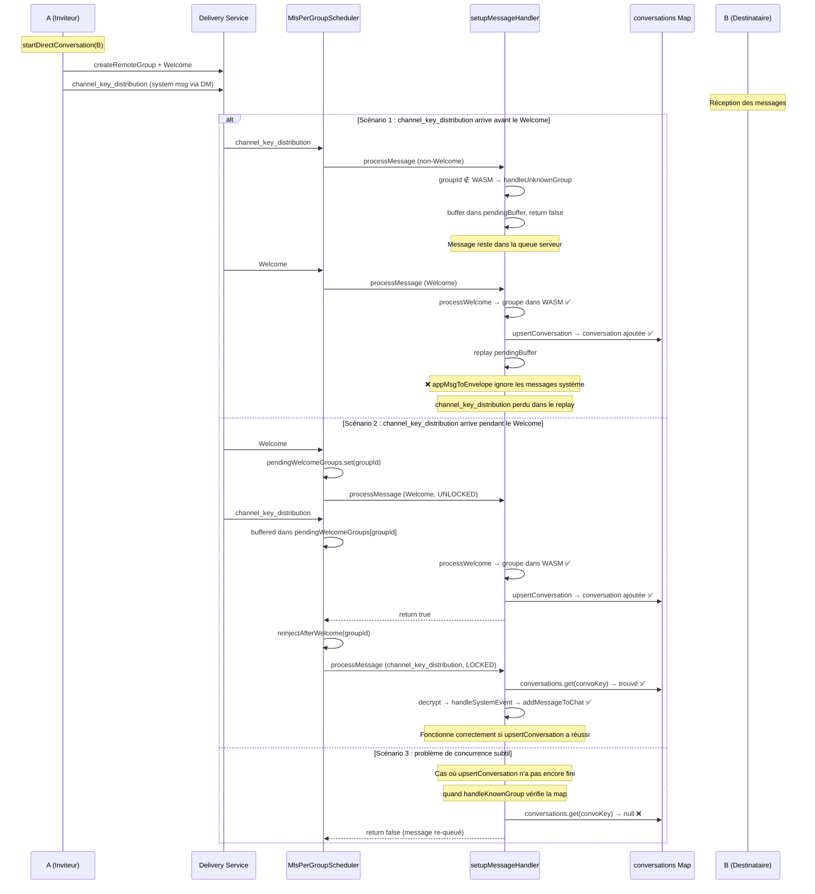
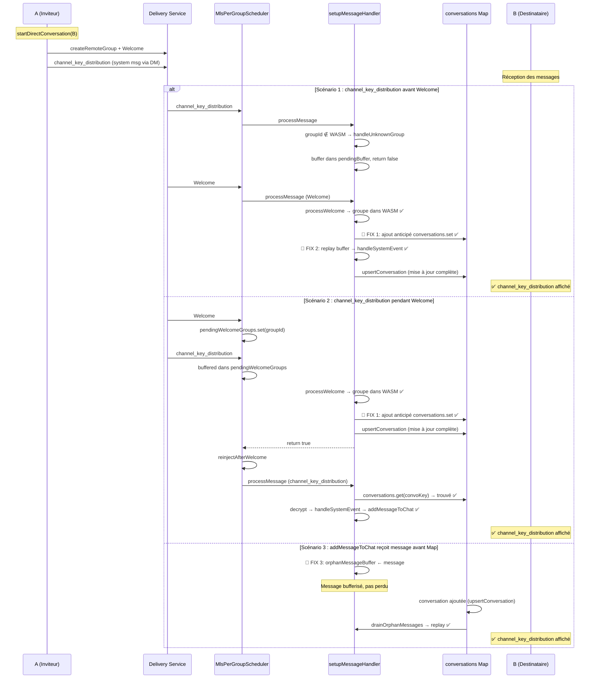

# Plan technique : Correction de la condition de course `channel_key_distribution`

## Synthèse du bug

Lorsqu'un utilisateur A invite un utilisateur B à un canal (channel) sans DM préexistante, le message système `channel_key_distribution` (contenant le bouton « Rejoindre ») n'apparaît pas dans la DM côté destinataire B.

### Cause racine

Le traitement du Welcome MLS côté destinataire crée le groupe dans WASM via [`processWelcome`](frontend/src/lib/mls-client/messagePipeline/setupMessageHandler.ts:266) **avant** d'ajouter la conversation à la map `conversations` via [`upsertConversation`](frontend/src/lib/mls-client/messagePipeline/setupMessageHandler.ts:296). Entre ces deux opérations, un message non-Welcome (`channel_key_distribution`) peut arriver et être routé vers [`handleKnownGroup`](frontend/src/lib/mls-client/messagePipeline/setupMessageHandler.ts:462) — car le groupe est déjà dans WASM — mais la conversation est absente de la map, ce qui cause un échec silencieux ou un re-queueing.

Deuxième facteur aggravant : le replay de buffer dans [`handleWelcome`](frontend/src/lib/mls-client/messagePipeline/setupMessageHandler.ts:300-329) ne traite que les messages applicatifs (text/reply/media) via `appMsgToEnvelope`. Les messages système (`channel_key_distribution`, `memberAdded`, etc.) sont **silencieusement ignorés** lors du replay.

---

## Flux complet — État actuel



---

## Modifications détaillées

### Modification 1 — PRINCIPALE : Ajout anticipé de la conversation dans `handleWelcome`

**Fichier** : [`frontend/src/lib/mls-client/messagePipeline/setupMessageHandler.ts`](frontend/src/lib/mls-client/messagePipeline/setupMessageHandler.ts)

**Problème** : [`upsertConversation`](frontend/src/lib/mls-client/messagePipeline/setupMessageHandler.ts:296) est appelée tardivement dans le bloc sous `runUnderMlsLock`, après `registerMember` et `updateInvitationStatus`. Entre [`processWelcome`](frontend/src/lib/mls-client/messagePipeline/setupMessageHandler.ts:266) et [`upsertConversation`](frontend/src/lib/mls-client/messagePipeline/setupMessageHandler.ts:296), la map `conversations` ne contient pas la conversation.

**Solution** : Insérer la conversation dans la map avec `lifecycle: 'pending'` **immédiatement après** [`processWelcome`](frontend/src/lib/mls-client/messagePipeline/setupMessageHandler.ts:266) (ligne ~268), **avant** toute autre opération asynchrone. [`upsertConversation`](frontend/src/lib/mls-client/messagePipeline/setupMessageHandler.ts:296) reste en place et mettra à jour l'entrée (passage de `pending` à `active`, résolution du `directPeerId`, etc.).

**Changement exact** (pseudo-diff) :

À la ligne ~268 (juste après `const joinedGroupId = (await mlsService.processWelcome(...)) ?? groupId ?? '';`) :

1. Ajouter une entrée minimale dans `conversations` :
   ```typescript
   // Ajout anticipé dans la map pour éviter la condition de course :
   // les messages système (channel_key_distribution, etc.) peuvent arriver
   // avant que upsertConversation n'ait terminé la résolution complète.
   if (!deps.conversations.has(joinedGroupId)) {
     deps.conversations.set(joinedGroupId, {
       id: joinedGroupId,
       contactName: groupMeta?.name ?? sender,
       name: groupMeta?.name ?? sender,
       messages: [],
       lifecycle: 'pending',
       mlsStateHex: null,
       conversationType: groupMeta?.isGroup === false ? 'direct' : 'group',
     });
   }
   ```

2. [`upsertConversation`](frontend/src/lib/mls-client/messagePipeline/setupMessageHandler.ts:296) reste inchangée — elle écrasera cette entrée avec les données complètes (résolution du pair direct, nom d'affichage, etc.).

**Edge cases couverts** :
- Conversation déjà existante dans la map → le `if (!deps.conversations.has(joinedGroupId))` évite d'écraser une entrée existante
- `groupMeta` null (ligne 211) → fallback sur `sender` comme nom
- Ré-invitation (Welcome redélivré pour un groupe déjà tenu) → le chemin idempotent lignes 227-249 est déjà géré correctement

---

### Modification 2 — DÉFENSIVE : Replay des messages système dans le buffer de `handleWelcome`

**Fichier** : [`frontend/src/lib/mls-client/messagePipeline/setupMessageHandler.ts`](frontend/src/lib/mls-client/messagePipeline/setupMessageHandler.ts)

**Problème** : Le replay de buffer (lignes 300-329) ne traite que les messages applicatifs via `appMsgToEnvelope`. Les messages système (`channel_key_distribution`, `memberAdded`, `groupRenamed`, etc.) sont silencieusement ignorés car `appMsgToEnvelope` retourne `null` pour eux.

**Solution** : Ajouter un branchement pour les messages système dans la boucle de replay, en appelant [`handleSystemEvent`](frontend/src/lib/mls-client/messagePipeline/systemMessageHandler.ts:38).

**Changement exact** (pseudo-diff) :

Dans la boucle `for (const msg of buf.msgs)` (lignes 301-328), après `const appMsg = decodeAppMessage(decBytes);` (ligne 305), ajouter :

```typescript
if (appMsg) {
  // Messages système : déléguer à handleSystemEvent
  if (appMsg.system) {
    const event = appMsg.system.event ?? '';
    let data: any = {};
    try {
      data = appMsg.system.data ? JSON.parse(appMsg.system.data) : {};
    } catch { /* noop */ }
    // Récupérer la conversation depuis la map (elle vient d'être ajoutée)
    const convo = deps.conversations.get(joinedGroupId);
    if (convo) {
      await handleSystemEvent(event, data, {
        ...deps,
        convo,
        convoKey: joinedGroupId,
        senderNorm: msg.sender,
        persistMlsStateNow: () => statePersister.persistNow(),
      });
    }
  } else {
    // Messages applicatifs (comportement existant)
    const envelope = appMsgToEnvelope(appMsg);
    if (envelope) {
      if (batchAddMessages) {
        await batchAddMessages(
          [{ senderId: msg.sender, content: envelope.content, ...envelope.options }],
          joinedGroupId
        );
      } else {
        await addMessageToChat(msg.sender, envelope.content, joinedGroupId, envelope.options);
      }
    }
  }
}
```

**Note** : [`handleSystemEvent`](frontend/src/lib/mls-client/messagePipeline/systemMessageHandler.ts:38) a besoin d'un objet [`SystemEventContext`](frontend/src/lib/mls-client/messagePipeline/systemMessageHandler.ts:17) complet, incluant `convo`, `convoKey`, `senderNorm`, `persistMlsStateNow`. Tous ces éléments sont disponibles dans le contexte de `handleWelcome`.

---

### Modification 3 — DÉFENSIVE : Buffer de messages pour conversations inconnues dans `addMessageToChat`

**Fichier** : [`frontend/src/lib/composables/useMessaging.svelte.ts`](frontend/src/lib/composables/useMessaging.svelte.ts)

**Problème** : [`addMessageToChat`](frontend/src/lib/composables/useMessaging.svelte.ts:226-228) fait un `return` silencieux quand la conversation n'est pas dans la map. Le message est définitivement perdu.

**Solution** : Ajouter un buffer de messages orphelins (messages dont la conversation n'existe pas encore dans la map). Quand une nouvelle conversation est ajoutée à la map, rejouer les messages orphelins qui lui sont destinés.

**Changement exact** (pseudo-diff) :

1. Au niveau du module (fichier [`useMessaging.svelte.ts`](frontend/src/lib/composables/useMessaging.svelte.ts)), ajouter un buffer :

   ```typescript
   /** Messages reçus pour des conversations pas encore dans la map (condition de course). */
   const orphanMessageBuffer = new Map<string, Array<{
     senderId: string;
     content: string;
     contactName: string;
     options: AddMessageToChatOptions;
   }>>();
   ```

2. Dans [`addMessageToChat`](frontend/src/lib/composables/useMessaging.svelte.ts:225-229), remplacer le `return` silencieux par un buffering :

   ```typescript
   const convo = ctx.conversations.get(normalized);
   if (!convo) {
     // Buffer défensif : la conversation peut ne pas encore exister
     // (condition de course Welcome vs message système).
     const buf = orphanMessageBuffer.get(normalized) ?? [];
     if (buf.length < 20) {
       buf.push({ senderId, content, contactName, options });
       orphanMessageBuffer.set(normalized, buf);
     }
     console.warn(`[ADD_MSG] conversation "${normalized}" introuvable — buffered (${buf.length} pending)`);
     return;
   }
   ```

3. Exposer une fonction `drainOrphanMessages(conversationKey: string, conversations: SvelteMap<string, Conversation>)` qui rejoue les messages bufferisés. Cette fonction est appelée après qu'une conversation est ajoutée à la map (par exemple dans `upsertConversation` ou dans `onWelcomeProcessed`).

4. Dans [`upsertConversation`](frontend/src/lib/mls-client/messagePipeline/setupMessageHandler.ts:776-788), après avoir ajouté la conversation à la map, appeler `drainOrphanMessages` :

   ```typescript
   // Après conversations.set(newConvoKey, ...)
   if (deps.drainOrphanMessages) {
     await deps.drainOrphanMessages(newConvoKey, conversations);
   }
   ```

5. Ajouter `drainOrphanMessages` à l'interface [`MessageHandlerDeps`](frontend/src/lib/mls-client/messagePipeline/deps.ts).

**Alternative simplifiée** : Si l'ajout du buffer complet est trop invasif, une solution plus légère est de modifier le comportement de [`addMessageToChat`](frontend/src/lib/composables/useMessaging.svelte.ts:226-228) pour qu'il retourne un statut (success/retry/failed) au lieu d'un `void`, permettant à l'appelant ([`systemMessageHandler.ts`](frontend/src/lib/mls-client/messagePipeline/systemMessageHandler.ts:109)) de décider s'il faut réessayer. Cette approche est moins robuste car elle repose sur la coopération de chaque appelant.

---

### Modification 4 — VÉRIFICATION : Validation des données dans `handleSystemEvent` pour `channel_key_distribution`

**Fichier** : [`frontend/src/lib/mls-client/messagePipeline/systemMessageHandler.ts`](frontend/src/lib/mls-client/messagePipeline/systemMessageHandler.ts)

**Problème** : La garde à la [ligne 89](frontend/src/lib/mls-client/messagePipeline/systemMessageHandler.ts:89) (`if (!channelId || !distributionId || keysToImport.length === 0)`) fait un retour précoce si les données sont incomplètes. Bien que ce soit un comportement correct (on ne peut pas importer sans données), il faut vérifier que le `channel_key_distribution` émis par l'inviteur contient bien toutes les données nécessaires.

**Solution** : Ajouter un log warning explicite lorsque les données sont rejetées pour faciliter le diagnostic futur.

**Changement exact** :

Remplacer la [ligne 89-91](frontend/src/lib/mls-client/messagePipeline/systemMessageHandler.ts:89) :

```typescript
// AVANT
if (!channelId || !distributionId || keysToImport.length === 0) {
  return true;
}

// APRÈS
if (!channelId || !distributionId || keysToImport.length === 0) {
  log(
    `[CHANNEL-KEY] Données incomplètes — channelId=${!!channelId} distributionId=${!!distributionId} keys=${keysToImport.length}`
  );
  return true;
}
```

---

## Diagramme du flux corrigé



---

## Résumé des modifications

| # | Fichier | Lignes | Type | Description |
|---|---------|--------|------|-------------|
| 1 | [`setupMessageHandler.ts`](frontend/src/lib/mls-client/messagePipeline/setupMessageHandler.ts) | ~268 | **Principal** | Ajout anticipé de la conversation dans `conversations` juste après `processWelcome` |
| 2 | [`setupMessageHandler.ts`](frontend/src/lib/mls-client/messagePipeline/setupMessageHandler.ts) | ~300-329 | **Défensif** | Replay des messages système dans la boucle de buffer post-Welcome |
| 3 | [`useMessaging.svelte.ts`](frontend/src/lib/composables/useMessaging.svelte.ts) | ~226 | **Défensif** | Buffer de messages orphelins + fonction `drainOrphanMessages` |
| 4 | [`deps.ts`](frontend/src/lib/mls-client/messagePipeline/deps.ts) | ~28 | **Support** | Ajout de `drainOrphanMessages` à `MessageHandlerDeps` (si FIX 3 retenu) |
| 5 | [`systemMessageHandler.ts`](frontend/src/lib/mls-client/messagePipeline/systemMessageHandler.ts) | ~89 | **Diagnostic** | Log warning explicite quand les données `channel_key_distribution` sont rejetées |

---

## Edge cases couverts

1. **Conversation déjà existante dans la map** : Le `if (!deps.conversations.has(joinedGroupId))` du FIX 1 évite d'écraser une entrée existante. `upsertConversation` gère déjà la fusion.

2. **Ré-invitation (Welcome redélivré pour un groupe déjà tenu)** : Le chemin idempotent lignes 227-249 de [`handleWelcome`](frontend/src/lib/mls-client/messagePipeline/setupMessageHandler.ts:227) est déjà correct ; la conversation est mise à jour avec `lifecycle: 'active'` si nécessaire.

3. **`groupMeta` null** : Le FIX 1 utilise `groupMeta?.name ?? sender` comme fallback pour le nom.

4. **Buffer saturé** : Les limites `buf.length < 20` dans `handleUnknownGroup` et `orphanMessageBuffer` préviennent les fuites mémoire.

5. **Message système autre que `channel_key_distribution`** : Le FIX 2 gère TOUS les messages système (pas seulement `channel_key_distribution`), ce qui corrige la même classe de bug pour `memberAdded`, `groupRenamed`, etc.

---

## Ordre d'implémentation recommandé

1. **FIX 1** (Principal) — Le plus critique, élimine la fenêtre de race principale
2. **FIX 2** (Replay buffer) — Corrige le scénario où le message arrive avant le Welcome
3. **FIX 5** (Log diagnostic) — Simple, bas risque
4. **FIX 3 + 4** (Buffer orphelins) — Défensif, plus invasif, à évaluer si les FIX 1+2 suffisent

---

## Tests de régression suggérés

1. **Invitation à un canal sans DM préexistante** : Vérifier que le bouton « Rejoindre » apparaît côté destinataire
2. **Invitation à un canal avec DM existante** : Vérifier que le comportement n'est pas dégradé
3. **Ré-invitation après kick** : Vérifier que le message système est toujours affiché
4. **Messages système simultanés** : Envoyer `channel_key_distribution` + `memberAdded` rapidement, vérifier que les deux sont affichés
5. **Redémarrage de l'application pendant l'invitation** : Vérifier que les messages en attente sont correctement traités au retour
