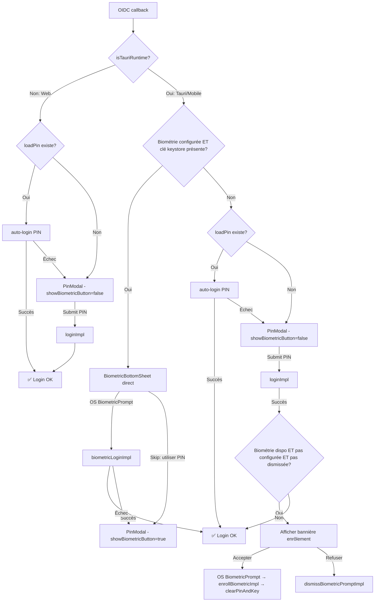

# Plan de refonte du flux de connexion MLS (PIN + Biométrie)

## Résumé du changement

Le flux de connexion actuel sur mobile (Tauri) affiche la [`BiometricBottomSheet`](frontend/src/lib/components/auth/BiometricBottomSheet.svelte) **avant** le PIN, ce qui est incorrect pour une première connexion. La bannière d'enrôlement biométrique post-login n'est jamais affichée. Le plan ci-dessous corrige ces problèmes et unifie le comportement.

## Diagramme de flux



## 1. Nouveau `startLoginFlow()` en pseudo-code

```typescript
async function startLoginFlow() {
  if (_loginInProgress || globalSession.isLoggedIn || globalSession.isLoginInProgress) return;
  _loginInProgress = true;
  globalSession.isLoginInProgress = true;

  try {
    if (!(await ensurePlatformAllowsUnlock())) {
      globalSession.isLoginInProgress = false;
      return;
    }

    // ── BRANCHE TAURI (MOBILE) ──
    if (isTauriRuntime()) {
      const savedUser = currentUserId();
      if (!savedUser) {
        globalSession.isLoginInProgress = false;
        return;
      }
      globalSession.userId = savedUser;

      // Étape 1 : Vérifier si biométrie est CONFIGURÉE (keystore key présente)
      const deviceKey = `mls_device_id_${savedUser}`;
      const storedDeviceId = localStorage.getItem(deviceKey);
      const hasExistingDevice = storedDeviceId !== null;
      let biometricReady = false;

      if (hasExistingDevice) {
        const alias = `mls_device_key_${savedUser}_${storedDeviceId}`;
        biometricReady = await BiometricService.isKeyPresent(alias).catch(() => false);
      }

      if (biometricReady) {
        // Connexion suivante avec biométrie ENROLÉE :
        // → BiometricBottomSheet direct, PAS de PIN stocké
        biometricConfigured = true;
        showBiometricSheet = true;
        await globalSession.biometricLogin({
          ...sessionCb(),
          onLoginFailed: onSavedPinFailed,
        });
        dismissAuthPrompts();
      }

      if (!globalSession.isLoggedIn) {
        // Biométrie a échoué, annulée, ou pas configurée
        // → Essayer le PIN stocké
        const savedPin = await loadPin();
        if (savedPin) {
          globalSession.pin = savedPin;
          globalSession.isLoginInProgress = false;
          void globalSession.login({
            ...sessionCb(),
            onLoginFailed: onSavedPinFailed,
          });
        } else {
          // Pas de PIN stocké → PinModal SANS bouton empreinte
          biometricConfigured = false;  // Pas d'empreinte → pas de bouton
          globalSession.isLoginInProgress = false;
          await openPinModal(savedUser);
        }
      }
      return;
    }

    // ── BRANCHE WEB ──
    const savedUser = currentUserId();
    const savedPin = await loadPin();
    if (savedUser && savedPin) {
      globalSession.userId = savedUser;
      globalSession.pin = savedPin;
      globalSession.isLoginInProgress = false;
      void globalSession.login({ ...sessionCb(), onLoginFailed: onSavedPinFailed });
    } else if (savedUser) {
      globalSession.userId = savedUser;
      globalSession.isLoginInProgress = false;
      await openPinModal(savedUser);
    } else {
      globalSession.isLoginInProgress = false;
    }
  } finally {
    if (!globalSession.isLoggedIn && !showPinModal) _loginInProgress = false;
  }
}
```

### Points clés de `startLoginFlow()` :

1. **Mobile : biométrie d'abord UNIQUEMENT si clé keystore présente** (`BiometricService.isKeyPresent`). Pas de vérification de `isAvailable` : si la clé est là, c'est que l'utilisateur a déjà enrolé.
2. **Mobile : PAS de `BiometricBottomSheet` avant le PIN** sur première connexion. La bottom sheet n'apparaît que quand `biometricReady === true`.
3. **Mobile : `biometricConfigured = false`** quand on tombe dans le fallback PIN sans empreinte configurée, pour que le `PinModal` n'affiche pas le bouton empreinte.
4. **Web : inchangé** — PIN stocké → auto-login, sinon PinModal.

## 2. Templates à modifier dans [`ChatBackgroundService.svelte`](frontend/src/lib/components/layout/ChatBackgroundService.svelte)

### 2.1 Bannière d'enrôlement biométrique (NOUVEAU template)

Ajouter **après** le `{#if showIncomingToast}...{/if}` (avant la fermeture du fichier) un bloc conditionnel :

```svelte
{#if globalSession.showBiometricEnrollPrompt}
  <!-- Bannière d'enrôlement biométrique post-login -->
  <div
    class="fixed bottom-6 left-1/2 -translate-x-1/2 z-[300] max-w-sm w-[calc(100%-2rem)] bg-[#1a1f2e]/95 backdrop-blur-2xl rounded-2xl shadow-2xl ring-1 ring-white/10 px-5 py-4 flex items-center gap-4"
    transition:fly={{ y: 20, duration: 300 }}
  >
    <div class="p-3 rounded-full bg-amber-500/10 shrink-0">
      <Fingerprint size={24} strokeWidth={1.5} class="text-amber-500" />
    </div>
    <div class="min-w-0 flex-1">
      <p class="text-sm font-bold text-white">{m.auth_biometric_enroll_title()}</p>
      <p class="text-xs text-white/55 mt-0.5">{m.auth_biometric_enroll_prompt()}</p>
    </div>
    <div class="flex items-center gap-2 shrink-0">
      <button
        onclick={() => dismissBiometricPromptImpl(/* ctx */)}
        class="px-3 py-1.5 text-xs font-semibold text-white/60 hover:text-white transition-colors"
      >
        {m.auth_biometric_later_btn()}
      </button>
      <button
        onclick={() => handleBiometricEnroll()}
        class="px-4 py-1.5 text-xs font-bold bg-amber-500 text-[#151B2C] rounded-lg hover:bg-amber-400 transition-all active:scale-95"
      >
        {m.auth_biometric_enable_btn()}
      </button>
    </div>
  </div>
{/if}
```

### 2.2 `BiometricBottomSheet` — usage conservé mais uniquement pour connexions suivantes

La ligne actuelle (ligne 1061) :
```svelte
<BiometricBottomSheet open={showBiometricSheet} onSkip={onBiometricSkip} />
```
Est conservée telle quelle. Elle ne s'affiche que quand `biometricReady === true` (connexions suivantes avec empreinte).

### 2.3 `PinModal` — binding `showBiometricButton` corrigé

La ligne 1073 :
```svelte
showBiometricButton={biometricConfigured}
```
Est déjà correcte. `biometricConfigured` est `true` seulement quand l'empreinte est configurée ET la clé keystore existe. Sur première connexion ou fallback PIN simple, il sera `false`.

### 2.4 Import de `Fingerprint` depuis `@lucide/svelte`

Vérifier que `Fingerprint` est bien importé (utilisé dans la bannière). L'import actuel (ligne 39) :
```typescript
import { Phone, PhoneOff, Video } from '@lucide/svelte';
```
Devra être modifié pour ajouter `Fingerprint` :
```typescript
import { Fingerprint, Phone, PhoneOff, Video } from '@lucide/svelte';
```

## 3. Conditions précises par branche

### Tableau de décision

| Contexte | Condition | Action |
|----------|-----------|--------|
| **WEB** - PIN stocké | `loadPin() !== null` | auto-login → loginImpl |
| **WEB** - Pas de PIN | `loadPin() === null` | PinModal (`showBiometricButton=false`, `showStaySignedIn=true`) |
| **MOBILE** - Empreinte configurée | `BiometricService.isKeyPresent(alias) === true` | BiometricBottomSheet → biometricLoginImpl |
| **MOBILE** - Empreinte échoue/annulée + PIN stocké | `isLoggedIn === false && loadPin() !== null` | auto-login PIN |
| **MOBILE** - Empreinte échoue/annulée + pas de PIN | `isLoggedIn === false && loadPin() === null` | PinModal (`showBiometricButton=false`) |
| **MOBILE** - Première connexion, PIN submit réussi | `loginImpl` succès | Vérifier si `BiometricService.isAvailable() && !BiometricService.isConfigured() && !isBiometricPromptDismissed()` → bannière enrôlement |
| **MOBILE** - Enrôlement accepté | Clic "Activer" | `BiometricService.enableBiometric()` → `clearPinAndKey()` → cacher bannière |
| **MOBILE** - Enrôlement refusé | Clic "Plus tard" | `dismissBiometricPromptImpl` (flag permanent) |

### Détail des flags

- **`biometricConfigured`** (état local `ChatBackgroundService`) : `true` quand l'utilisateur a une clé keystore (`isKeyPresent`). Contrôle `showBiometricButton` du `PinModal` et si on tente la biométrie en premier.
- **`showBiometricEnrollPrompt`** (état dans `globalSession`) : `true` après un login PIN réussi sur mobile si les conditions sont remplies. Consommé par le template bannière. Mis à `false` par `enrollBiometricImpl` ou `dismissBiometricPromptImpl`.
- **`biometricPromptDismissed`** (flag localStorage + Tauri natif) : persistant, empêche de reproposer l'enrôlement.

## 4. Gestion du flag `showBiometricEnrollPrompt`

### 4.1 Déclenchement (SET à `true`)

Dans `handlePinSubmit()`, après que `onMlsReady` est appelé (login PIN réussi), **si on est sur Tauri** :

```typescript
onMlsReady: () => {
  clearTimeout(stepTimer);
  clearTimeout(watchdog);
  // Vérifier si on doit proposer l'enrôlement biométrique
  if (isTauriRuntime()) {
    void (async () => {
      const available = await BiometricService.isAvailable().catch(() => false);
      const configured = await BiometricService.isConfigured().catch(() => false);
      const dismissed = await isBiometricPromptDismissed();
      if (available && !configured && !dismissed) {
        globalSession.showBiometricEnrollPrompt = true;
      }
    })();
  }
},
```

**Important** : cette vérification doit se faire APRÈS `dismissAuthPrompts()` pour ne pas bloquer la fermeture du modal PIN. La bannière apparaît après que le modal PIN est fermé.

Alternative plus propre : ne pas mettre cette logique dans `handlePinSubmit` mais plutôt avoir un `$effect` réactif dans `ChatBackgroundService.svelte` :

```typescript
$effect(() => {
  if (!globalSession.isLoggedIn || !isTauriRuntime()) return;
  // Vérifier l'enrôlement après chaque login réussi
  const justLoggedIn = globalSession.isLoggedIn;
  untrack(async () => {
    const available = await BiometricService.isAvailable().catch(() => false);
    const configured = await BiometricService.isConfigured().catch(() => false);
    const dismissed = await isBiometricPromptDismissed();
    if (available && !configured && !dismissed && !globalSession.showBiometricEnrollPrompt) {
      globalSession.showBiometricEnrollPrompt = true;
    }
  });
});
```

**Recommandation** : utiliser l'approche `$effect` car elle est plus robuste (couvre aussi le cas où l'utilisateur active la biométrie dans les paramètres puis se déconnecte/reconnecte).

### 4.2 Désactivation (SET à `false`)

- `dismissBiometricPromptImpl` : appelée quand l'utilisateur clique "Plus tard". Persiste le flag.
- `enrollBiometricImpl` : appelée quand l'utilisateur clique "Activer". Appelle `BiometricService.enableBiometric()` puis `clearPinAndKey()`. Met `showBiometricEnrollPrompt` à `false`.
- `logoutImpl` : met déjà `showBiometricEnrollPrompt` à `false` (ligne 1071 de `sessionAuth.ts`).

### 4.3 Fonctions à exposer dans `ChatBackgroundService.svelte`

```typescript
async function handleBiometricEnroll() {
  // Appeler enrollBiometricImpl du SessionContext
  // Le SessionContext n'a pas de méthode enrollBiometric directement,
  // il faut utiliser globalSession.enrollBiometric() si elle existe,
  // ou passer par le module sessionBiometrics.ts directement.
  await enrollBiometricImpl(getSessionContext());
  // Après enrollment réussi : recharger l'état biometricConfigured
  if (globalSession.isLoggedIn) {
    biometricConfigured = await BiometricService.isConfigured().catch(() => false);
  }
}

async function handleBiometricDismiss() {
  await dismissBiometricPromptImpl(getSessionContext());
}
```

**Point d'attention** : `globalSession` expose-t-il `enrollBiometric` et `dismissBiometricPrompt` ? Il faut vérifier dans [`useChatSession.svelte.ts`](frontend/src/lib/composables/useChatSession.svelte.ts). Si oui, utiliser `globalSession.enrollBiometric()` et `globalSession.dismissBiometricPrompt()`. Sinon, importer directement depuis [`sessionBiometrics.ts`](frontend/src/lib/composables/session/sessionBiometrics.ts) en passant le `SessionContext` obtenu via une méthode sur `globalSession`.

## 5. Modifications de [`PinModal.svelte`](frontend/src/lib/components/auth/PinModal.svelte)

**Aucune modification structurelle nécessaire.** Le composant est déjà bien conçu :

- `showBiometricButton` contrôle le bouton empreinte → le parent passe `biometricConfigured`
- `showStaySignedIn` contrôle la checkbox → le parent passe `!isTauriRuntime()`
- `isFirstSetup` contrôle le message → le parent détecte via `detectFirstPinSetup()`

**Optionnel** : sur mobile, `showStaySignedIn` doit rester à `true` ? Actuellement `showStaySignedIn = !isTauriRuntime()`, donc sur mobile c'est `false`. L'état désiré dit que sur mobile première connexion, la checkbox "Se souvenir du PIN" est présente. Il faut donc **toujours** afficher la checkbox, mais avec un comportement différent : sur mobile, si l'utilisateur accepte l'enrôlement biométrique, le PIN est supprimé quoi qu'il arrive.

**Changement nécessaire** : `showStaySignedIn` doit être `true` sur mobile aussi pour la première connexion. Modifier la ligne 195 :

```typescript
// AVANT
const showStaySignedIn = !isTauriRuntime();

// APRÈS
const showStaySignedIn = true;  // Toujours afficher la checkbox
```

La logique métier (suppression du PIN si enrôlement biométrique) est gérée par `enrollBiometricImpl` → `clearPinAndKey()`.

## 6. Modifications de [`sessionAuth.ts`](frontend/src/lib/composables/session/sessionAuth.ts)

**Aucune modification nécessaire.** Les fonctions sont déjà correctes :

- [`loginImpl`](frontend/src/lib/composables/session/sessionAuth.ts:221) : supporte le mode biométrique (PIN vide). Sauvegarde le PIN via `savePin` en fin de flow.
- [`biometricLoginImpl`](frontend/src/lib/composables/session/sessionAuth.ts:903) : passe un PIN vide, intercepte les erreurs "keystore empty" proprement.
- [`nativeStorageLoginImpl`](frontend/src/lib/composables/session/sessionAuth.ts:875) : déjà OK pour le fallback PIN natif.

## 7. Modifications de [`sessionBiometrics.ts`](frontend/src/lib/composables/session/sessionBiometrics.ts)

**Une modification mineure** : `enrollBiometricImpl` (ligne 64) doit s'assurer que le flag `CONFIG_FLAG_KEY` (`canari_biometric_configured`) est bien positionné. Actuellement, `BiometricService.enableBiometric()` le fait déjà. Mais `enrollBiometricImpl` fait `localStorage.removeItem(BIOMETRIC_DISMISSED_KEY)` ce qui est correct (réarme la bannière si on désactive puis réactive).

**Aucun changement fonctionnel requis.**

## 8. Ordre exact des opérations à implémenter

### Étape 1 : [`ChatBackgroundService.svelte`](frontend/src/lib/components/layout/ChatBackgroundService.svelte) — Réécriture de `startLoginFlow()`

1. Supprimer le bloc Tauri actuel (lignes 683-713) qui essaie la biométrie en premier même sans configuration.
2. Implémenter le nouveau flow :
   - Vérifier `BiometricService.isKeyPresent(alias)` au lieu de `BiometricService.isAvailable()`
   - Ne PAS afficher `BiometricBottomSheet` si pas de clé keystore
   - Mettre `biometricConfigured = false` dans la branche fallback PIN quand pas de biométrie
   - Essayer le PIN stocké AVANT d'ouvrir le PinModal (fallback après échec biométrique)

### Étape 2 : [`ChatBackgroundService.svelte`](frontend/src/lib/components/layout/ChatBackgroundService.svelte) — Bannière d'enrôlement

1. Ajouter l'import `Fingerprint` depuis `@lucide/svelte` (ligne 39)
2. Ajouter l'import des fonctions biométriques :
   ```typescript
   import { enrollBiometricImpl, dismissBiometricPromptImpl, isBiometricPromptDismissed } from '$lib/composables/session/sessionBiometrics';
   ```
3. Ajouter le template de bannière d'enrôlement (section 2.1 ci-dessus)
4. Ajouter les fonctions `handleBiometricEnroll()` et `handleBiometricDismiss()`
5. Ajouter un `$effect` qui vérifie les conditions d'enrôlement après login (section 4.1)

### Étape 3 : [`ChatBackgroundService.svelte`](frontend/src/lib/components/layout/ChatBackgroundService.svelte) — `showStaySignedIn`

1. Modifier la ligne 195 : `const showStaySignedIn = true;` (toujours afficher la checkbox, même sur mobile)

### Étape 4 : [`ChatBackgroundService.svelte`](frontend/src/lib/components/layout/ChatBackgroundService.svelte) — Mise à jour de `afterNavigate`

1. Adapter le bloc `afterNavigate` (lignes 1000-1057) pour refléter le même flow que `startLoginFlow()` :
   - Mobile : vérifier `isKeyPresent` avant de tenter biométrie
   - Éviter la duplication de logique en factorisant si possible

### Étape 5 : Vérifier l'exposition des méthodes dans [`useChatSession.svelte.ts`](frontend/src/lib/composables/useChatSession.svelte.ts)

1. Vérifier si `globalSession` expose `enrollBiometric()` et `dismissBiometricPrompt()`
2. Si oui, les utiliser directement. Si non, importer depuis [`sessionBiometrics.ts`](frontend/src/lib/composables/session/sessionBiometrics.ts) avec un `SessionContext` construit manuellement ou obtenu via `globalSession`.

### Étape 6 : Tests manuels

1. **Web - première connexion** : OIDC → PinModal → saisie PIN → checkbox "Rester connecté" → login OK
2. **Web - retour** : OIDC → PIN stocké → auto-login OK
3. **Web - retour échec PIN** : OIDC → PIN stocké → échec → PinModal sans bouton empreinte
4. **Mobile - première connexion** : OIDC → PinModal SANS bouton empreinte → saisie PIN + checkbox → login OK → bannière enrôlement
5. **Mobile - enrôlement accepté** : clic "Activer" → OS BiometricPrompt → succès → PIN supprimé → bannière disparaît
6. **Mobile - enrôlement refusé** : clic "Plus tard" → flag dismissé → bannière disparaît pour toujours
7. **Mobile - retour avec empreinte** : OIDC → BiometricBottomSheet → OS BiometricPrompt → login OK
8. **Mobile - retour empreinte échec** : BiometricBottomSheet → échec → PinModal avec bouton empreinte (`showBiometricButton=true`)
9. **Mobile - pas d'empreinte, PIN stocké** : OIDC → PIN stocké → auto-login OK
10. **Mobile - pas d'empreinte, pas de PIN** : OIDC → PinModal sans bouton empreinte

## 9. État actuel des états réactifs

| Variable | Type | Localisation | Rôle |
|----------|------|-------------|------|
| `showPinModal` | `$state(bool)` | [`ChatBackgroundService`](frontend/src/lib/components/layout/ChatBackgroundService.svelte:186) | Affiche le PinModal |
| `isFirstPinSetup` | `$state(bool)` | [`ChatBackgroundService`](frontend/src/lib/components/layout/ChatBackgroundService.svelte:188) | "Choisissez votre PIN" vs "Déverrouillez" |
| `biometricConfigured` | `$state(bool)` | [`ChatBackgroundService`](frontend/src/lib/components/layout/ChatBackgroundService.svelte:192) | Contrôle `showBiometricButton` du PinModal |
| `pinStaySignedIn` | `$state(bool)` | [`ChatBackgroundService`](frontend/src/lib/components/layout/ChatBackgroundService.svelte:196) | Checkbox "Rester connecté" |
| `showBiometricSheet` | `$state(bool)` | [`ChatBackgroundService`](frontend/src/lib/components/layout/ChatBackgroundService.svelte:262) | Affiche BiometricBottomSheet |
| `showBiometricEnrollPrompt` | `$state(bool)` | [`useChatSession`](frontend/src/lib/composables/useChatSession.svelte.ts:64) | Affiche la bannière d'enrôlement |
| `BIOMETRIC_DISMISSED_KEY` | `localStorage` | [`sessionBiometrics`](frontend/src/lib/composables/session/sessionBiometrics.ts:13) | Flag "ne plus proposer" |
| `CONFIG_FLAG_KEY` | `localStorage` | [`BiometricService`](frontend/src/lib/services/biometric.ts:11) | Flag "biométrie configurée" |

## 10. Points d'attention et risques

1. **`globalSession` n'expose peut-être pas `enrollBiometric()` et `dismissBiometricPrompt()` directement.** Vérifier l'API publique de [`useChatSession.svelte.ts`](frontend/src/lib/composables/useChatSession.svelte.ts) et ajouter ces méthodes si nécessaire.

2. **L'`$effect` d'enrôlement post-login** doit être protégé contre les exécutions multiples. Utiliser `untrack()` et vérifier `!globalSession.showBiometricEnrollPrompt` avant de le mettre à `true`.

3. **La gestion du `SessionContext`** pour `enrollBiometricImpl` et `dismissBiometricPromptImpl` : ces fonctions attendent un `ctx: SessionContext`. Si `globalSession` n'expose pas de méthode `getSessionContext()`, il faudra soit en ajouter une, soit exposer des wrappers `enrollBiometric()` / `dismissBiometricPrompt()` directement sur `globalSession`.

4. **`BiometricBottomSheet` actuelle** n'a que `open` et `onSkip`. Pour les connexions suivantes, le flow est : BottomSheet s'affiche → l'utilisateur peut soit laisser le prompt OS s'ouvrir (via `biometricLogin` déjà lancé en arrière-plan dans `startLoginFlow`), soit cliquer "Utiliser mon PIN" → fallback PinModal. **Problème** : actuellement `biometricLogin` est appelé immédiatement dans `startLoginFlow` sans attendre l'interaction utilisateur avec la BottomSheet. La BottomSheet actuelle est purement décorative ? Il faut clarifier : soit on lance `biometricLogin` après que l'utilisateur a interagi avec la BottomSheet, soit la BottomSheet est supprimée et on va directement au prompt OS.

   → **Recommandation** : Supprimer la `BiometricBottomSheet` du flow. Aller directement au `biometricLogin` (qui ouvre le prompt OS). Si l'utilisateur annule le prompt OS, `biometricLoginImpl` échoue avec une erreur silencieuse et on tombe dans le fallback PinModal. La BottomSheet actuelle n'ajoute pas de valeur (elle n'a qu'un bouton "skip" qui revient au PIN, ce qui est identique à annuler le prompt OS).

   **Si on garde la BottomSheet** : il faut lancer `biometricLogin` SEULEMENT quand l'utilisateur interagit avec (pas de `onSkip`). Il faut ajouter un callback `onBiometric` à la BottomSheet, ou lancer le flux biométrique automatiquement quand la sheet s'affiche.

5. **Suppression du PIN après enrôlement** : `enrollBiometricImpl` appelle `clearPinAndKey()` qui supprime le PIN du vault. C'est correct. Mais le PIN est encore dans `globalSession.pin` en mémoire. Il faudrait aussi vider `globalSession.pin = ''` après enrôlement pour que le prochain login ne tente pas un auto-login PIN. `clearPinAndKey` ne vide pas `ctx.setPin('')`. À vérifier si c'est nécessaire.
