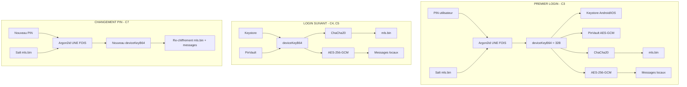
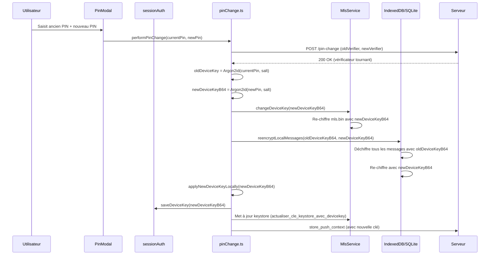

# Plan Architectural — Remplacement du PIN par `deviceKeyB64` PARTOUT

> **Version :** 2.0
> **Date :** 2026-07-27
> **Statut :** À valider
> **Stratégie :** Approche **complète** — `mls.bin` ET messages locaux migrés vers `deviceKeyB64`
> **Audit source :** [`audit-pin-argon2-pbkdf2.md`](audit-pin-argon2-pbkdf2.md) — 173 usages recensés, 14 oubliés du plan initial

---

## Table des matières

1. [Résumé exécutif](#1-résumé-exécutif)
2. [Architecture cible](#2-architecture-cible)
3. [Liste exhaustive des fichiers à modifier](#3-liste-exhaustive-des-fichiers-à-modifier)
4. [Nouvelles fonctions à créer](#4-nouvelles-fonctions-à-créer)
5. [Fonctions à supprimer](#5-fonctions-à-supprimer)
6. [Stratégie de migration](#6-stratégie-de-migration)
7. [Impact `changePIN`](#7-impact-changepin)
8. [Impact multi-appareils](#8-impact-multi-appareils)
9. [Ordre d'implémentation](#9-ordre-dimplémentation)
10. [Risques et mitigations](#10-risques-et-mitigations)

---

## 1. Résumé exécutif

### 1.1 Problème actuel

Actuellement, le PIN est utilisé à **2 endroits avec 2 KDF différents** :

| Composant | KDF | Chiffrement |
|---|---|---|
| [`mls.bin`](frontend/mls-core/src/crypto.rs) | Argon2id(PIN, salt) → clé 32B | ChaCha20-Poly1305 |
| Messages locaux IndexedDB/SQLite | PBKDF2(PIN, stableSalt) → clé AES | AES-256-GCM |
| PinVault | Aucun KDF | AES-GCM (stocke le PIN raw) |

Le `deviceKeyB64` (clé de 32 bytes dérivée du PIN via Argon2id une seule fois) existe déjà dans le keystore Android/iOS et dans [`push_context.json`](frontend/src-tauri/src/commands/push.rs), mais n'est pas utilisé pour les opérations de chiffrement quotidiennes.

### 1.2 Objectif

**Ne plus jamais utiliser le PIN pour le chiffrement.** Après le premier login (C3), `deviceKeyB64` devient la seule clé de chiffrement pour `mls.bin` ET les messages locaux. Le PIN ne sert plus qu'à l'authentification serveur (`pin-check`) et à la dérivation initiale de `deviceKeyB64`.

### 1.3 Bénéfices

| Avant | Après |
|---|---|
| Argon2id à chaque lancement (~1s sur mobile) | 0 Argon2id (hors premier login et changement de PIN) |
| PBKDF2 pour chaque message (100K itérations) | 0 PBKDF2 — clé AES directe |
| PIN en mémoire pour le chiffrement | `deviceKeyB64` en mémoire (même empreinte) |
| 2 KDF différents, 2 sels différents | 1 clé unique pour tout |

---

## 2. Architecture cible

### 2.1 Diagramme de flux



### 2.2 Formats de chiffrement

#### mls.bin (inchangé)

```
[salt (16 bytes)] [nonce (12 bytes) || ciphertext (N bytes)]
                    └── ChaCha20-Poly1305 ──┘
```

Le salt est conservé pour rétrocompatibilité (migration paresseuse). Avec le nouveau chemin, il est ignoré au `load_with_key` mais présent pour qu'un vieux `mls.bin` puisse être relu avec l'ancien chemin Argon2id si nécessaire.

#### Messages locaux (NOUVEAU format)

```
[nonce (12 bytes) || ciphertext (N bytes)]
  └── AES-256-GCM avec deviceKeyB64 ──┘
```

**Plus de PBKDF2, plus de salt.** La clé `deviceKeyB64` (32 bytes décodés depuis base64) est utilisée directement comme clé AES-256-GCM via Web Crypto (`importKey('raw', keyBytes, 'AES-GCM')`).

---

## 3. Liste exhaustive des fichiers à modifier

### 3.1 Couche Rust — [`frontend/mls-core/src/`](frontend/mls-core/src/)

#### Fichier : [`crypto.rs`](frontend/mls-core/src/crypto.rs)

| Ligne(s) | Élément actuel | Changement |
|---|---|---|
| 13-17 | `encrypt_state_blob(pin: &str)` | **Supprimer** (plus d'appelants après migration) |
| 19-23 | `save_encrypted(&self, pin: &str)` | **Supprimer** (redirigé vers `save_encrypted_with_key`) |
| 25-31 | `save_encrypted_owned(&self, pin: String)` | **Supprimer** |
| 33-49 | `save_encrypted_with_key(&self, key: &[u8; 32])` | ✅ **Conserver** (utilisé par le background et nouveau chemin) |
| 51-77 | `load_encrypted(pin: &str)` | **Supprimer** (redirigé vers `load_with_key`) |
| 79-90 | `load_encrypted_owned(pin: String)` | **Supprimer** |
| 93-164 | `load_encrypted_with_keystore(pin: Option<String>)` | **Modifier** — simplifier le chemin PIN : dériver `deviceKeyB64` puis utiliser `load_with_key`. Le stockage keystore est déjà fait par `derive_and_store_device_key`. |
| 166-191 | `load_with_key(key: &[u8; 32])` | ✅ **Conserver** — devient le chemin principal |

**Actions précises :**
- Supprimer `encrypt_state_blob`, `save_encrypted`, `save_encrypted_owned`, `load_encrypted`, `load_encrypted_owned`
- Dans `load_encrypted_with_keystore`, le chemin PIN (lignes 114-136) appelle déjà `derive_and_store_device_key` puis `load_with_key` — c'est correct mais il faut aussi **stocker `deviceKeyB64` dans un format accessible au frontend** (cf. `get_device_key_b64` ci-dessous)
- Ajouter une méthode publique pour exporter la clé dérivée : `pub fn get_derived_key_b64(&self) -> Option<String>` — permettra au frontend de récupérer la clé après le premier login

#### Fichier : [`security.rs`](frontend/mls-core/src/security.rs)

| Ligne(s) | Élément actuel | Changement |
|---|---|---|
| 11-20 | `derive_key_from_pin(pin: &str, salt: &[u8])` | **Conserver** mais garder `#[deprecated]` — utilisé uniquement pour le premier login et le changePIN |
| 22-29 | `derive_key_from_pin_owned(pin: String, salt: &[u8])` | **Conserver** — idem |
| 31-42 | `encrypt_blob(key: &[u8; 32], data: &[u8])` | ✅ **Conserver** |
| 43-52 | `decrypt_blob(key: &[u8; 32], encrypted_data: &[u8])` | ✅ **Conserver** |
| 54-69 | `encrypt_state_with_pin(pin: &str, plain_state: &[u8])` | **Supprimer** |
| 70-81 | `encrypt_state_with_pin_owned(pin: String, plain_state: &[u8])` | **Supprimer** |
| 84-112 | `derive_and_store_device_key(pin, salt, alias, keystore)` | ✅ **Conserver** — utilisé par le premier login et `store_push_context` |
| 114-120 | `generate_salt()` | ✅ **Conserver** |

**Actions précises :**
- Supprimer `encrypt_state_with_pin` et `encrypt_state_with_pin_owned`
- Rien à ajouter — les primitives key-based (`encrypt_blob`, `decrypt_blob`) existent déjà

### 3.2 Couche WASM — [`frontend/mls-wasm/src/`](frontend/mls-wasm/src/)

#### Fichier : [`pin_crypto.rs`](frontend/mls-wasm/src/pin_crypto.rs)

| Élément actuel | Changement |
|---|---|
| `encrypt_with_pin(pin, data)` | **Supprimer** — remplacer par `encrypt_with_key(key_b64, data)` |
| `decrypt_with_pin(pin, data)` | **Supprimer** — remplacer par `decrypt_with_key(key_b64, data)` |

**Actions précises :**
- Ajouter `encrypt_with_key(key_b64: String, data: Vec<u8>) -> Vec<u8>` : décode `key_b64` en 32 bytes, appelle `encrypt_blob`
- Ajouter `decrypt_with_key(key_b64: String, encrypted_data: Vec<u8>) -> Vec<u8>` : décode `key_b64` en 32 bytes, appelle `decrypt_blob`
- Supprimer `encrypt_with_pin` et `decrypt_with_pin`
- Mettre à jour les bindings WASM exposés

#### Fichier : [`lib.rs`](frontend/mls-wasm/src/lib.rs) — Nouveaux bindings WASM

| Ligne(s) | Élément actuel | Changement |
|---|---|---|
| 53-57 | `encrypt_mls_state_blob(plain_state, pin)` | **Supprimer** — remplacé par `encrypt_mls_state_blob_with_key` |
| 69-104 | `WasmMlsClient::new(user_id, device_id, state_bytes, pin: Option<String>)` | **Modifier** — le constructeur accepte `pin` pour le chemin C3 mais doit aussi accepter `device_key_b64: Option<String>` pour C4/C5 |
| 163-176 | `save_state(&self, pin: Option<String>)` | **Modifier** — `save_state(&self, device_key_b64: Option<String>)` |

**Nouvelles fonctions WASM publiques :**

```rust
#[wasm_bindgen]
pub fn encrypt_mls_state_blob_with_key(plain_state: &[u8], key_b64: &str) -> Result<Vec<u8>, JsValue> { ... }

#[wasm_bindgen]
pub fn decrypt_mls_state_blob_with_key(encrypted: &[u8], key_b64: &str) -> Result<Vec<u8>, JsValue> { ... }
```

### 3.3 Couche TypeScript — Stockage et chiffrement

#### Fichier : [`encryption.ts`](frontend/src/lib/encryption.ts) — **LE PLUS GROS CHANGEMENT**

| Élément actuel | Changement |
|---|---|
| `encryptData(data, pin, stableSalt?)` | **Remplacer** par `encryptDataWithKey(data, deviceKeyB64)` |
| `decryptData(cipherText, iv, salt, pin)` | **Remplacer** par `decryptDataWithKey(cipherText, iv, deviceKeyB64)` |
| `deriveKey(pin, salt)` (PBKDF2) | **Supprimer** |
| `derivedKeyCache` (cache PBKDF2) | **Supprimer** |
| `PBKDF2_ITERATIONS` | **Supprimer** |

**Nouvelles fonctions :**

```typescript
// Nouveau format : [nonce (12 bytes) || ciphertext (N bytes)]
// La clé deviceKeyB64 (base64 de 32 bytes) est importée directement comme CryptoKey AES-GCM.

const deviceKeyCache = new Map<string, Promise<CryptoKey>>();

async function importDeviceKey(deviceKeyB64: string): Promise<CryptoKey> {
  const cached = deviceKeyCache.get(deviceKeyB64);
  if (cached) return cached;
  const promise = (async () => {
    const keyBytes = Uint8Array.from(atob(deviceKeyB64), c => c.charCodeAt(0));
    return crypto.subtle.importKey('raw', keyBytes, { name: 'AES-GCM' }, false, ['encrypt', 'decrypt']);
  })();
  deviceKeyCache.set(deviceKeyB64, promise);
  return promise;
}

export async function encryptDataWithKey(
  data: any,
  deviceKeyB64: string
): Promise<{ iv: Uint8Array; cipherText: Uint8Array }> {
  const iv = crypto.getRandomValues(new Uint8Array(12));
  const key = await importDeviceKey(deviceKeyB64);
  const plaintext = new TextEncoder().encode(JSON.stringify(data));
  const cipherBuf = await crypto.subtle.encrypt({ name: 'AES-GCM', iv }, key, plaintext);
  return { iv, cipherText: new Uint8Array(cipherBuf) };
}

export async function decryptDataWithKey(
  cipherText: Uint8Array,
  iv: Uint8Array,
  deviceKeyB64: string
): Promise<any> {
  const key = await importDeviceKey(deviceKeyB64);
  try {
    const plainBuf = await crypto.subtle.decrypt({ name: 'AES-GCM', iv: new Uint8Array(iv) }, key, new Uint8Array(cipherText));
    return JSON.parse(new TextDecoder().decode(plainBuf));
  } catch {
    throw new Error('Decryption failed. Wrong device key?');
  }
}
```

**Remarque importante :** Les fonctions `encryptData`/`decryptData` (PBKDF2) doivent être **conservées temporairement** pour la migration (re-chiffrement des anciens messages). Elles seront marquées `@deprecated` et leurs appelants migrés un par un.

#### Fichier : [`pinVault.ts`](frontend/src/lib/utils/pinVault.ts)

| Élément actuel | Changement |
|---|---|
| `savePin(pin: string)` | **Remplacer** par `saveDeviceKey(deviceKeyB64: string)` |
| `loadPin(): Promise<string \| null>` | **Remplacer** par `loadDeviceKey(): Promise<string \| null>` |
| `clearPin()` | **Renommer** en `clearDeviceKey()` |
| `clearPinAndKey()` | **Renommer** en `clearDeviceKeyAndWrapKey()` |
| `setPinPersistence(enabled, pin)` | **Renommer** en `setDeviceKeyPersistence(enabled, deviceKeyB64)` |
| `isPinPersistenceEnabled()` | **Renommer** en `isDeviceKeyPersistenceEnabled()` |
| `VAULT_BLOB_KEY = 'canari_pin_vault'` | Changer en `'canari_device_key_vault'` |
| `VAULT_KEY_KEY = 'canari_pin_vault_key'` | Changer en `'canari_device_key_vault_key'` |
| `PERSIST_FLAG_KEY = 'canari_pin_persist'` | Changer en `'canari_device_key_persist'` |

**Actions précises :**
- **Conserver les anciens noms en alias `@deprecated`** qui redirigent vers les nouveaux pour éviter de casser tous les appelants d'un coup
- Le mécanisme AES-GCM reste identique, seul le contenu change (PIN 6-8 chiffres → `deviceKeyB64` de 44 caractères base64)
- Ajouter une fonction `clearAllDeviceKeys()` qui nettoie aussi les anciennes clés (pour la migration)

### 3.4 Couche TypeScript — Services MLS

#### Fichier : [`BaseMlsService.ts`](frontend/src/lib/services/BaseMlsService.ts)

| Élément actuel | Changement |
|---|---|
| `abstract saveState(pin: string): Promise<Uint8Array>` | **Modifier** — `saveState(deviceKeyB64: string): Promise<Uint8Array>` |
| `abstract changePIN(newPin: string): Promise<void>` | **Remplacer** par `abstract changeDeviceKey(newDeviceKeyB64: string): Promise<void>` |
| `abstract _initImpl(userId, pin, state?, opts?)` | **Modifier** — `_initImpl(userId, pin, state?, opts?)` : le `pin` est conservé pour le premier login (C3) mais un paramètre `deviceKeyB64?` optionnel est ajouté |
| `abstract loadStateWithPin(pin: string, state?: Uint8Array)` | **Remplacer** par `abstract loadStateWithKey(deviceKeyB64: string, state?: Uint8Array)` |
| `generateKeyPackage(pin: string)` | **Modifier** — `generateKeyPackage(deviceKeyB64: string)` |
| `republishKeyMaterial(pin: string)` | **Modifier** — `republishKeyMaterial(deviceKeyB64: string)` |
| `recoverAndRekey(userId, oldPin, newPin, state)` | **Modifier** — `recoverAndRekey(userId, oldDeviceKeyB64, newDeviceKeyB64, state)` |

#### Fichier : [`TauriMlsService.ts`](frontend/src/lib/services/TauriMlsService.ts)

| Ligne(s) | Élément actuel | Changement |
|---|---|---|
| 48 | `private _pin = ''` | **Remplacer** par `private _deviceKeyB64 = ''` |
| 364-368 | `async init(userId, pin, state?)` | **Modifier** — ajouter paramètre `deviceKeyB64?: string` |
| 386-481 | `_initImpl(userId, pin, state?, opts?)` | **Refonte majeure** — si `deviceKeyB64` est fourni, l'utiliser directement ; sinon dériver du PIN (C3) |
| 498-505 | `async saveState(pin: string)` | **Modifier** — `saveState(deviceKeyB64: string)`, passer `deviceKeyB64` à `sauvegarder_mls_et_persister` |
| 515-540 | `reloadStateFromDisk()` | Utilise `this._pin` → utiliser `this._deviceKeyB64` |
| 547-556 | `loadStateWithPin(pin, state?)` | **Remplacer** par `loadStateWithKey(deviceKeyB64, state?)` |
| 558-591 | `async changePIN(newPin: string)` | **Refonte** — devient `async changeDeviceKey(newDeviceKeyB64: string)` |
| 594-630 | `generateKeyPackage(pin: string)` | **Modifier** — `generateKeyPackage(deviceKeyB64: string)` |

**Détail `_initImpl` Tauri — nouveau flux :**

```typescript
protected async _initImpl(userId: string, pin: string, state?: Uint8Array, opts?: MlsInitOptions): Promise<void> {
  this.userId = userId;
  this._pin = pin; // Conservé pour le flux de fallback / migration
  this.freshStart = !state;

  // Si une deviceKeyB64 est déjà connue (login suivant C4/C5), l'utiliser directement
  // via le nouveau invoke 'initialiser_mls_avec_clef' (à créer côté Rust)
  // Sinon, utiliser le chemin PIN existant (C3 - premier login)

  if (this._deviceKeyB64) {
    await this.loadStateWithKey(this._deviceKeyB64, state);
  } else {
    // Premier login : le PIN est nécessaire pour dériver la clé
    await this.loadStateWithPin(pin, state);
    // Après init réussi, récupérer la deviceKeyB64 dérivée
    // Le invoke initialiser_mls doit exposer la clé dérivée
  }
  // ... suite inchangée (saveState, store_push_context, lister_groupes)
}
```

#### Fichier : [`WebMlsService.ts`](frontend/src/lib/services/WebMlsService.ts)

| Ligne(s) | Élément actuel | Changement |
|---|---|---|
| 122-123 | `reloadClientFromState(state, pin: string)` | **Modifier** — `reloadClientFromState(state, deviceKeyB64: string)` |
| 530-533 | `async init(userId, pin, state?)` | **Modifier** — ajouter `deviceKeyB64?` |
| 536-589 | `_initImpl(userId, pin, state?, opts?)` | **Refonte** — comme Tauri |
| 592-594 | `loadStateWithPin(pin, state?)` | **Remplacer** par `loadStateWithKey(deviceKeyB64, state?)` |
| 607-611 | `saveStatePlain()` | ✅ **Inchangé** (sauvegarde CBOR plain) |
| 614-616 | `encryptState(plain, pin)` | **Modifier** — `encryptState(plain, deviceKeyB64)` |
| 619-627 | `saveState(pin)` | **Modifier** — `saveState(deviceKeyB64)` |
| 633-638 | `changePIN(newPin)` | **Remplacer** par `changeDeviceKey(newDeviceKeyB64)` |
| 641-746 | `generateKeyPackage(pin)` | **Modifier** — `generateKeyPackage(deviceKeyB64)` |

#### Fichier : [`mlsWasmLoader.ts`](frontend/src/lib/mls-client/mlsWasmLoader.ts)

| Élément actuel | Changement |
|---|---|
| `loadAndInitWasm(userId, deviceId, state, pin?)` | **Modifier** — `loadAndInitWasm(userId, deviceId, state, deviceKeyB64?)` |
| `encryptMlsStateOnMainThread(plain, pin)` | **Modifier** — `encryptMlsStateOnMainThread(plain, deviceKeyB64)` |
| `encryptMlsStateOffThread(plain, pin, opts)` | **Modifier** — `encryptMlsStateOffThread(plain, deviceKeyB64, opts)` |

#### Fichier : [`IMlsService.ts`](frontend/src/lib/mls-client/IMlsService.ts)

| Ligne(s) | Élément actuel | Changement |
|---|---|---|
| 74 | `init(userId: string, pin: string, state?)` | **Modifier** — ajouter `deviceKeyB64?: string` |
| 82 | `saveState(pin: string): Promise<Uint8Array>` | **Modifier** — `saveState(deviceKeyB64: string)` |
| 110 | `generateKeyPackage(pin: string)` | **Modifier** — `generateKeyPackage(deviceKeyB64: string)` |
| 119 | `republishKeyMaterial(pin: string)` | **Modifier** — `republishKeyMaterial(deviceKeyB64: string)` |

#### Fichier : [`keyPackages.ts`](frontend/src/lib/mls-client/keyPackages.ts)

| Ligne(s) | Élément actuel | Changement |
|---|---|---|
| 10 | `replenishKeyPackages(mlsService, pin: string)` | **Modifier** — `replenishKeyPackages(mlsService, deviceKeyB64: string)` |

### 3.5 Couche TypeScript — Base de données

#### Fichier : [`indexeddb.ts`](frontend/src/lib/db/indexeddb.ts)

**Toutes les méthodes prenant `pin: string` doivent prendre `deviceKeyB64: string` :**

| Ligne(s) | Méthode | Changement |
|---|---|---|
| 228-230 | `saveMessage(msg, pin)` | `saveMessage(msg, deviceKeyB64)` |
| 238-274 | `saveMessages(msgs, pin)` | `saveMessages(msgs, deviceKeyB64)` |
| 277-315 | `getMessages(conversationId, pin)` | `getMessages(conversationId, deviceKeyB64)` |
| 323-377 | `getMessagesPage(conversationId, pin, limit, beforeTimestamp?)` | `getMessagesPage(conversationId, deviceKeyB64, ...)` |
| 475-486 | `saveOutboxEntry(entry, pin)` | `saveOutboxEntry(entry, deviceKeyB64)` |
| 489-498 | `getOutboxEntries(pin)` | `getOutboxEntries(deviceKeyB64)` |
| 501-516 | `getOutboxEntriesForConversation(conversationId, pin)` | `getOutboxEntriesForConversation(conversationId, deviceKeyB64)` |
| 519-536 | `updateOutboxEntry(id, patch, pin)` | `updateOutboxEntry(id, patch, deviceKeyB64)` |

**Nouveau format de stockage :** Supprimer le champ `salt` de `EncryptedMessageRow` (plus nécessaire sans PBKDF2).

**Bump de version IndexedDB :** Passer de v5 à v6 pour dropper tous les messages chiffrés avec l'ancien format (PBKDF2). La migration paresseuse re-chiffrera les messages depuis le serveur.

#### Fichier : [`sqlite.ts`](frontend/src/lib/db/sqlite.ts)

Mêmes changements que [`indexeddb.ts`](frontend/src/lib/db/indexeddb.ts) pour toutes les signatures prenant `pin: string`.

**Bump de version SQLite :** Ajouter une migration qui supprime tous les messages de l'ancien format.

#### Fichier : [`salt.ts`](frontend/src/lib/db/salt.ts)

| Élément actuel | Changement |
|---|---|
| `getOrCreateEncryptionSalt(storageId)` | **Supprimer** — plus besoin de salt stable sans PBKDF2 |

#### Fichier : [`types.ts`](frontend/src/lib/db/types.ts)

| Élément actuel | Changement |
|---|---|
| `EncryptedMessageRow.salt: Uint8Array` | **Supprimer** — plus de salt |
| Toutes les signatures `IStorage` avec `pin: string` | **Modifier** — `deviceKeyB64: string` |

### 3.6 Couche TypeScript — Session et Auth

#### Fichier : [`sessionTypes.ts`](frontend/src/lib/composables/session/sessionTypes.ts)

| Élément actuel | Changement |
|---|---|
| `getPin(): string` | **Conserver** (vérification serveur) |
| `setPin(v: string)` | **Conserver** |
| — | **Ajouter** `getDeviceKey(): string` |
| — | **Ajouter** `setDeviceKey(v: string): void` |

#### Fichier : [`sessionAuth.ts`](frontend/src/lib/composables/session/sessionAuth.ts)

| Ligne(s) | Élément actuel | Changement |
|---|---|---|
| 89-103 | `makeRecoveryDeps` — `pin: ctx.getPin()` | Utiliser `deviceKey: ctx.getDeviceKey()` pour le chiffrement |
| 114-141 | `makeOutboxDeps` — `pin: ctx.getPin()` | Utiliser `deviceKey: ctx.getDeviceKey()` |
| 170-207 | `resetDeviceAsFreshImpl` — `clearPinAndKey()` | ⚠️ **Oublié du plan v1.0** — Remplacer `clearPinAndKey()` par `clearDeviceKeyAndWrapKey()`. La fonction wipe l'état local (mls.bin, device ID, DB) après révocation. |
| 221-869 | `loginImpl` | **Refonte** — après `mlsService.init()`, récupérer `deviceKeyB64` et la stocker via `saveDeviceKey()` |
| 439-441 | `savePin(ctx.getPin())` | Remplacer par `saveDeviceKey(deviceKeyB64)` |
| 880-921 | `nativeStorageLoginImpl` | `loadPin()` → `loadDeviceKey()` |
| 933-971 | `biometricLoginImpl` | **Inchangé** (utilise déjà le keystore) |
| 983-1050 | `recoverPinImpl(oldPin, newPin)` | ⚠️ **Refonte** — `recoverDeviceKeyImpl(oldDeviceKeyB64, newDeviceKeyB64)` : dériver `oldDeviceKeyB64 = Argon2id(oldPin, salt)` et `newDeviceKeyB64 = Argon2id(newPin, salt)` côté frontend, puis appeler `mls.recoverAndRekey(userId, oldDeviceKeyB64, newDeviceKeyB64, state)`. |

**Détail `loginImpl` — nouveau flux :**

```
1. Vérification PIN serveur (inchangée)
2. Si deviceKeyB64 est dans PinVault/keystore → l'utiliser pour mlsService.init()
   Sinon (C3) → mlsService.init(userId, pin, state) → Argon2id interne → dérive deviceKeyB64
3. Après init réussi → récupérer deviceKeyB64 (depuis le service MLS ou la dériver)
4. Stocker deviceKeyB64 dans PinVault : saveDeviceKey(deviceKeyB64)
5. Tous les appels ultérieurs à ctx.getPin() pour le chiffrement → ctx.getDeviceKey()
```

**Audit de tous les appels à `ctx.getPin()` :**

| Localisation | Usage | Action |
|---|---|---|
| [`makeRecoveryDeps` (l.95)](frontend/src/lib/composables/session/sessionAuth.ts:95) | Passé à `reencryptLocalMessages` → chiffrement | Remplacer par `ctx.getDeviceKey()` |
| [`makeOutboxDeps` (l.119)](frontend/src/lib/composables/session/sessionAuth.ts:119) | Passé au flusher d'outbox | Remplacer par `ctx.getDeviceKey()` |
| [`setupMessageHandler` (l.565)](frontend/src/lib/composables/session/sessionAuth.ts:565) | Passé au handler de messages | Remplacer par `ctx.getDeviceKey()` |
| [`handleWelcomeRequest` (l.618)](frontend/src/lib/composables/session/sessionAuth.ts:618) | Chiffrement | Remplacer par `ctx.getDeviceKey()` |
| [`handleHistoryRequest` (l.744)](frontend/src/lib/composables/session/sessionAuth.ts:744) | Chiffrement | Remplacer par `ctx.getDeviceKey()` |
| [`initializeConnection` (l.768)](frontend/src/lib/composables/session/sessionAuth.ts:768) | Connexion WebSocket | **Conserver** `ctx.getPin()` — utilisé pour l'auth, pas le chiffrement |
| Appels à `savePin` / `loadPin` / `clearPinAndKey` | Stockage | Remplacer par `saveDeviceKey` / `loadDeviceKey` / `clearDeviceKeyAndWrapKey` |

#### Fichier : [`sessionBiometrics.ts`](frontend/src/lib/composables/session/sessionBiometrics.ts)

| Ligne(s) | Élément actuel | Changement |
|---|---|---|
| 64-91 | `enrollBiometricImpl` — `clearPinAndKey()` | Remplacer par `clearDeviceKeyAndWrapKey()` |
| 75 | `clearPinAndKey()` | `clearDeviceKeyAndWrapKey()` |
| 77-78 | `setPinPersistence(false, null)` | `setDeviceKeyPersistence(false, null)` |
| 99-130 | `disableBiometricImpl` — `savePin(pin)` | `saveDeviceKey(deviceKeyB64)` |
| 109 | `savePin(pin)` | `saveDeviceKey(ctx.getDeviceKey())` |
| 83 | Commentaire `deviceKeyB64 dans push_context.json reste utilisable` | ✅ Déjà correct |

### 3.7 Couche TypeScript — Changement de PIN

#### Fichier : [`pinChange.ts`](frontend/src/lib/utils/chat/pinChange.ts)

| Ligne(s) | Élément actuel | Changement |
|---|---|---|
| 68-154 | `reencryptLocalMessages(storage, oldPin, newPin, ...)` | **Refonte** — `reencryptLocalMessages(storage, oldDeviceKeyB64, newDeviceKeyB64, ...)` |
| 162-174 | `applyNewPinLocally(newPin, userId, deviceId, log)` | **Remplacer** par `applyNewDeviceKeyLocally(newDeviceKeyB64, userId, deviceId, log)` |
| 197-243 | `performPinChange(opts, currentPin, newPin)` | **Refonte majeure** |

**Détail `performPinChange` — nouveau flux :**

```
1. Vérification serveur : pin-check avec currentPin + pin-change avec newPin (INCHANGÉ)
2. Dériver nouvelle deviceKeyB64 = Argon2id(newPin, salt mls.bin) — UNE FOIS
3. mlsService.changeDeviceKey(newDeviceKeyB64) → ré-encrypte mls.bin
4. reencryptLocalMessages(storage, oldDeviceKeyB64, newDeviceKeyB64) → ré-encrypte messages
5. applyNewDeviceKeyLocally(newDeviceKeyB64) → saveDeviceKey() + keystore
```

**`reencryptLocalMessages` — nouveau flux :**

```typescript
export async function reencryptLocalMessages(
  storage: IStorage,
  oldDeviceKeyB64: string,
  newDeviceKeyB64: string,
  log: (msg: string) => void = () => {},
  onProgress?: PinProgressCallback,
  percentRange: { start: number; end: number } = { start: 30, end: 80 }
): Promise<number> {
  if (oldDeviceKeyB64 === newDeviceKeyB64) return 0;

  const rows = await storage.getAllEncryptedRows();
  if (rows.length === 0) return 0;

  const decrypted: StoredMessage[] = [];
  for (let i = 0; i < rows.length; i++) {
    const row = rows[i]!;
    try {
      // Essayer d'abord avec decryptDataWithKey (nouveau format)
      // puis avec decryptData (ancien format PBKDF2 — fallback migration)
      const payload = await decryptDataWithKey(row.cipherText, row.iv, oldDeviceKeyB64);
      decrypted.push({ /* ... */ });
    } catch {
      console.warn('[PIN_CHANGE] Failed to decrypt message', row.id);
    }
    // ... progression
  }

  // Re-chiffrer avec newDeviceKeyB64 via encryptDataWithKey
  for (let i = 0; i < decrypted.length; i += REENCRYPT_BATCH_SIZE) {
    await storage.saveMessagesWithKey(decrypted.slice(i, i + REENCRYPT_BATCH_SIZE), newDeviceKeyB64);
  }

  return decrypted.length;
}
```

### 3.8 Fichiers additionnels impactés (déjà dans le plan v1.0)

#### Fichier : [`connection.ts`](frontend/src/lib/utils/chat/connection.ts)

Tous les appels à `ctx.getPin()` passés aux fonctions de chiffrement → `ctx.getDeviceKey()`.

#### Fichier : [`actions.ts`](frontend/src/lib/utils/chat/actions.ts)

| Ligne(s) | Élément actuel | Changement |
|---|---|---|
| 39-41 | `processPendingInvitations(userId, pin, ...)` | `processPendingInvitations(userId, deviceKeyB64, ...)` |
| 293-294 | Autre fonction avec `pin: string` | `deviceKeyB64: string` |
| 528-530 | Autre fonction avec `pin: string` | `deviceKeyB64: string` |
| 577-578 | Envoi de fichier avec `pin: string` | ⚠️ **Oublié du plan v1.0** — Le chiffrement de média pour upload utilise aussi le PIN. Doit passer à `deviceKeyB64`. |
| 622 | `generateDevKeyPackage(mlsService, pin)` | `generateDevKeyPackage(mlsService, deviceKeyB64)` |
| 700-702 | `removeFromGroup` avec `pin: string` | `deviceKeyB64: string` |
| 955-957 | `leaveGroup` avec `pin: string` | `deviceKeyB64: string` |

#### Fichier : [`groupActions.ts`](frontend/src/lib/utils/chat/groupActions.ts)

Toutes les fonctions (lignes 97, 146, 169, 221, 257, 288, 347, 391, 463) : `pin: string` → `deviceKeyB64: string`.

#### Fichier : [`recovery.ts`](frontend/src/lib/utils/chat/recovery.ts)

`requestReAdd` et `recoverForkedGroup` : `pin` → `deviceKeyB64`.

#### Fichier : [`fcmCache.ts`](frontend/src/lib/utils/chat/fcmCache.ts)

`consumeFcmCache(pin, storage)` → `consumeFcmCache(deviceKeyB64, storage)`.

#### Fichier : [`outbox.ts`](frontend/src/lib/utils/chat/outbox.ts)

`registerOutbox`, `flushOutbox` : `pin` → `deviceKeyB64`.

#### Fichier : [`callSystemMessages.ts`](frontend/src/lib/utils/chat/callSystemMessages.ts)

`setCallSystemMessageContext`, `recordCallStarted`, `recordCallEnded` : `pin` → `deviceKeyB64`.

#### Fichier : [`historySolicit.ts`](frontend/src/lib/utils/chat/historySolicit.ts)

`solicitHistory` : `pin` → `deviceKeyB64`.

#### Fichier : [`history.ts`](frontend/src/lib/utils/chat/history.ts)

| Ligne(s) | Élément actuel | Changement |
|---|---|---|
| 188-189 | `fetchAndStoreHistory(userId, pin, ...)` | `fetchAndStoreHistory(userId, deviceKeyB64, ...)` |
| 629-630 | `buildConversationFromDB(conversationId, pin)` | `buildConversationFromDB(conversationId, deviceKeyB64)` |

#### Fichier : [`messaging.ts`](frontend/src/lib/utils/chat/messaging.ts)

`sendMessage` : `pin: string` → `deviceKeyB64: string`.

#### Fichier : [`groupCreation.ts`](frontend/src/lib/utils/chat/groupCreation.ts)

`createGroup` : `pin: string` → `deviceKeyB64: string`.

#### Fichier : [`conversations.ts`](frontend/src/lib/utils/chat/conversations.ts)

`createConversation` : `pin` → `deviceKeyB64`.

#### Fichier : [`initializeConnection.ts`](frontend/src/lib/mls-client/initializeConnection.ts)

`pin: string` → `deviceKeyB64: string`.

#### Fichier : [`mlsStatePersister.ts`](frontend/src/lib/mls-client/mlsStatePersister.ts) / [`mlsStatePersisterRegistry.ts`](frontend/src/lib/mls-client/mlsStatePersisterRegistry.ts)

`pin: string` → `deviceKeyB64: string`.

#### Fichier : [`mlsEncryptWorkerSession.ts`](frontend/src/lib/mls-client/mlsEncryptWorkerSession.ts)

`encryptOffThread(plain, pin, workerFactory)` → `encryptOffThread(plain, deviceKeyB64, workerFactory)`.

#### Fichier : [`PinModal.svelte`](frontend/src/lib/components/auth/PinModal.svelte)

Appels à `ctx.getPin()` pour le stockage → `ctx.getDeviceKey()`.

#### Fichier : [`sessionConnection.ts`](frontend/src/lib/composables/session/sessionConnection.ts)

`scheduleReconnectImpl`, `runGroupDiscoveryImpl` : `pin` → `deviceKeyB64`.

#### Fichier : [`sessionWatchdogs.ts`](frontend/src/lib/composables/session/sessionWatchdogs.ts)

`startSyncWatchdogImpl` : `pin` → `deviceKeyB64`.

#### Fichier : [`MainChatPage.svelte`](frontend/src/lib/components/MainChatPage.svelte)

| Ligne(s) | Élément actuel | Changement |
|---|---|---|
| 163 | `pin: session.pin` → props enfants | `deviceKeyB64: session.deviceKeyB64` |
| 420 | `pin: session.pin` → création conversation | `deviceKeyB64: session.deviceKeyB64` |
| 627 | `getMessages(conversationId, session.pin)` | `getMessages(conversationId, session.deviceKeyB64)` |

#### Fichier : [`SettingsSecuritySection.svelte`](frontend/src/lib/components/settings/SettingsSecuritySection.svelte)

| Ligne(s) | Élément actuel | Changement |
|---|---|---|
| 60 | `setPinPersistence(next, session.pin \|\| null)` | `setDeviceKeyPersistence(next, session.deviceKeyB64 \|\| null)` |
| 113 | `setPin: (p: string) => (session.pin = p)` | `setDeviceKey: (k: string) => (session.deviceKeyB64 = k)` |

#### Fichier : [`SettingsSyncSection.svelte`](frontend/src/lib/components/settings/SettingsSyncSection.svelte)

`pin: session.pin` → `deviceKeyB64: session.deviceKeyB64`.

### 3.9 Fichiers NON modifiés (déjà conformes)

| Fichier | Raison |
|---|---|
| [`push.rs`](frontend/src-tauri/src/commands/push.rs) | ✅ Déjà OK — stocke `deviceKeyB64` dans `push_context.json` |
| [`background.rs`](frontend/src-tauri/src/mobile/background.rs) | ✅ Déjà OK — utilise `deviceKeyB64` (variantes `_with_key`) |
| [`crypto.rs:39`](frontend/mls-core/src/crypto.rs:39) `save_encrypted_with_key` | ✅ Déjà OK |
| [`crypto.rs:171`](frontend/mls-core/src/crypto.rs:171) `load_with_key` | ✅ Déjà OK |
| [`security.rs:31`](frontend/mls-core/src/security.rs:31) `encrypt_blob` | ✅ Déjà OK |
| [`security.rs:44`](frontend/mls-core/src/security.rs:44) `decrypt_blob` | ✅ Déjà OK |
| [`security.rs:95`](frontend/mls-core/src/security.rs:95) `derive_and_store_device_key` | ✅ Déjà OK |
| [`hex.ts`](frontend/src/lib/utils/hex.ts) | ✅ Inchangé (stocke les bytes, indépendant du chiffrement) |
| [`keystore_bridge.rs`](frontend/src-tauri/src/keystore_bridge.rs) | ✅ Déjà OK — implémente `DeviceKeyStore` |
| [`keystore.rs`](frontend/mls-core/src/keystore.rs) | ✅ Déjà OK — trait `DeviceKeyStore` |
| [`pinValidation.ts`](frontend/src/lib/utils/chat/pinValidation.ts) | ✅ Hors scope — validation UI uniquement |
| [`vaultCrypto.ts`](frontend/src/lib/associations/vaultCrypto.ts) | ✅ Hors scope — PBKDF2 pour mots de passe de documents associatifs |

---

### 3.10 Fichiers OUBLIÉS du plan v1.0 — Ajouts v2.0

Ces 14 usages ont été identifiés par l'[audit exhaustif](audit-pin-argon2-pbkdf2.md) mais n'étaient pas couverts par la version 1.0 du plan.

#### O1 — [`backup.ts`](frontend/src/lib/backup.ts) : Export/Import de backup

| Ligne(s) | Élément actuel | Problème | Changement |
|---|---|---|---|
| 90-127 | `exportBackup(storage, userId, pin, deviceId, mlsStateHex?)` | Appelle WASM `encrypt_with_pin(pin, plaintext)` → Argon2id | **Remplacer** : `exportBackup(..., deviceKeyB64: string, ...)`. Appeler `encrypt_with_key(deviceKeyB64, plaintext)`. |
| 121 | `wasm.encrypt_with_pin(pin, plaintext)` | Argon2id | `wasm.encrypt_with_key(deviceKeyB64, plaintext)` |
| 149-175 | `importBackup(fileData, pin, storage, currentDeviceId)` | Appelle WASM `decrypt_with_pin(pin, encrypted)` → Argon2id | **Remplacer** : `importBackup(fileData, deviceKeyB64, storage, currentDeviceId)`. Appeler `decrypt_with_key(deviceKeyB64, encrypted)`. |
| 172 | `wasm.decrypt_with_pin(pin, encrypted)` | Argon2id | `wasm.decrypt_with_key(deviceKeyB64, encrypted)` |

**Nouvelles signatures :**

```typescript
export async function exportBackup(
  storage: IStorage,
  userId: string,
  deviceKeyB64: string,  // était pin: string
  deviceId: string,
  mlsStateHex?: string
): Promise<Uint8Array>

export async function importBackup(
  fileData: Uint8Array,
  deviceKeyB64: string,  // était pin: string
  storage: IStorage,
  currentDeviceId: string
): Promise<{ data: BackupData; isSameDevice: boolean }>
```

#### O2 — [`bootstrap.rs`](frontend/src-tauri/src/commands/bootstrap.rs) : Commande de re-bootstrap

| Ligne(s) | Élément actuel | Problème | Changement |
|---|---|---|---|
| 54-66 | `bootstrap_dead_conversation(..., pin: String, ...)` | Accepte `pin: String` en paramètre | **Modifier** : accepter `device_key_b64: String` pour le chemin C4/C5. Le paramètre `pin: String` doit devenir `device_key_b64: String`. |
| 238 | `manager.save_encrypted(&pin)` | Appel à `save_encrypted` → Argon2id | Remplacer par `manager.save_encrypted_with_key(&key)` après décodage base64 de `device_key_b64`. |

**Nouvelle signature :**

```rust
#[tauri::command]
pub(crate) async fn bootstrap_dead_conversation(
    conversation_id: String,
    member_user_ids: Vec<String>,
    expected_bootstrap_version: u32,
    auth_token: String,
    base_url: String,
    device_key_b64: String,  // était pin: String
    state: tauri::State<'_, AppState>,
    pending_db: tauri::State<'_, PendingDb>,
    http_client: tauri::State<'_, HttpClient>,
    app: tauri::AppHandle,
) -> Result<BootstrapOutcome, String>
```

#### O3 — [`mls.rs:704-741`](frontend/src-tauri/src/commands/mls.rs:704) : `actualiser_cle_keystore`

| Ligne(s) | Élément actuel | Problème | Changement |
|---|---|---|---|
| 709-714 | `actualiser_cle_keystore(pin: String, user_id, device_id, app)` | Re-dérive la clé keystore via Argon2id après changePIN | **Remplacer** par `actualiser_cle_keystore_avec_devicekey(device_key_b64: String, user_id, device_id, app)` qui décode la base64 et stocke directement dans le keystore sans Argon2id. |

**Nouvelle signature :**

```rust
/// Stocke la nouvelle deviceKeyB64 directement dans le keystore après un changement de PIN.
/// La dérivation Argon2id(newPin, salt) a déjà été faite côté frontend.
#[tauri::command]
pub(crate) async fn actualiser_cle_keystore_avec_devicekey(
    device_key_b64: String,
    user_id: String,
    device_id: String,
    app: tauri::AppHandle,
) -> Result<(), String> {
    let alias = format!("mls_device_key_{user_id}_{device_id}");
    let keystore = PluginDeviceKeyStore::new(app);
    let key_bytes: [u8; 32] = decode_base64_to_32_bytes(&device_key_b64)?;
    tauri::async_runtime::spawn_blocking(move || {
        keystore.store_device_key(&alias, &key_bytes)
            .map_err(|e| { log::warn!("[PIN_CHANGE] Failed to refresh keystore key: {e}"); e })
    }).await.map_err(|e| e.to_string())?
}
```

#### O4 — [`MlsBackgroundWorker.kt:58`](frontend/src-tauri/gen/android/app/src/main/java/fr/emse/canari/MlsBackgroundWorker.kt:58) : JNI Background

| Élément actuel | Problème | Changement |
|---|---|---|
| `nativeProcessBackgroundTasks(filesDir, stateBytes, pin: String, userId, deviceId)` | Le paramètre `pin` est passé comme `""` (ligne 124). Le JNI Rust correspondant doit être audité. | Vérifier que le JNI `nativeProcessBackgroundTasks` utilise bien `deviceKeyB64` côté Rust. Si `pin` est vide, le code Rust doit déjà utiliser le keystore. **Action :** auditer le code JNI Rust et s'assurer que le paramètre est renommé `deviceKeyB64` ou rendu optionnel. |

#### O5 — [`ChatBackgroundService.svelte`](frontend/src/lib/components/layout/ChatBackgroundService.svelte) : Session globale

| Ligne(s) | Élément actuel | Problème | Changement |
|---|---|---|---|
| 788 | `globalSession.pin = savedPin` | Stocke le PIN dans la session globale | Remplacer par `globalSession.deviceKeyB64 = savedDeviceKeyB64` |
| 871-891 | `const { pin, storage } = globalSession` → `flushFcmCache(pin, storage)` | Utilise `pin` pour le chiffrement | `const { deviceKeyB64, storage } = globalSession` → `flushFcmCache(deviceKeyB64, storage)` |
| 909-913 | Timer FCM : `flushFcmCache(pin, storage)` | Utilise `pin` | `flushFcmCache(deviceKeyB64, storage)` |
| 982-983 | `globalSession.pin = submittedPin` | Stocke le PIN saisi | `globalSession.deviceKeyB64 = derivedDeviceKeyB64` |

#### O6 — [`useSyncSession.svelte.ts:25`](frontend/src/lib/composables/useSyncSession.svelte.ts) : Composable Sync

| Élément actuel | Problème | Changement |
|---|---|---|
| `pin: string` dans l'état du composable | Utilisé pour le backup sync | Remplacer par `deviceKeyB64: string` |

#### O7 — [`useMessaging.svelte.ts:71`](frontend/src/lib/composables/useMessaging.svelte.ts) : Composable Messaging

| Élément actuel | Problème | Changement |
|---|---|---|
| `pin: string` dans l'état du composable | Utilisé pour le chiffrement des messages | Remplacer par `deviceKeyB64: string` |

#### O8 — [`useConversations.svelte.ts:65`](frontend/src/lib/composables/useConversations.svelte.ts) : Composable Conversations

| Élément actuel | Problème | Changement |
|---|---|---|
| `pin: string` dans l'état du composable | Utilisé pour les opérations de stockage | Remplacer par `deviceKeyB64: string` |

#### O9 — [`mlsKeyPackage.worker.ts:21`](frontend/src/lib/workers/mlsKeyPackage.worker.ts) : Worker KeyPackage

| Élément actuel | Problème | Changement |
|---|---|---|
| Message au worker contient `pin: string` | Passé pour la génération de KeyPackage | Remplacer par `deviceKeyB64: string` dans le message worker |

#### O10 — [`messagePipeline/deps.ts:14`](frontend/src/lib/mls-client/messagePipeline/deps.ts) : Pipeline de messages

| Élément actuel | Problème | Changement |
|---|---|---|
| `pin: string` dans les dépendances du pipeline | Utilisé pour le chiffrement/déchiffrement des messages | Remplacer par `deviceKeyB64: string` |

#### O11 — [`syncEngine.ts:82-83,586-588`](frontend/src/lib/sync/syncEngine.ts) : Moteur de synchronisation

| Ligne(s) | Élément actuel | Problème | Changement |
|---|---|---|---|
| 82-83 | `pin: string` pour le backup sync | Utilisé pour le chiffrement de backup | Remplacer par `deviceKeyB64: string` |
| 586-588 | `pin: string` dans les types d'interface Sync | Interface de sync | Remplacer par `deviceKeyB64: string` |

#### O12 — [`migration.ts:13-15`](frontend/src/lib/utils/migration.ts) : Utilitaire de migration

| Élément actuel | Problème | Changement |
|---|---|---|
| Fonctions de migration utilisant `pin: string` | Re-chiffrement pendant la migration | Remplacer par `deviceKeyB64: string`. Si la migration doit supporter l'ancien format PBKDF2, utiliser `decryptData` (fallback) puis `encryptDataWithKey`. |

#### O13 — [`actions.ts:577-578`](frontend/src/lib/utils/chat/actions.ts:577) : Envoi de fichier

| Élément actuel | Problème | Changement |
|---|---|---|
| Envoi de fichier avec `pin: string` | Le chiffrement du média pour upload utilise le PIN | Remplacer par `deviceKeyB64: string`. Vérifier si le chiffrement de fichier est du stockage local ou du chiffrement pour upload — dans les deux cas, migrer vers `deviceKeyB64`. |

#### O14 — Commentaires Kotlin obsolètes dans [`CanariFirebaseMessagingService.kt`](frontend/src-tauri/gen/android/app/src/main/java/fr/emse/canari/CanariFirebaseMessagingService.kt)

| Ligne(s) | Commentaire actuel | Action |
|---|---|---|
| 1199 | "mls.bin read + Argon2 decryption + add_member + mls.bin write ~5-8s" | Mettre à jour : "mls.bin read + deviceKeyB64 decryption + add_member + mls.bin write ~1-2s" |
| 1421-1422 | "The lock is acquired ONLY for mls.bin access and the JNI Argon2" | Mettre à jour : remplacer "JNI Argon2" par "JNI deviceKeyB64 decryption" |
| 1450 | "mls.bin + Argon2/JNI (~3-5s max)" | Mettre à jour : "mls.bin + deviceKeyB64/JNI (~0.5-1s max)" |

---

### 3.11 Tests Rust — Oubliés du plan v1.0

Les tests Rust dans [`frontend/mls-core/`](frontend/mls-core/) et [`frontend/mls-wasm/`](frontend/mls-wasm/) qui appellent `encrypt_state_with_pin` ou `encrypt_with_pin` doivent être migrés :

| Élément actuel | Changement |
|---|---|
| `encrypt_state_with_pin(pin, data)` dans les tests | Remplacer par `encrypt_blob(&key, data)` avec une clé dérivée une fois en setup |
| `encrypt_with_pin(pin, data)` dans les tests WASM | Remplacer par `encrypt_with_key(key_b64, data)` |
| `decrypt_with_pin(pin, data)` dans les tests WASM | Remplacer par `decrypt_with_key(key_b64, data)` |

**Recherche nécessaire :** `grep -r "encrypt_state_with_pin\|encrypt_with_pin\|decrypt_with_pin" --include="*.rs" frontend/mls-core/ frontend/mls-wasm/`

---

## 4. Nouvelles fonctions à créer

### 4.1 Rust — [`security.rs`](frontend/mls-core/src/security.rs)

Aucune nouvelle fonction nécessaire. Les primitives `encrypt_blob`/`decrypt_blob` suffisent.

### 4.2 Rust — [`crypto.rs`](frontend/mls-core/src/crypto.rs)

```rust
/// Récupère la deviceKeyB64 dérivée lors du dernier `load_encrypted_with_keystore`.
/// Retourne `None` si la clé n'a pas encore été dérivée (biometric path).
/// Permet au frontend de stocker la clé dans PinVault après le premier login.
pub fn get_derived_key_b64(&self) -> Option<String> { ... }
```

### 4.3 WASM — [`pin_crypto.rs`](frontend/mls-wasm/src/pin_crypto.rs)

```rust
#[wasm_bindgen]
pub fn encrypt_with_key(key_b64: String, data: Vec<u8>) -> Vec<u8> { ... }

#[wasm_bindgen]
pub fn decrypt_with_key(key_b64: String, encrypted_data: Vec<u8>) -> Vec<u8> { ... }
```

### 4.4 WASM — [`lib.rs`](frontend/mls-wasm/src/lib.rs)

```rust
#[wasm_bindgen]
pub fn encrypt_mls_state_blob_with_key(plain_state: &[u8], key_b64: &str) -> Result<Vec<u8>, JsValue> { ... }

#[wasm_bindgen]
pub fn decrypt_mls_state_blob_with_key(encrypted: &[u8], key_b64: &str) -> Result<Vec<u8>, JsValue> { ... }
```

### 4.5 TypeScript — [`encryption.ts`](frontend/src/lib/encryption.ts)

```typescript
export async function encryptDataWithKey(data: any, deviceKeyB64: string): Promise<{ iv: Uint8Array; cipherText: Uint8Array }>
export async function decryptDataWithKey(cipherText: Uint8Array, iv: Uint8Array, deviceKeyB64: string): Promise<any>
```

### 4.6 TypeScript — [`pinVault.ts`](frontend/src/lib/utils/pinVault.ts)

```typescript
export async function saveDeviceKey(deviceKeyB64: string): Promise<void>
export async function loadDeviceKey(): Promise<string | null>
export function clearDeviceKey(): void
export function clearDeviceKeyAndWrapKey(): void
export async function setDeviceKeyPersistence(enabled: boolean, deviceKeyB64: string | null): Promise<void>
export function isDeviceKeyPersistenceEnabled(): boolean
// Aliases @deprecated pour rétrocompatibilité
```

### 4.7 TypeScript — DB

```typescript
// Dans IStorage (types.ts) :
saveMessagesWithKey(msgs: StoredMessage[], deviceKeyB64: string): Promise<void>;
getMessagesWithKey(conversationId: string, deviceKeyB64: string): Promise<StoredMessage[]>;
// etc.
```

### 4.8 Tauri — Nouvelles commandes Rust

```rust
// Nouveau invoke côté Rust :
#[tauri::command]
fn initialiser_mls_avec_clef(userId: String, deviceId: String, deviceKeyB64: String, encryptedState: Option<Vec<u8>>) -> Result<(), String> { ... }

#[tauri::command]
fn sauvegarder_mls_avec_clef(deviceKeyB64: String, state: tauri::State<AppState>) -> Result<Vec<u8>, String> { ... }

#[tauri::command]
fn sauvegarder_mls_et_persister_avec_clef(deviceKeyB64: String, state: tauri::State<AppState>, app: tauri::AppHandle) -> Result<Vec<u8>, String> { ... }

#[tauri::command]
fn actualiser_cle_keystore_avec_devicekey(device_key_b64: String, user_id: String, device_id: String, app: tauri::AppHandle) -> Result<(), String> { ... }
```

---

## 5. Fonctions à supprimer

### 5.1 Suppression immédiate (après migration de tous les appelants)

| Fichier | Fonction |
|---|---|
| [`security.rs`](frontend/mls-core/src/security.rs) | `encrypt_state_with_pin` |
| [`security.rs`](frontend/mls-core/src/security.rs) | `encrypt_state_with_pin_owned` |
| [`crypto.rs`](frontend/mls-core/src/crypto.rs) | `encrypt_state_blob` |
| [`crypto.rs`](frontend/mls-core/src/crypto.rs) | `save_encrypted` |
| [`crypto.rs`](frontend/mls-core/src/crypto.rs) | `save_encrypted_owned` |
| [`crypto.rs`](frontend/mls-core/src/crypto.rs) | `load_encrypted` |
| [`crypto.rs`](frontend/mls-core/src/crypto.rs) | `load_encrypted_owned` |
| [`pin_crypto.rs`](frontend/mls-wasm/src/pin_crypto.rs) | `encrypt_with_pin` |
| [`pin_crypto.rs`](frontend/mls-wasm/src/pin_crypto.rs) | `decrypt_with_pin` |
| [`lib.rs`](frontend/mls-wasm/src/lib.rs) | `encrypt_mls_state_blob` (version PIN) |
| [`encryption.ts`](frontend/src/lib/encryption.ts) | `deriveKey` (PBKDF2 interne) |
| [`encryption.ts`](frontend/src/lib/encryption.ts) | `derivedKeyCache` |
| [`salt.ts`](frontend/src/lib/db/salt.ts) | `getOrCreateEncryptionSalt` |
| [`pinVault.ts`](frontend/src/lib/utils/pinVault.ts) | `savePin` (après période de dépréciation) |
| [`pinVault.ts`](frontend/src/lib/utils/pinVault.ts) | `loadPin` (après période de dépréciation) |
| [`pinVault.ts`](frontend/src/lib/utils/pinVault.ts) | `clearPin` (après période de dépréciation) |

### 5.2 Conservation avec `#[deprecated]` / `@deprecated` (migration paresseuse)

| Fichier | Fonction | Période de grâce |
|---|---|---|
| [`security.rs`](frontend/mls-core/src/security.rs) | `derive_key_from_pin` | Jusqu'à ce que le changePIN soit migré |
| [`security.rs`](frontend/mls-core/src/security.rs) | `derive_key_from_pin_owned` | Jusqu'à ce que le changePIN soit migré |
| [`encryption.ts`](frontend/src/lib/encryption.ts) | `encryptData` | Jusqu'à la migration complète des messages |
| [`encryption.ts`](frontend/src/lib/encryption.ts) | `decryptData` | Jusqu'à la migration complète des messages |
| [`pinVault.ts`](frontend/src/lib/utils/pinVault.ts) | `savePin` → alias `saveDeviceKey` | 1 version |
| [`pinVault.ts`](frontend/src/lib/utils/pinVault.ts) | `loadPin` → alias `loadDeviceKey` | 1 version |

---

## 6. Stratégie de migration

### 6.1 Principe général

**Migration paresseuse au prochain login, par appareil, avec suppression des anciennes données.**

Puisque l'application n'est pas en production, on peut se permettre une migration destructive :
1. Au prochain login, on détecte si `deviceKeyB64` existe dans PinVault/keystore
2. Si oui → on l'utilise directement (C4/C5)
3. Si non → l'utilisateur saisit son PIN → Argon2id une fois → on dérive `deviceKeyB64` → on le stocke
4. Les anciens messages chiffrés avec PBKDF2 sont **supprimés** (bump de version IndexedDB/SQLite)
5. Les messages sont re-fetchés du serveur et re-chiffrés avec `deviceKeyB64`

### 6.2 Migration IndexedDB (Web)

```
Version 5 → 6 :
  1. Supprimer l'object store 'messages' (tous les messages PBKDF2)
  2. Supprimer l'object store 'outbox' (tous les outbox PBKDF2)
  3. Recréer 'messages' et 'outbox' vides
  4. Les conversations (metadata plaintext) sont conservées
```

### 6.3 Migration SQLite (Tauri)

```
ALTER TABLE messages RENAME TO messages_old_pbkdf2;
CREATE TABLE messages ( ... ); -- nouveau schéma sans colonne salt
DROP TABLE messages_old_pbkdf2; -- après confirmation que la migration est OK
-- Idem pour outbox
```

### 6.4 Migration PinVault

```
1. Lire l'ancien PIN avec loadPin() (ancien nom)
2. Dériver deviceKeyB64 = Argon2id(PIN, salt mls.bin)
3. Écrire deviceKeyB64 avec saveDeviceKey() (nouveau nom)
4. Supprimer l'ancienne entrée 'canari_pin_vault' du storage
5. Supprimer l'ancienne entrée 'canari_enc_salt:*' (plus besoin du salt stable)
```

### 6.5 Séquence de migration au login

```
1. Détecter si deviceKeyB64 est disponible (PinVault ou keystore)
   → OUI : chemin normal C4/C5
   → NON : chemin C3 (premier login ou migration)

2. Chemin C3 / migration :
   a. L'utilisateur saisit son PIN
   b. Vérification serveur (pin-check)
   c. mlsService.init(userId, pin, state)
      → En interne, Argon2id(pin, salt) → deviceKeyB64
      → Déchiffre mls.bin
      → Stocke deviceKeyB64 dans le keystore (si dispo)
   d. Récupérer deviceKeyB64 depuis le service MLS
   e. Sauvegarder deviceKeyB64 dans PinVault
   f. Sauvegarder mls.bin avec save_encrypted_with_key(deviceKeyB64)
   g. Les messages locaux seront re-chiffrés au fil de l'eau
```

### 6.6 Gestion du cas "PIN changé sur un autre appareil"

```
1. L'utilisateur sur l'appareil B saisit son (ancien) PIN
2. Le pin-check serveur échoue → l'utilisateur est invité à saisir le nouveau PIN
3. L'utilisateur saisit l'ancien PIN + le nouveau PIN
4. On dérive oldDeviceKey = Argon2id(oldPin, salt)
5. On dérive newDeviceKey = Argon2id(newPin, salt)
6. On déchiffre mls.bin avec oldDeviceKey
7. On ré-encrypte mls.bin avec newDeviceKey
8. On met à jour PinVault avec newDeviceKeyB64
9. On met à jour le keystore
10. Les messages locaux sont supprimés et re-fetchés (application pas en production)
```

---

## 7. Impact `changePIN`

### 7.1 Flux complet du changement de PIN



### 7.2 Changements dans [`TauriMlsService.changePIN`](frontend/src/lib/services/TauriMlsService.ts:558)

**Avant :**
```typescript
async changePIN(newPin: string): Promise<void> {
  this._pin = newPin;
  await this.saveState(newPin);  // PIN → Argon2id → ChaCha20
  // ...
}
```

**Après :**
```typescript
async changeDeviceKey(newDeviceKeyB64: string): Promise<void> {
  this._deviceKeyB64 = newDeviceKeyB64;
  await this.saveState(newDeviceKeyB64);  // deviceKeyB64 → ChaCha20 direct
  // Le keystore doit être mis à jour avec la nouvelle clé
  // store_push_context doit être rappelé
}
```

### 7.3 Changements dans [`WebMlsService.changePIN`](frontend/src/lib/services/WebMlsService.ts:633)

**Avant :**
```typescript
async changePIN(newPin: string): Promise<void> {
  const newState = await this.saveState(newPin);
  this.lastKnownState = newState.slice();
  await saveMlsState(this.userId, newState);
}
```

**Après :**
```typescript
async changeDeviceKey(newDeviceKeyB64: string): Promise<void> {
  const newState = await this.saveState(newDeviceKeyB64);
  this.lastKnownState = newState.slice();
  await saveMlsState(this.userId, newState);
}
```

### 7.4 Changements dans [`pinChange.ts`](frontend/src/lib/utils/chat/pinChange.ts)

**Avant :**
```typescript
export async function performPinChange(opts, currentPin, newPin) {
  // ...
  await mlsService.changePIN(newPin);
  await reencryptLocalMessages(storage, currentPin, newPin, ...);
  await applyNewPinLocally(newPin, userId, deviceId, log);
}
```

**Après :**
```typescript
export async function performPinChange(opts, currentPin, newPin) {
  // 1. Vérification serveur (inchangée)
  // 2. Dériver les clés
  const oldDeviceKeyB64 = await deriveDeviceKeyFromPin(currentPin, salt);
  const newDeviceKeyB64 = await deriveDeviceKeyFromPin(newPin, salt);
  // 3. Re-chiffrer mls.bin
  await mlsService.changeDeviceKey(newDeviceKeyB64);
  // 4. Re-chiffrer les messages locaux
  await reencryptLocalMessages(storage, oldDeviceKeyB64, newDeviceKeyB64, ...);
  // 5. Mettre à jour le stockage local
  await applyNewDeviceKeyLocally(newDeviceKeyB64, userId, deviceId, log);
}
```

---

## 8. Impact multi-appareils

### 8.1 Principe fondamental

Chaque appareil a sa **propre** `deviceKeyB64`, dérivée du même PIN mais avec un **sel différent** (le salt de 16 bytes dans `mls.bin`, qui est différent par appareil car généré aléatoirement au premier login).

```
Appareil A : deviceKeyB64_A = Argon2id(PIN, salt_A)
Appareil B : deviceKeyB64_B = Argon2id(PIN, salt_B)
```

### 8.2 Scénarios multi-appareils

#### Scénario 1 : Changement de PIN sur l'appareil A

```
1. Appareil A change son PIN
2. Nouveau deviceKeyB64_A' = Argon2id(newPIN, salt_A)
3. mls.bin sur A est re-chiffré avec deviceKeyB64_A'
4. Messages locaux sur A sont re-chiffrés avec deviceKeyB64_A'
5. Le vérificateur serveur est mis à jour (nouveau hash du PIN)
6. Appareil B : au prochain login, le pin-check avec l'ancien PIN échoue
   → L'utilisateur saisit le nouveau PIN
   → deviceKeyB64_B' = Argon2id(newPIN, salt_B)
   → mls.bin sur B est re-chiffré avec deviceKeyB64_B'
   → Messages locaux sur B sont supprimés et re-fetchés
```

**Verdict :** ✅ Aucun problème. Chaque appareil a son propre sel, donc sa propre clé. Le changement de PIN sur A ne casse pas B — B a juste besoin du nouveau PIN pour re-dériver sa clé.

#### Scénario 2 : Premier login sur l'appareil B (appareil A déjà configuré)

```
1. Appareil B saisit le PIN (le même que A)
2. pin-check serveur → OK
3. mls.bin n'existe pas sur B → fresh start
4. salt_B est généré aléatoirement
5. deviceKeyB64_B = Argon2id(PIN, salt_B)
6. Stocké dans keystore + PinVault
```

**Verdict :** ✅ Correct. Chaque appareil a son propre sel.

#### Scénario 3 : Mode biométrique sur les deux appareils

```
1. Appareil A : deviceKeyB64_A dans keystore → biometricPrompt → clé
2. Appareil B : deviceKeyB64_B dans keystore → biometricPrompt → clé
```

**Verdict :** ✅ Déjà fonctionnel. Aucun changement.

### 8.3 Vérification : `push_context.json`

[`store_push_context`](frontend/src-tauri/src/commands/push.rs:309) dérive déjà `deviceKeyB64` via [`derive_and_store_device_key`](frontend/mls-core/src/security.rs:95) à partir du **PIN** et du **salt de `mls.bin`**. Chaque appareil a son propre `push_context.json` avec sa propre clé.

**Verdict :** ✅ Aucun problème multi-appareils.

---

## 9. Ordre d'implémentation

L'implémentation doit suivre un ordre **bottom-up** pour que chaque couche soit prête avant que la couche supérieure ne l'utilise.

### Phase 1 : Primitives cryptographiques (Rust + WASM)

| Étape | Fichier(s) | Description |
|---|---|---|
| **1.1** | [`security.rs`](frontend/mls-core/src/security.rs) | Marquer `encrypt_state_with_pin*` comme `#[deprecated]`. Ajouter doc. |
| **1.2** | [`crypto.rs`](frontend/mls-core/src/crypto.rs) | Marquer `save_encrypted*`, `load_encrypted*`, `encrypt_state_blob` comme `#[deprecated]`. Ajouter `get_derived_key_b64()`. |
| **1.3** | [`pin_crypto.rs`](frontend/mls-wasm/src/pin_crypto.rs) | Ajouter `encrypt_with_key` et `decrypt_with_key`. Marquer `encrypt_with_pin`/`decrypt_with_pin` comme `#[deprecated]`. |
| **1.4** | [`lib.rs`](frontend/mls-wasm/src/lib.rs) | Ajouter `encrypt_mls_state_blob_with_key` et `decrypt_mls_state_blob_with_key`. Marquer `encrypt_mls_state_blob` comme `#[deprecated]`. |
| **1.5** | Tauri commands | Ajouter `initialiser_mls_avec_clef`, `sauvegarder_mls_avec_clef`, `sauvegarder_mls_et_persister_avec_clef`, `actualiser_cle_keystore_avec_devicekey`. |

### Phase 2 : Chiffrement TypeScript

| Étape | Fichier(s) | Description |
|---|---|---|
| **2.1** | [`encryption.ts`](frontend/src/lib/encryption.ts) | Ajouter `encryptDataWithKey`, `decryptDataWithKey`, `importDeviceKey`. Garder `encryptData`/`decryptData` en `@deprecated`. |
| **2.2** | [`pinVault.ts`](frontend/src/lib/utils/pinVault.ts) | Ajouter `saveDeviceKey`, `loadDeviceKey`, etc. Garder les anciens noms en alias `@deprecated`. |

### Phase 3 : Base de données

| Étape | Fichier(s) | Description |
|---|---|---|
| **3.1** | [`types.ts`](frontend/src/lib/db/types.ts) | Supprimer `salt` de `EncryptedMessageRow`. Ajouter `saveMessagesWithKey`, `getMessagesWithKey` dans `IStorage`. |
| **3.2** | [`indexeddb.ts`](frontend/src/lib/db/indexeddb.ts) | Bump v5→v6. Supprimer messages/outbox (drop PBKDF2). Implémenter `saveMessagesWithKey` avec `encryptDataWithKey`. |
| **3.3** | [`sqlite.ts`](frontend/src/lib/db/sqlite.ts) | Même migration. Implémenter `saveMessagesWithKey`. |
| **3.4** | [`salt.ts`](frontend/src/lib/db/salt.ts) | Marquer `getOrCreateEncryptionSalt` comme `@deprecated`. |

### Phase 4 : Services MLS

| Étape | Fichier(s) | Description |
|---|---|---|
| **4.1** | [`IMlsService.ts`](frontend/src/lib/mls-client/IMlsService.ts) | Modifier les signatures : `init`, `saveState`, `generateKeyPackage`, `republishKeyMaterial`. |
| **4.2** | [`BaseMlsService.ts`](frontend/src/lib/services/BaseMlsService.ts) | Modifier les signatures abstraites : `saveState(deviceKeyB64)`, `changeDeviceKey`, `loadStateWithKey`. |
| **4.3** | [`TauriMlsService.ts`](frontend/src/lib/services/TauriMlsService.ts) | Implémenter les nouvelles signatures. Ajouter `_deviceKeyB64`. |
| **4.4** | [`WebMlsService.ts`](frontend/src/lib/services/WebMlsService.ts) | Implémenter les nouvelles signatures. |
| **4.5** | [`mlsWasmLoader.ts`](frontend/src/lib/mls-client/mlsWasmLoader.ts) | Modifier `loadAndInitWasm` pour accepter `deviceKeyB64`. |
| **4.6** | [`mlsEncryptWorkerSession.ts`](frontend/src/lib/mls-client/mlsEncryptWorkerSession.ts) | `pin` → `deviceKeyB64`. |
| **4.7** | [`keyPackages.ts`](frontend/src/lib/mls-client/keyPackages.ts) | `pin` → `deviceKeyB64`. |

### Phase 5 : Session et Auth

| Étape | Fichier(s) | Description |
|---|---|---|
| **5.1** | [`sessionTypes.ts`](frontend/src/lib/composables/session/sessionTypes.ts) | Ajouter `getDeviceKey()` / `setDeviceKey()`. |
| **5.2** | [`sessionAuth.ts`](frontend/src/lib/composables/session/sessionAuth.ts) | Refonte `loginImpl` : stocker `deviceKeyB64` après init. Remplacer `savePin` → `saveDeviceKey`, `loadPin` → `loadDeviceKey`. Refonte `recoverPinImpl` → `recoverDeviceKeyImpl`. Mettre à jour `resetDeviceAsFreshImpl` : `clearPinAndKey()` → `clearDeviceKeyAndWrapKey()`. |
| **5.3** | [`sessionBiometrics.ts`](frontend/src/lib/composables/session/sessionBiometrics.ts) | Remplacer `clearPinAndKey` → `clearDeviceKeyAndWrapKey`, `savePin` → `saveDeviceKey`. |
| **5.4** | [`sessionConnection.ts`](frontend/src/lib/composables/session/sessionConnection.ts) | `pin` → `deviceKeyB64`. |
| **5.5** | [`sessionWatchdogs.ts`](frontend/src/lib/composables/session/sessionWatchdogs.ts) | `pin` → `deviceKeyB64`. |

### Phase 6 : Changement de PIN

| Étape | Fichier(s) | Description |
|---|---|---|
| **6.1** | [`pinChange.ts`](frontend/src/lib/utils/chat/pinChange.ts) | Refonte `performPinChange` : dériver deviceKeyB64 depuis newPin, appeler `changeDeviceKey`. Refonte `reencryptLocalMessages` avec `encryptDataWithKey`/`decryptDataWithKey`. |

### Phase 7 : Appelants métier (chat, recovery, sync)

| Étape | Fichier(s) | Description |
|---|---|---|
| **7.1** | [`connection.ts`](frontend/src/lib/utils/chat/connection.ts) | `pin` → `deviceKeyB64`. |
| **7.2** | [`actions.ts`](frontend/src/lib/utils/chat/actions.ts) | Toutes les fonctions avec `pin: string` → `deviceKeyB64: string`, y compris l'envoi de fichier (O13). |
| **7.3** | [`groupActions.ts`](frontend/src/lib/utils/chat/groupActions.ts) | Toutes les fonctions avec `pin: string` → `deviceKeyB64: string`. |
| **7.4** | [`recovery.ts`](frontend/src/lib/utils/chat/recovery.ts) | `pin` → `deviceKeyB64`. |
| **7.5** | [`fcmCache.ts`](frontend/src/lib/utils/chat/fcmCache.ts) | `pin` → `deviceKeyB64`. |
| **7.6** | [`outbox.ts`](frontend/src/lib/utils/chat/outbox.ts) | `pin` → `deviceKeyB64`. |
| **7.7** | [`callSystemMessages.ts`](frontend/src/lib/utils/chat/callSystemMessages.ts) | `pin` → `deviceKeyB64`. |
| **7.8** | [`historySolicit.ts`](frontend/src/lib/utils/chat/historySolicit.ts) | `pin` → `deviceKeyB64`. |
| **7.9** | [`history.ts`](frontend/src/lib/utils/chat/history.ts) | `pin` → `deviceKeyB64`. |
| **7.10** | [`messaging.ts`](frontend/src/lib/utils/chat/messaging.ts) | `pin` → `deviceKeyB64`. |
| **7.11** | [`groupCreation.ts`](frontend/src/lib/utils/chat/groupCreation.ts) | `pin` → `deviceKeyB64`. |
| **7.12** | [`conversations.ts`](frontend/src/lib/utils/chat/conversations.ts) | `pin` → `deviceKeyB64`. |
| **7.13** | [`initializeConnection.ts`](frontend/src/lib/mls-client/initializeConnection.ts) | `pin` → `deviceKeyB64`. |
| **7.14** | [`mlsStatePersister.ts`](frontend/src/lib/mls-client/mlsStatePersister.ts) | `pin` → `deviceKeyB64`. |
| **7.15** | [`mlsStatePersisterRegistry.ts`](frontend/src/lib/mls-client/mlsStatePersisterRegistry.ts) | `pin` → `deviceKeyB64`. |

### Phase 8 : Fichiers oubliés du plan v1.0 (ajouts v2.0)

| Étape | Fichier(s) | Description |
|---|---|---|
| **8.1** | [`backup.ts`](frontend/src/lib/backup.ts) (O1) | `exportBackup` et `importBackup` : `pin` → `deviceKeyB64`, appel WASM `encrypt_with_pin` → `encrypt_with_key`. |
| **8.2** | [`bootstrap.rs`](frontend/src-tauri/src/commands/bootstrap.rs) (O2) | `bootstrap_dead_conversation` : `pin: String` → `device_key_b64: String`. Utiliser `save_encrypted_with_key`. |
| **8.3** | [`mls.rs:704`](frontend/src-tauri/src/commands/mls.rs:704) (O3) | `actualiser_cle_keystore` → `actualiser_cle_keystore_avec_devicekey`. |
| **8.4** | [`ChatBackgroundService.svelte`](frontend/src/lib/components/layout/ChatBackgroundService.svelte) (O5) | `globalSession.pin` → `globalSession.deviceKeyB64` (lignes 788, 871, 909, 982). |
| **8.5** | [`useSyncSession.svelte.ts`](frontend/src/lib/composables/useSyncSession.svelte.ts) (O6) | `pin: string` → `deviceKeyB64: string`. |
| **8.6** | [`useMessaging.svelte.ts`](frontend/src/lib/composables/useMessaging.svelte.ts) (O7) | `pin: string` → `deviceKeyB64: string`. |
| **8.7** | [`useConversations.svelte.ts`](frontend/src/lib/composables/useConversations.svelte.ts) (O8) | `pin: string` → `deviceKeyB64: string`. |
| **8.8** | [`mlsKeyPackage.worker.ts`](frontend/src/lib/workers/mlsKeyPackage.worker.ts) (O9) | Message worker : `pin: string` → `deviceKeyB64: string`. |
| **8.9** | [`messagePipeline/deps.ts`](frontend/src/lib/mls-client/messagePipeline/deps.ts) (O10) | `pin: string` → `deviceKeyB64: string`. |
| **8.10** | [`syncEngine.ts`](frontend/src/lib/sync/syncEngine.ts) (O11) | `pin: string` → `deviceKeyB64: string`. |
| **8.11** | [`migration.ts`](frontend/src/lib/utils/migration.ts) (O12) | `pin: string` → `deviceKeyB64: string`. |
| **8.12** | [`CanariFirebaseMessagingService.kt`](frontend/src-tauri/gen/android/app/src/main/java/fr/emse/canari/CanariFirebaseMessagingService.kt) (O14) | Mettre à jour les commentaires obsolètes mentionnant "Argon2" (lignes 1199, 1421, 1450). |
| **8.13** | [`MlsBackgroundWorker.kt`](frontend/src-tauri/gen/android/app/src/main/java/fr/emse/canari/MlsBackgroundWorker.kt) (O4) | Auditer le JNI `nativeProcessBackgroundTasks` — si le code Rust utilise déjà `deviceKeyB64`, renommer le paramètre Kotlin. |

### Phase 9 : Composants Svelte

| Étape | Fichier(s) | Description |
|---|---|---|
| **9.1** | [`PinModal.svelte`](frontend/src/lib/components/auth/PinModal.svelte) | Mettre à jour les appels à `savePin` → `saveDeviceKey`. |
| **9.2** | [`MainChatPage.svelte`](frontend/src/lib/components/MainChatPage.svelte) | `session.pin` → `session.deviceKeyB64`. |
| **9.3** | [`SettingsSecuritySection.svelte`](frontend/src/lib/components/settings/SettingsSecuritySection.svelte) | `setPinPersistence` → `setDeviceKeyPersistence`. |
| **9.4** | [`SettingsSyncSection.svelte`](frontend/src/lib/components/settings/SettingsSyncSection.svelte) | `pin: session.pin` → `deviceKeyB64: session.deviceKeyB64`. |

### Phase 10 : Tests et nettoyage

| Étape | Fichier(s) | Description |
|---|---|---|
| **10.1** | Tests Rust (`mls-core/`, `mls-wasm/`) | Migrer les tests de `encrypt_state_with_pin` vers `encrypt_blob(&key, data)`. |
| **10.2** | [`security.rs`](frontend/mls-core/src/security.rs) | Supprimer `encrypt_state_with_pin*` (plus d'appelants). |
| **10.3** | [`crypto.rs`](frontend/mls-core/src/crypto.rs) | Supprimer `save_encrypted*`, `load_encrypted*`, `encrypt_state_blob`. |
| **10.4** | [`pin_crypto.rs`](frontend/mls-wasm/src/pin_crypto.rs) | Supprimer `encrypt_with_pin`, `decrypt_with_pin`. |
| **10.5** | [`lib.rs`](frontend/mls-wasm/src/lib.rs) | Supprimer `encrypt_mls_state_blob` (version PIN). |
| **10.6** | [`encryption.ts`](frontend/src/lib/encryption.ts) | Supprimer `encryptData`, `decryptData`, `deriveKey`, `derivedKeyCache`, `PBKDF2_ITERATIONS`. |
| **10.7** | [`salt.ts`](frontend/src/lib/db/salt.ts) | Supprimer `getOrCreateEncryptionSalt`. |
| **10.8** | [`pinVault.ts`](frontend/src/lib/utils/pinVault.ts) | Supprimer les alias `@deprecated` (`savePin`, `loadPin`, `clearPin`, etc.). |

---

## 10. Risques et mitigations

### 🔴 Risque ÉLEVÉ — Régression du flux de login

**Cause :** Le flux `loginImpl` est complexe et touche à l'initialisation MLS, au stockage, et à la biométrie.

**Mitigation :**
- Implémenter la phase 5 (Session et Auth) en dernier, une fois que toutes les primitives sont stables
- Tests manuels sur les 3 plateformes (Web, Android, iOS)
- Les fonctions `loadPin`/`savePin` conservées en alias permettent un rollback rapide

### 🔴 Risque ÉLEVÉ — Perte de messages locaux

**Cause :** La migration IndexedDB/SQLite supprime tous les anciens messages.

**Mitigation :**
- L'application n'est pas en production → acceptable
- Les messages sont re-fetchés du serveur (historique MLS)
- La suppression est explicite dans le bump de version (v5→v6), pas silencieuse

### 🟡 Risque MOYEN — Changement d'interface `IMlsService`

**Cause :** `saveState`, `changePIN`, `generateKeyPackage`, `loadStateWithPin` changent de signature.

**Mitigation :**
- Changement mécanique : `pin: string` → `deviceKeyB64: string`
- Le compilateur TypeScript attrapera tous les appelants manqués
- Procéder par phases (cf. §9)

### 🟡 Risque MOYEN — Désynchronisation PinVault / Keystore

**Cause :** Après un `changePIN`, `deviceKeyB64` doit être mis à jour dans PinVault ET dans le keystore.

**Mitigation :**
- `applyNewDeviceKeyLocally` fait les deux dans une séquence explicite
- Si le keystore échoue (non supporté sur desktop), on log un warning mais on continue (le PinVault reste la source de vérité)

### 🟡 Risque MOYEN — Fallback Web sans keystore

**Cause :** Sur Web, `localStorage` peut être vidé → `deviceKeyB64` perdue.

**Mitigation :**
- L'utilisateur doit re-saisir son PIN → Argon2id → re-dérive `deviceKeyB64`
- Le flux de fallback est le même que le premier login (C3)
- La clé de wrapping PinVault dans `sessionStorage` (par défaut) réduit ce risque

### 🟡 Risque MOYEN — Oubli de fichiers (v2.0)

**Cause :** 14 usages avaient été oubliés du plan v1.0.

**Mitigation :**
- L'audit exhaustif ([`audit-pin-argon2-pbkdf2.md`](audit-pin-argon2-pbkdf2.md)) recense 173 usages
- La phase 8 du nouveau plan couvre explicitement ces 14 oubliés
- Une passe de vérification `rg "pin" --type ts --type rust` sera faite après implémentation pour confirmer qu'aucun appelant n'a été manqué

### 🟢 Risque FAIBLE — Rétrocompatibilité `mls.bin`

**Cause :** Le format binaire ne change pas.

**Mitigation :**
- Aucun flag de version nécessaire
- Un vieux `mls.bin` peut être relu avec l'ancien chemin Argon2id, puis ré-écrit avec le nouveau chemin `deviceKeyB64`
- Les fonctions dépréciées restent disponibles pendant la transition

### 🟢 Risque FAIBLE — Background push déjà migré

**Cause :** [`background.rs`](frontend/src-tauri/src/mobile/background.rs) utilise déjà `deviceKeyB64` (variantes `_with_key`).

**Mitigation :** Aucune action nécessaire.

### 🟢 Risque FAIBLE — `push_context.json` déjà migré

**Cause :** [`store_push_context`](frontend/src-tauri/src/commands/push.rs:309) dérive et stocke déjà `deviceKeyB64`.

**Mitigation :** Aucune action nécessaire.

---

## Annexe A — Résumé des changements par couche

```
┌──────────────────────────────────────────────────────────────────┐
│                    COUCHE RUST                                    │
│  crypto.rs       : -5 fonctions, +1 (get_derived_key_b64)        │
│  security.rs     : -2 fonctions                                  │
│  mls.rs          : -3 commandes PIN, +4 commandes deviceKeyB64   │
│  bootstrap.rs    : pin → device_key_b64 (O2)                     │
│  background.rs   : Aucun changement ✅                           │
│  push.rs         : Aucun changement ✅                           │
├──────────────────────────────────────────────────────────────────┤
│                    COUCHE WASM                                    │
│  pin_crypto.rs   : -2 fonctions, +2 (encrypt/decrypt_with_key)   │
│  lib.rs          : -1 (encrypt_mls_state_blob PIN), +2 (key)     │
├──────────────────────────────────────────────────────────────────┤
│                    COUCHE TypeScript                              │
│  encryption.ts   : +2 fonctions, -2 fonctions (PBKDF2)           │
│  pinVault.ts     : +6 fonctions, renommage clés storage          │
│  sessionTypes    : +2 getters/setters                            │
│  sessionAuth.ts  : Refonte loginImpl, recoverPinImpl,            │
│                    resetDeviceAsFreshImpl                         │
│  sessionBiomet   : Renommage clearPinAndKey → clearDevice        │
│  sessionConnect  : pin → deviceKeyB64                            │
│  sessionWatchdog : pin → deviceKeyB64                            │
│  IMlsService.ts  : 4 signatures modifiées                        │
│  BaseMlsService  : 4 signatures abstraites modifiées             │
│  TauriMlsSvc     : Refonte _pin, saveState, changePIN            │
│  WebMlsService   : Refonte saveState, changePIN                  │
│  mlsWasmLoader   : pin? → deviceKeyB64?                          │
│  mlsEncryptWork  : pin → deviceKeyB64                            │
│  keyPackages.ts  : pin → deviceKeyB64                            │
│  indexeddb.ts    : Bump v5→v6, pin → deviceKeyB64               │
│  sqlite.ts       : Bump version, pin → deviceKeyB64              │
│  types.ts        : -salt, +méthodes avec deviceKeyB64            │
│  salt.ts         : @deprecated → suppression                     │
│  pinChange.ts    : Refonte performPinChange                      │
│  connection.ts   : pin → deviceKeyB64                            │
│  actions.ts      : pin → deviceKeyB64 (incl. envoi fichier O13)  │
│  groupActions.ts : pin → deviceKeyB64                            │
│  recovery.ts     : pin → deviceKeyB64                            │
│  fcmCache.ts     : pin → deviceKeyB64                            │
│  outbox.ts       : pin → deviceKeyB64                            │
│  callSystemMsg   : pin → deviceKeyB64                            │
│  historySolicit  : pin → deviceKeyB64                            │
│  history.ts      : pin → deviceKeyB64                            │
│  messaging.ts    : pin → deviceKeyB64                            │
│  groupCreation   : pin → deviceKeyB64                            │
│  conversations   : pin → deviceKeyB64                            │
│  initConnection  : pin → deviceKeyB64                            │
│  mlsStatePersist : pin → deviceKeyB64                            │
│  backup.ts       : pin → deviceKeyB64 (O1)                       │
│  syncEngine.ts   : pin → deviceKeyB64 (O11)                      │
│  migration.ts    : pin → deviceKeyB64 (O12)                      │
│  ChatBgService   : globalSession.pin → deviceKeyB64 (O5)         │
│  useSyncSession  : pin → deviceKeyB64 (O6)                       │
│  useMessaging    : pin → deviceKeyB64 (O7)                       │
│  useConversations: pin → deviceKeyB64 (O8)                       │
│  mlsKeyPkgWorker : pin → deviceKeyB64 (O9)                       │
│  msgPipelineDep  : pin → deviceKeyB64 (O10)                      │
│  PinModal        : savePin → saveDeviceKey                       │
│  MainChatPage    : session.pin → session.deviceKeyB64            │
│  SettingsSecurity: setPinPersistence → setDeviceKeyPersistence   │
│  SettingsSync    : pin → deviceKeyB64                            │
├──────────────────────────────────────────────────────────────────┤
│                    COUCHE Kotlin/Android                          │
│  CanariFcmSvc.kt : MàJ commentaires Argon2 obsolètes (O14)       │
│  MlsBgWorker.kt  : Audit JNI nativeProcessBackgroundTasks (O4)   │
├──────────────────────────────────────────────────────────────────┤
│                    TOTAL                                         │
│  ~45 fichiers modifiés (v2.0, +14 vs v1.0)                       │
│  ~10 fonctions supprimées                                        │
│  ~14 fonctions créées                                            │
│  2 bumps de version DB                                           │
└──────────────────────────────────────────────────────────────────┘
```

---

## Annexe B — Check-list de validation

- [ ] Le flux C3 (premier login) dérive et stocke `deviceKeyB64`
- [ ] Le flux C4 (login suivant, PinVault) utilise `deviceKeyB64` sans Argon2id
- [ ] Le flux C5 (login biométrique) utilise `deviceKeyB64` du keystore (inchangé)
- [ ] Le flux C7 (changement PIN) dérive une nouvelle `deviceKeyB64` et re-chiffre tout
- [ ] `mls.bin` est chiffré avec `deviceKeyB64` → ChaCha20
- [ ] Les messages locaux sont chiffrés avec `deviceKeyB64` → AES-256-GCM
- [ ] Le PinVault stocke `deviceKeyB64` (plus le PIN)
- [ ] Le keystore stocke `deviceKeyB64` (inchangé)
- [ ] `push_context.json` contient `deviceKeyB64` (inchangé)
- [ ] Le background push utilise `deviceKeyB64` (inchangé)
- [ ] La migration IndexedDB (v5→v6) supprime les anciens messages PBKDF2
- [ ] La migration SQLite supprime les anciens messages PBKDF2
- [ ] Le changement de PIN sur l'appareil A ne casse pas l'appareil B
- [ ] La désactivation biométrique re-stocke `deviceKeyB64` dans PinVault
- [ ] Le fallback Web (localStorage vidé) permet de re-saisir le PIN
- [ ] Tous les appels à `ctx.getPin()` pour le chiffrement sont migrés vers `ctx.getDeviceKey()`
- [ ] Tous les appels à `savePin`/`loadPin` sont migrés vers `saveDeviceKey`/`loadDeviceKey`
- [ ] Aucun appel à `encrypt_state_with_pin` ne subsiste
- [ ] Aucun appel à `encryptData`/`decryptData` (PBKDF2) ne subsiste
- [ ] `backup.ts` utilise `encrypt_with_key` / `decrypt_with_key` (O1)
- [ ] `bootstrap.rs` accepte `device_key_b64` au lieu de `pin` (O2)
- [ ] `actualiser_cle_keystore` est remplacé par la version `_avec_devicekey` (O3)
- [ ] `ChatBackgroundService.svelte` utilise `globalSession.deviceKeyB64` (O5)
- [ ] Les composables `useSyncSession`, `useMessaging`, `useConversations` utilisent `deviceKeyB64` (O6-O8)
- [ ] Le worker `mlsKeyPackage.worker.ts` utilise `deviceKeyB64` (O9)
- [ ] `messagePipeline/deps.ts` utilise `deviceKeyB64` (O10)
- [ ] `syncEngine.ts` utilise `deviceKeyB64` (O11)
- [ ] `migration.ts` utilise `deviceKeyB64` (O12)
- [ ] L'envoi de fichier dans `actions.ts` utilise `deviceKeyB64` (O13)
- [ ] Les commentaires Kotlin obsolètes sont mis à jour (O14)
- [ ] Les tests Rust sont migrés de `encrypt_state_with_pin` vers `encrypt_blob`
- [ ] `resetDeviceAsFreshImpl` appelle `clearDeviceKeyAndWrapKey` au lieu de `clearPinAndKey`

---

## Annexe C — Table de correspondance PIN → deviceKeyB64

| Signature actuelle (PIN) | Nouvelle signature (deviceKeyB64) |
|---|---|
| `initialiser_mls(pin: String, ...)` | `initialiser_mls_avec_clef(device_key_b64: String, ...)` |
| `sauvegarder_mls(pin: String, ...)` | `sauvegarder_mls_avec_clef(device_key_b64: String, ...)` |
| `sauvegarder_mls_et_persister(pin: String, ...)` | `sauvegarder_mls_et_persister_avec_clef(device_key_b64: String, ...)` |
| `actualiser_cle_keystore(pin: String, ...)` | `actualiser_cle_keystore_avec_devicekey(device_key_b64: String, ...)` |
| `bootstrap_dead_conversation(..., pin: String, ...)` | `bootstrap_dead_conversation(..., device_key_b64: String, ...)` |
| `encrypt_mls_state_blob(data, pin: &str)` | `encrypt_mls_state_blob_with_key(data, key_b64: &str)` |
| `WasmMlsClient::new(..., pin: Option<String>)` | `WasmMlsClient::new(..., pin: Option<String>, device_key_b64: Option<String>)` |
| `WasmMlsClient::save_state(pin: Option<String>)` | `WasmMlsClient::save_state(device_key_b64: Option<String>)` |
| `encrypt_with_pin(pin, data)` | `encrypt_with_key(key_b64, data)` |
| `decrypt_with_pin(pin, data)` | `decrypt_with_key(key_b64, data)` |
| `encryptData(data, pin, salt?)` | `encryptDataWithKey(data, deviceKeyB64)` |
| `decryptData(ct, iv, salt, pin)` | `decryptDataWithKey(ct, iv, deviceKeyB64)` |
| `savePin(pin)` | `saveDeviceKey(deviceKeyB64)` |
| `loadPin()` | `loadDeviceKey()` |
| `clearPinAndKey()` | `clearDeviceKeyAndWrapKey()` |
| `setPinPersistence(enabled, pin)` | `setDeviceKeyPersistence(enabled, deviceKeyB64)` |
| `IMlsService.init(userId, pin, state?)` | `IMlsService.init(userId, pin, state?, deviceKeyB64?)` |
| `IMlsService.saveState(pin)` | `IMlsService.saveState(deviceKeyB64)` |
| `IMlsService.changePIN(newPin)` | `IMlsService.changeDeviceKey(newDeviceKeyB64)` |
| `IMlsService.generateKeyPackage(pin)` | `IMlsService.generateKeyPackage(deviceKeyB64)` |
| `recoverPinImpl(oldPin, newPin)` | `recoverDeviceKeyImpl(oldDeviceKeyB64, newDeviceKeyB64)` |
| `recoverAndRekey(userId, oldPin, newPin, state)` | `recoverAndRekey(userId, oldDeviceKeyB64, newDeviceKeyB64, state)` |
| `reencryptLocalMessages(s, oldPin, newPin)` | `reencryptLocalMessages(s, oldDeviceKeyB64, newDeviceKeyB64)` |
| `exportBackup(s, uid, pin, did, hex?)` | `exportBackup(s, uid, deviceKeyB64, did, hex?)` |
| `importBackup(data, pin, s, did)` | `importBackup(data, deviceKeyB64, s, did)` |
| `flushFcmCache(pin, storage)` | `flushFcmCache(deviceKeyB64, storage)` |
| `consumeFcmCache(pin, storage)` | `consumeFcmCache(deviceKeyB64, storage)` |
