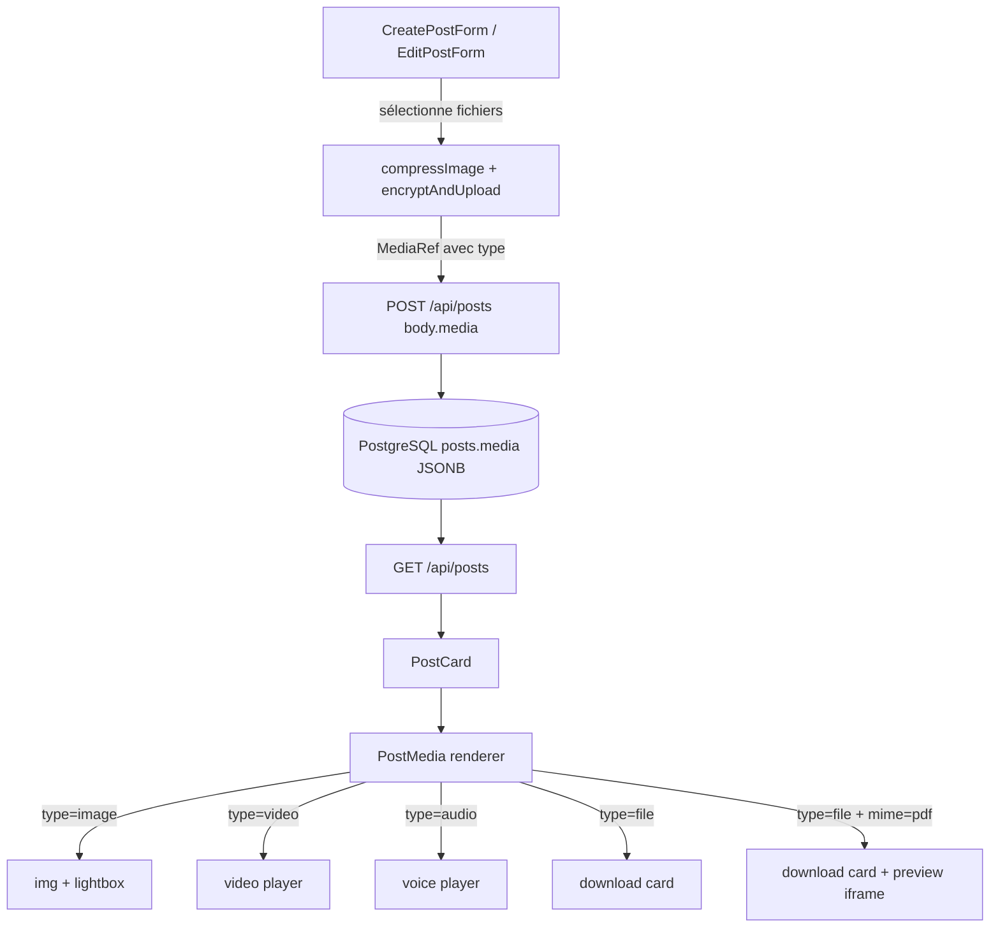

# Plan : Support des pièces jointes non-image dans les posts

**Date** : 2026-07-30
**Contexte** : Actuellement, seules les images sont supportées dans les posts. Le chat gère déjà `image`, `video`, `audio`, `file` avec chiffrement AES-256-GCM et prévisualisation PDF. L'infrastructure est prête, il faut câbler ces capacités dans le contexte des posts.

---

## Architecture cible



Le `MediaService` existant fait déjà :
- Chiffrement AES-256-GCM client-side
- Upload chunké (>50 Mo) ou standard
- Retourne un `MediaRef { type, mediaId, key, iv, mimeType, size, fileName, width?, height? }`

Le champ `type` (`'image' | 'video' | 'audio' | 'file'`) est le discriminant qui permet au renderer de choisir le bon affichage. Il est actuellement **omis** par `PostImageRef`.

---

## Phase 1 — Backend : renommer `images` → `media`

### 1.1 Entité Post

**Fichier** : [`apps/social-service/src/posts/entities/post.entity.ts`](apps/social-service/src/posts/entities/post.entity.ts)

Renommer le champ `images` en `media` :

```typescript
// AVANT
@Column('jsonb', { default: [] })
images: any[];

// APRÈS
@Column('jsonb', { default: [] })
media: any[];
```

Ajouter une **colonne de migration** qui copie les données existantes :

```sql
ALTER TABLE posts ADD COLUMN IF NOT EXISTS "media" jsonb DEFAULT '[]'::jsonb;
UPDATE posts SET "media" = "images" WHERE "media" = '[]'::jsonb AND "images" IS NOT NULL AND jsonb_array_length("images") > 0;
-- On garde "images" comme colonne fantôme pour la rétrocompatibilité, puis on la droppera
-- après avoir vérifié que tout fonctionne.
```

### 1.2 DTOs

**Fichier** : [`apps/social-service/src/posts/dto/post.dto.ts`](apps/social-service/src/posts/dto/post.dto.ts)

Renommer `PostImageDto` → `PostMediaDto` et ajouter le champ `type` :

```typescript
export class PostMediaDto {
  @IsString()
  @IsNotEmpty()
  @IsIn(['image', 'video', 'audio', 'file'])
  type: string;

  @IsString()
  @IsNotEmpty()
  mediaId: string;
  // ... reste inchangé
}
```

Dans `CreatePostDto` et `UpdatePostDto`, renommer le champ `images` → `media` :

```typescript
// CreatePostDto
@IsArray()
@IsOptional()
@ValidateNested({ each: true })
@Type(() => PostMediaDto)
media?: PostMediaDto[];

// UpdatePostDto — idem
```

### 1.3 Service

**Fichier** : [`apps/social-service/src/posts/posts.service.ts`](apps/social-service/src/posts/posts.service.ts)

- `createPost()` : référencer `data.media` au lieu de `data.images`
- `updatePost()` : `post.media = data.media` au lieu de `post.images = data.images`
- `listPosts()` / `searchPosts()` : les requêtes SQL sélectionnent déjà `posts.images` → renommer en `posts.media`
- `toPublicPostFromEntity()` / `shapeListRow()` : renommer `images` → `media`

### 1.4 Rétrocompatibilité API

Pour ne pas casser les clients existants pendant la transition, le controller peut **servir les deux champs** :

```typescript
// Dans toPublicPostFromEntity
const result = { ...raw };
// Rétrocompatibilité : exposer "images" ET "media"
if (Array.isArray(result.media)) {
  result.images = result.media; // client legacy continue de fonctionner
}
```

---

## Phase 2 — Frontend : types

### 2.1 PostImageRef → PostMediaRef

**Fichier** : [`frontend/src/lib/posts/api.ts`](frontend/src/lib/posts/api.ts)

```typescript
// AVANT
export type PostImageRef = Omit<MediaRef, 'type'> & { caption?: string };

// APRÈS
export type PostMediaRef = MediaRef & { caption?: string };
```

### 2.2 PostEntity

```typescript
export interface PostEntity {
  // ...
  images: PostMediaRef[];  // gardé pour rétrocompatibilité (le serveur renvoie les deux)
  media: PostMediaRef[];   // nouveau champ canonique
  // ...
}
```

### 2.3 CreatePostPayload / UpdatePostPayload

```typescript
export interface CreatePostPayload {
  // ...
  images?: PostMediaRef[]; // déprécié, mais on continue d'envoyer ce nom
  media?: PostMediaRef[];  // nouveau nom
}
```

Le client continue d'envoyer `images` dans le payload (le serveur accepte les deux pendant la transition), ou on peut migrer directement vers `media`.

### 2.4 Points d'impact sur les imports

Chercher tous les imports de `PostImageRef` et `PostImageDto` dans le frontend :

```
frontend/src/lib/posts/api.ts
frontend/src/lib/components/posts/CreatePostForm.svelte
frontend/src/lib/components/posts/EditPostForm.svelte
frontend/src/lib/components/posts/PostCard.svelte
frontend/src/lib/components/posts/PostContent.svelte
frontend/src/lib/components/posts/PostImage.svelte
frontend/src/lib/components/posts/PostComments.svelte
```

---

## Phase 3 — PostImage.svelte → PostMedia.svelte

**Objectif** : Remplacer le renderer image-only par un renderer multimédia capable d'afficher les 4 types.

### 3.1 Nouveau composant `PostMedia.svelte`

S'inspirer de [`MessageMediaRenderer.svelte`](frontend/src/lib/components/messages/MessageMediaRenderer.svelte) qui gère déjà les 4 types.

```
PostMedia.svelte
├── type=image → comportement actuel de PostImage (img + lightbox)
├── type=video → <video> avec contrôles (réutiliser le code de MessageMediaRenderer)
├── type=audio → VoiceMessagePlayer (réutiliser)
└── type=file  → carte de download (icône + nom + taille)
    └── mime=application/pdf → prévisualisation iframe (réutiliser ChatComposer)
```

### 3.2 Props

```typescript
interface Props {
  media: PostMediaRef;  // contient maintenant le champ type
  authToken: string;
  onOpen?: () => void;
  galleryMode?: boolean;
}
```

### 3.3 Conserver l'ancien composant temporairement

Renommer `PostImage.svelte` en `PostMedia.svelte` et créer un wrapper `PostImage.svelte` qui réexporte/délègue pour ne pas casser tous les imports d'un coup.

---

## Phase 4 — CreatePostForm

### 4.1 Élargir le `accept` du file input

**Fichier** : [`frontend/src/lib/components/posts/CreatePostForm.svelte`](frontend/src/lib/components/posts/CreatePostForm.svelte)

```svelte
<!-- AVANT -->
<input accept="image/*" ... />

<!-- APRÈS -->
<input accept="image/*,video/*,audio/*,application/pdf,.doc,.docx,.zip" ... />
```

### 4.2 Retirer le filtre `image/*` dans `onPickFiles`

```typescript
// AVANT
const files = Array.from(input.files ?? []).filter((f) => f.type.startsWith('image/'));

// APRÈS
const files = Array.from(input.files ?? []);
```

### 4.3 Prévisualisations par type

Dans la zone de preview (actuellement `filePreviews` qui fait `URL.createObjectURL`), distinguer :

| Type | Preview |
|------|---------|
| `image/*` | `URL.createObjectURL` + `` (existant) |
| `video/*` | `URL.createObjectURL` + `<video>` avec icône play overlay |
| `audio/*` | Icône waveform + nom du fichier |
| `application/pdf` | `URL.createObjectURL` + `<iframe>` (réutiliser le code de ChatComposer) |
| autre | Icône fichier générique + nom + taille |

### 4.4 Upload

Actuellement, `publishPost()` appelle `compressImage` qui ne fonctionne que pour les images. Adapter :

```typescript
for (let i = 0; i < selectedFiles.length; i++) {
  const file = selectedFiles[i];
  let fileToUpload = file;
  let dimensions: Partial<ImageDimensions> = {};

  if (file.type.startsWith('image/')) {
    const compressed = await compressImage(file, maxWidth, maxHeight, quality);
    fileToUpload = compressed.file;
    dimensions = { width: compressed.width, height: compressed.height };
  }

  const ref = await mediaService.encryptAndUpload(fileToUpload, authToken, dimensions);
  const caption = imageCaptions[i]?.trim();
  images.push({ ...ref, ...(caption ? { caption } : {}) });
}
```

### 4.5 Renommer les variables internes

- `selectedFiles` → garder (c'est bien un `File[]`)
- `filePreviews` → garder (c'est bien des URLs de preview)
- `imageCaptions` → `mediaCaptions`

---

## Phase 5 — EditPostForm

**Fichier** : [`frontend/src/lib/components/posts/EditPostForm.svelte`](frontend/src/lib/components/posts/EditPostForm.svelte)

Mêmes changements que Phase 4, plus :

- `existingImages` → `existingMedia`
- `newImageCaptions` → `newMediaCaptions`
- Le file input : même élargissement `accept`
- Remplacer `PostImage` par `PostMedia` dans le template

---

## Phase 6 — PostContent / PostCard

### 6.1 PostContent

**Fichier** : [`frontend/src/lib/components/posts/PostContent.svelte`](frontend/src/lib/components/posts/PostContent.svelte)

- Remplacer `post.images` par `post.media ?? post.images` (rétrocompatibilité)
- Dans la galerie, utiliser `PostMedia` au lieu de `PostImage`
- Adapter le layout de la galerie multi-images pour gérer les médias non-image :
  - Images : comportement actuel (grille 2 colonnes, lightbox)
  - Vidéos/Audio/Fichiers : carte pleine largeur (pas en grille serrée)
  - Mixte : on peut soit tout passer en liste verticale, soit faire une grille adaptative

**Suggestion** : Quand TOUS les médias sont des images, garder la grille 2 colonnes actuelle. Dès qu'il y a au moins un non-image, passer en liste verticale (une carte par média).

### 6.2 PostCard

**Fichier** : [`frontend/src/lib/components/posts/PostCard.svelte`](frontend/src/lib/components/posts/PostCard.svelte)

- Pas de changement structurel, le `PostContent` est déjà un sous-composant
- Vérifier que `post.images` est bien lu comme `post.media ?? post.images`

---

## Phase 7 — i18n

### 7.1 Nouveaux messages

**Fichiers** : [`frontend/messages/fr.json`](frontend/messages/fr.json) et [`frontend/messages/en.json`](frontend/messages/en.json)

Clés à ajouter :

| Clé | FR | EN |
|-----|----|----|
| `post_media_label` | Média | Media |
| `post_video_label` | Vidéo | Video |
| `post_audio_label` | Audio | Audio |
| `post_file_label` | Fichier | File |
| `post_download_file_label` | Télécharger le fichier | Download file |
| `post_pdf_preview_label` | Aperçu PDF | PDF preview |
| `post_create_media_label` | Médias | Media |
| `post_create_media_placeholder` | Ajouter des photos, vidéos ou fichiers... | Add photos, videos or files... |

### 7.2 Messages à renommer (garder les anciennes clés comme alias)

| Ancienne clé | Nouvelle clé |
|-------------|-------------|
| `post_create_photos_label` | `post_create_media_label` |
| `post_image_*` | `post_media_*` |

---

## Phase 8 — Tests et vérification

### 8.1 Tests backend

- Vérifier que `createPost` avec `media` (type `file`, `video`, `audio`) fonctionne
- Vérifier que `listPosts` renvoie bien `media` et `images` (rétrocompatibilité)
- Vérifier que `updatePost` met à jour `media`

### 8.2 Tests frontend

- Ajouter un test d'intégration pour le upload d'un PDF
- Vérifier que `PostMedia` rend correctement chaque type
- Vérifier la preview PDF dans le compositeur

### 8.3 Non-régression

- Les posts existants avec `images` doivent continuer de s'afficher
- La galerie d'images existante ne doit pas être cassée
- Les commentaires avec `media` (GIF) doivent continuer de fonctionner

---

## Résumé des fichiers touchés

```
# Backend
apps/social-service/src/posts/entities/post.entity.ts       # images → media
apps/social-service/src/posts/dto/post.dto.ts               # PostImageDto → PostMediaDto + type
apps/social-service/src/posts/posts.service.ts              # images → media
apps/social-service/src/posts/posts.controller.ts           # (léger, DTOs)

# Frontend - Types
frontend/src/lib/posts/api.ts                               # PostImageRef → PostMediaRef
frontend/src/lib/media.ts                                   # (MediaRef déjà OK)

# Frontend - Composants (nouveaux)
frontend/src/lib/components/posts/PostMedia.svelte          # NOUVEAU : renderer multimédia

# Frontend - Composants (modifiés)
frontend/src/lib/components/posts/PostImage.svelte          # → wrapper vers PostMedia (déprécié)
frontend/src/lib/components/posts/CreatePostForm.svelte     # accept, upload, preview
frontend/src/lib/components/posts/EditPostForm.svelte       # idem
frontend/src/lib/components/posts/PostContent.svelte        # galerie multi-type
frontend/src/lib/components/posts/PostCard.svelte           # post.media vs post.images
frontend/src/lib/components/posts/PostComments.svelte       # PostImage → PostMedia (comment media)

# i18n
frontend/messages/fr.json                                   # nouveaux messages
frontend/messages/en.json                                   # nouveaux messages
```

---

## Ordre d'exécution recommandé

1. **Backend DTOs + entité** (Phase 1) — le socle
2. **Frontend types** (Phase 2) — s'aligne sur les nouveaux DTOs
3. **PostMedia.svelte** (Phase 3) — le nouveau renderer, testable isolément
4. **CreatePostForm + EditPostForm** (Phase 4-5) — l'upload
5. **PostContent** (Phase 6) — l'affichage dans le feed
6. **i18n** (Phase 7) — les textes
7. **Tests** (Phase 8) — validation globale
